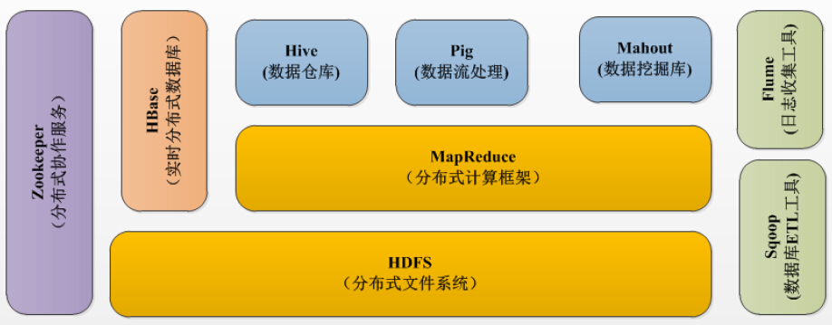
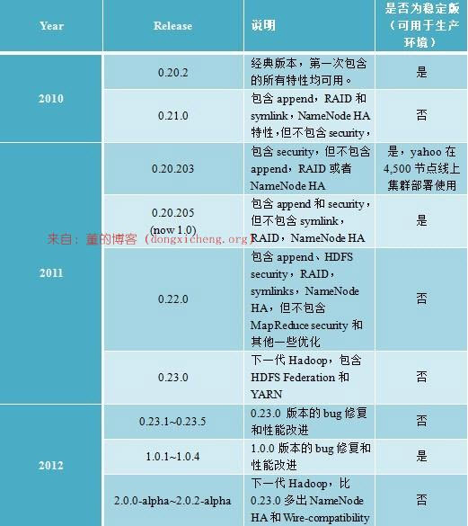

#### 实验介绍

本节实验将对 Apache Hadoop 进行介绍。

#### 知识点

- Hadoop 生态系统
- Hadoop 环境搭建

#### Hadoop 介绍

Apache Hadoop 软件库是一个框架，**允许在集群服务器上使用简单的编程模型对大数据集进行分布式处理**。Hadoop 被设计成能够从单台服务器扩展到数以千计的服务器，每台服务器都有本地的计算和存储资源。Hadoop 的高可用性并不依赖硬件，其代码库自身就能在应用层侦测并处理硬件故障，因此能基于服务器集群提供高可用性的服务。

---

Hadoop 生态系统

经过多年的发展形成了 Hadoop1.X 生态系统，其结构如下图所示：

- `HDFS`：Hadoop 生态圈的基本组成部分是 Hadoop 分布式文件系统（HDFS）。HDFS 是一种分布式文件系统，数据被保存在计算机集群上，HDFS 为 HBase 等工具提供了基础。
- `MapReduce`：Hadoop 的主要执行框架是 MapReduce，它是一个分布式、并行处理的编程模型，MapReduce 把任务分为 map（映射）阶段和 reduce（化简）阶段。由于 MapReduce 工作原理的特性，Hadoop 能以并行的方式访问数据，从而实现快速访问数据。
- `Hbase`：HBase 是一个建立在 HDFS 之上，面向列的 NoSQL 数据库，用于快速读 / 写大量数据，HBase 使用 Zookeeper 进行管理。
- `Zookeeper`：用于 Hadoop 的分布式协调服务。Hadoop 的许多组件依赖于 Zookeeper，它运行在计算机集群中，用于管理 Hadoop 集群。
- `Pig`：它是 MapReduce 编程的复杂性的抽象。Pig 平台包括运行环境和用于分析 Hadoop 数据集的脚本语言 (Pig Latin)，其编译器将 Pig Latin 翻译成 MapReduce 程序序列。
- `Hive`：类似于 SQL 高级语言，用于运行存储在 Hadoop 上的查询语句，Hive 让不熟悉 MapReduce 的开发人员也能编写数据查询语句，然后这些语句被翻译为 Hadoop 上面的 MapReduce 任务。像 Pig 一样，Hive 作为一个抽象层工具，吸引了很多熟悉 SQL 而不是 Java 编程的数据分析师。
- `Sqoop`：一个连接工具，用于在关系数据库、数据仓库和 Hadoop 之间转移数据。Sqoop 利用数据库技术描述架构，进行数据的导入 / 导出；利用 MapReduce 实现并行化运行和容错技术。
- `Flume`：提供了分布式、可靠、高效的服务，用于收集、汇总大数据，并将单台计算机的大量数据转移到 HDFS。它基于一个简单而灵活的架构，利用简单的可扩展的数据模型，将企业中多台计算机上的数据转移到 Hadoop 中。

---

#### Apache 版本衍化

截止 2012 年 12 月 23 日，Apache Hadoop 版本分为两代，我们将第一代 Hadoop 称为 Hadoop 1.0，第二代 Hadoop 称为 Hadoop 2.0。（注：2017 年 12 月 13 日，已发布 3.0 版本。）

第一代 Hadoop 包含三个大版本，分别是 0.20.x，0.21.x 和 0.22.x。其中，0.20.x 最后演化成 1.0.x，变成了稳定版，而 0.21.x 和 0.22.x 则包括 NameNode HA 等新的重大特性。

第二代 Hadoop 包含两个版本，分别是 0.23.x 和 2.x，它们完全不同于 Hadoop 1.0，是一套全新的架构，均包含 HDFS Federation 和 YARN 两个系统，相比于 0.23.x，2.x 增加了 NameNode HA 和 Wire-compatibility 两个重大特性。

---

#### Hadoop1.X 伪分布安装

Hadoop 安装有如下三种方式：

- `单机模式`：安装简单，几乎不用做任何配置，但仅限于调试用途。
- `伪分布模式`：在单节点上同时启动 NameNode、DataNode、JobTracker、TaskTracker、Secondary Namenode 等 5 个进程，模拟分布式运行的各个节点。
- `完全分布式模式`：正常的 Hadoop 集群，由多个各司其职的节点构成。

由于实验环境的限制，本节课程将讲解伪分布模式安装，并在随后的课程中以该环境为基础进行其他组件部署实验。以下为伪分布式环境下在 CentOS6 中配置 Hadoop-1.1.2，该配置可以作为其他 Linux 系统和其他版本的 Hadoop 部署参考。

---

#### 软硬件环境说明

**实验楼环境已配置，除 Host 文件需要修改，其他无需操作。**

节点使用 CentOS 系统，防火墙和 SElinux 需要禁用，创建了一个 shiyanlou 用户，并在系统根目录下创建 `/app` 目录，用于存放 Hadoop 等组件运行包。由于该目录用于安装 hadoop 等组件程序，用户对 shiyanlou 必须赋予 rwx 权限（一般做法是 root 用户在根目录下创建 `/app` 目录，并修改该目录拥有者为 shiyanlou(`chown –R shiyanlou:shiyanlou /app`)。

**Hadoop 搭建环境：**

- 虚拟机操作系统：CentOS6.6 64 位，单核，1G 内存
- JDK：1.7.0_55 64 位
- Hadoop：1.1.2