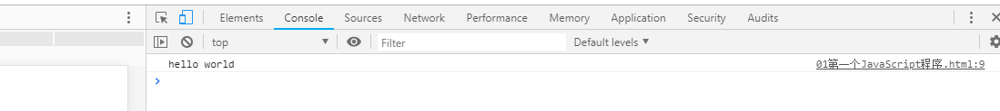
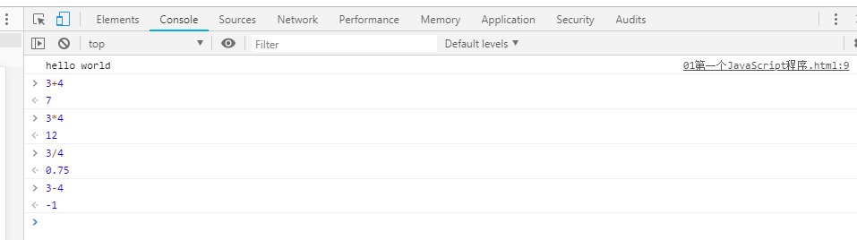

#### JavaScript 范例

2022年4月1日19:52:20

---

实验需新建一个 test.html 文件，用于编写代码。后续的例子中，将不再提醒建立文件，大家根据个人需求自行创建对应的 html 文件，并完成代码练习：

> 由于实验楼使用是 WebIDE 的在线环境，所以有不熟悉对同学请阅读下：[实验楼 WebIDE 使用指南](https://www.lanqiao.cn/library/shiyanlou-docs/feature/webide)，*前端开发* 部分的内容。

首先来看看范例代码：

```html
<!DOCTYPE html>
<html>
  <head>
    <meta charset="UTF-8" />
    <title></title>
  </head>
  <body>
    <script>
      console.log("hello world");
    </script>
  </body>
</html>
```

上述代码的含义就是在我们的控制台打印一句话：hello world。首先教大家怎么查看：将上述代码复制到一个 html 文件中，然后在浏览器中运行，点击 F12，再点击控制台上的 Console，即可查看。如下图所示：



值得注意的是我们可以直接在控制台上输入 JavaScript 代码，然后点击 enter 让其执行。如下图所示我们执行几行简单的加减乘除：



通过上面的代码，我们可以看出 JavaScript 代码是放在 `<script>……</script>` 标签里，而包含 JavaScript 代码的 script 标签，我们可以放在 `<body>……</body>` 标签里，也可以放在 `<head>……</head>` 标签里。比如上述范例也可以这样写：

```html
<!DOCTYPE html>
<html>
  <head>
    <meta charset="UTF-8" />
    <title></title>
    <script>
      console.log("hello world");
    </script>
  </head>
  <body></body>
</html>
```

执行结果没有什么区别，不同的是执行顺序，简单的来说，放在前面的会先执行。此外，和 CSS 引入相类似，JavaScript 也可以通过外部引入。首先我们需要创建一个扩展名为 .js 的文件，然后在 html 页面中引入它。同样的拿上述范例来修改，我们首先创建一个叫 test.js，名字可以自己取，但是扩展名一定要是 .js，只有这样才能够识别包含 JavaScript 代码的文件，然后在里面写上我们的 JavaScript 代码：

```javascript
console.log("hello world");
```

在 html 文件中写上如下代码：

```html
<!DOCTYPE html>
<html>
  <head>
    <meta charset="UTF-8" />
    <title></title>
  </head>
  <body>
    <script src="test.js"></script>
  </body>
</html>
```

值得注意的是 test.js 文件要和你的 html 文件在同一目录下才能用上面的方式引用，否则的话需要使用绝对路径来引入 js 文件，具体引入需要根据实际情况灵活运用了。前两种方式都是直接把 JavaScript 代码放在 HTML 中，在页面加载的同时，那些 JavaScript 的代码就被解析了。而**把 JavaScript 代码放在外部文件中，只有在事件被触发，需要该段 JavaScript 代码时，才调用执行。**这样做有个好处，当页面比较复杂的时候，把大量的 JavaScript 代码放到外部文件，只有在需要的时候才执行，那么会明显地加快页面加载速度，而且实现结构化分离，也便于我们维护自己的代码，所以建议大家养成外部引入的方式来写我们的 JavaScript 代码。

> 前两种,即把js直接放在body或者head标签中.