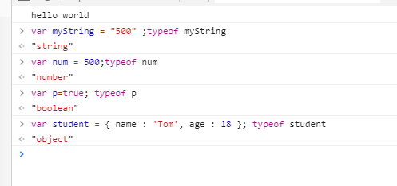

#### 变量

2022年4月1日20:01:59

---

#### 变量是什么

在计算机中，数据都存在内存中。而一个变量，就是一个用于存放数值的容器，每个变量存放的数值是可变的，每个变量都有其独有的名字，每个变量都占有一段内存。

注：变量不是数值本身，变量仅仅是一个用于储存数值的容器。

#### 声明变量

通过 var 关键字来声明变量，比如：

```javascript
var name = "实验楼";
```

上述代码声明了一个名为 name 的变量，并赋值为“实验楼”。注意此处的等于符号（=）为赋值符号，不是我们传统意义上理解的等号。

变量的命名规则如下：

- 变量名必须以字母、下划线 “_”、美元符号 “$” 开头，不能以数字开头。
- 变量可以包含字母、数字、下划线和美元符号。
- 不能使用 JavaScript 中的关键字做为变量名。
- 变量名不能有空格。
- 变量名对大小写敏感，比如：name 和 Name 就是两个完全不同的变量。

另外在 JavaScript 中，变量也可以不作声明，而在使用时再根据数据的类型来确其变量的类型，如：

```javascript
x = 50; // 变量 x 为整数
```

#### 变量类型

- Number：你可以在变量中存储数字，不论这些数字是 10（整数），或者是 3.1415926（浮点数）。

```javascript
var x1 = 10;
var x2 = 3.1415926;
```

- String：存储字符（比如 "shiyanlou"）的变量，字符串可以是引号中的任意文本，你可以使用单引号或双引号，也可以在字符串中使用引号，只要不匹配包围字符串的引号即可：

```javascript
var carname = "shiyanlou";
var carname = "shiyanlou";
var answer = "I Love 'shiyanlou'";
var answer = 'I Love "shiyanlou"';
```

- Boolean：布尔类型的值有两种：true 和 false。通常被用于在适当的代码之后，测试条件是否成立，后续会讲到。
- Array：数组是一个单个对象，其中包含很多值，方括号括起来，并用逗号分隔。后续我们将会对数值进行详细的讲解，此处看两个简单的数值例子： 

```javascript
var myNameArray = ["Tom", "Bob", "Jim"];
var myNumberArray = [10, 15, 20];
```

- Object：对象类型。同样的我们会在后续的课程中详细讲解什么是对象，此处先看一个简单的例子：

```javascript
var student = { name: "Tom", age: 18 };
```

#### 动态类型

JavaScript 是一种“动态类型语言”，这意味着不同于其他一些语言（如 C、Java），你不需要指定变量将包含什么数据类型（例如 number 或 string），全部用 `var` 关键字声明就是了。比如如果你声明一个变量并给它一个带引号的值，浏览器就会知道它是一个字符串：

```javascript
var myString = "Hello";
```

值得注意的就是引号中如果是一个数字，它依然是 string 类型的。我们可以在控制台中通过 `typeof` 函数，来查看我们声明的变量是什么类型的。



#### 注释

单行注释：用来描述下面一个或多行代码的作用。单行注释快捷键：`Ctrl + /`。

```javascript
// 这是一个变量
var name = "zhangsan";
```

多行注释：用来注释多条代码。多行注释快捷键：`Ctrl + Shift + /`。

```javascript
/*
var name = "zhangsan";
var age = 18;
console.log(name, age);
*/
```


下一步