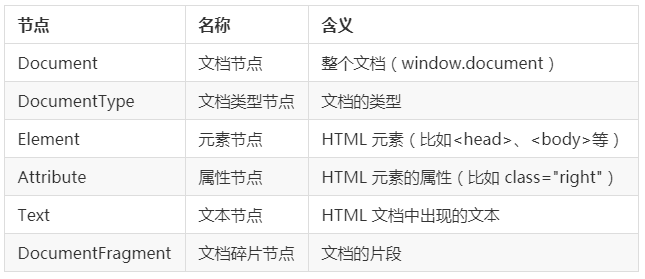

#### DOM 简介


文档对象模型（Document Object Model，简称 DOM），是 W3C 组织推荐的处理可扩展标志语言的标准编程接口。DOM 定义了访问 HTML 和 XML 文档的标准。我们这里主要学习 HTML DOM。DOM 可以把 HTML 看做是文档树，通过 DOM 提供的 API 可以对树上的节点进行操作。下面我们来看一下 W3C 上的 DOM 树：


#### DOM HTML


DOM 能够操作 HTML 的内容。

#### 改变 HTML 输出流

在 JavaScript 中，使用 `document.write()` 可用于直接向 HTML 输出流写内容。比如：

```javascript
document.write("新设置的内容<p>标签也可以生成</p>");
```

在控制台中复制上述代码运行后：


#### 改变 HTML 内容

使用 `innerHTML` 属性改变 HTML 内容。比如修改 p 标签中的内容：

```html
<!DOCTYPE html>
<html>
  <head>
    <meta charset="UTF-8" />
    <title></title>
  </head>
  <body>
    <p id="p1">Hello World!</p>
    <script>
      document.getElementById("p1").innerHTML = "Hello 实验楼";
    </script>
  </body>
</html>
```

#### 改变 HTML 属性

语法：

```javascript
document.getElementById(id).attribute = new value();
```

例子：

```html
<!DOCTYPE html>
<html>
  <head>
    <meta charset="UTF-8" />
    <title></title>
  </head>
  <body>
    
    <script>
      document.getElementById("image").src =
        "https://static.shiyanlou.com/img/shiyanlou_logo.svg";
    </script>
  </body>
</html>
```

注：上述例子将显示实验楼的 logo 图片。

---

#### DOM CSS

DOM 能够改变 HTML 元素的样式。语法为：

```javascript
document.getElementById(id).style.property = new style();
```

例子：

```html
<!DOCTYPE html>
<html>
  <head>
    <meta charset="UTF-8" />
    <title></title>
  </head>
  <body>
    <p id="syl" style="color: red;">实验楼</p>
    <script>
      document.getElementById("syl").style.color = "green";
    </script>
  </body>
</html>
```

注：在上述例子中，p 标签中实验楼的颜色本来为红色，但是通过 DOM 方法，最后将其改变成了绿色。运行上述代码，最终的效果是显示一个颜色为绿色的实验楼文本。

#### DOM 节点


根据 W3C 的 HTML DOM 标准，HTML 文档中的所有内容都是节点：整个文档就是一个文档节点，而每一个 HTML 标签都是一个元素节点。HTML 标签中的文本则是文本节点，HTML 标签的属性是属性节点，一切都是节点。



#### DOM 节点的操作


#### 获取节点

要操作节点，首先我们要找到节点。主要有以下三种办法：

1.  通过 ID 找到 HTML 元素：使用方法 `getElementById()` 通过元素的 ID 而选取元素，比如：

```javascript
document.getElementById("demo"); // 假定已经有一个 ID 名为 demo 的标签，可以这样来获取它
```

1.  通过标签名找到 HTML 元素：使用方法 getElementsByTagName() 来选取元素，如果有多个同类型标签，那么我们可以通过下标来确认，比如：

```html
<html>
  <body>
    <input type="text" />
    <input type="text" />
    <script>
      document.getElementsByTagName("input")[0].value = "hello"; // 下标为 [0] 表示选取第 1 个 input 标签
      document.getElementsByTagName("input")[1].value = "shiyanlou"; // 下标为 [1] 表示选取第 2 个 input 标签
    </script>
  </body>
</html>
```

1.  通过类名来找到 HTML 元素：使用方法 `getElementsByClassName()` 通过元素的类名来选取元素。比如：

```javascript
document.getElementsByClassName("name"); // 返回包含 class = "name" 的所有元素的一个列表。
```

#### DOM 节点之间的关系

DOM 的节点并不是孤立的，我们从 DOM 树中也可以看出，节点与节点之间存在着相对的关系，就如同一个家族一样，有父辈，有兄弟，有儿子等等。下面我们来看一下都有哪些节点：

| 父节点     | 兄弟节点               | 子节点            | 所有子节点 |
| ---------- | ---------------------- | ----------------- | ---------- |
| parentNode | nextSibling            | firstChild        | childNodes |
|            | nextElementSibling     | firstElementChild | children   |
|            | previousSibling        | lastChild         |            |
|            | previousElementSibling | lastElementChild  |            |

例子：

```html
<html>
  <head>
    <title>DOM 节点演示</title>
  </head>
  <body>
    <h1>我是h1标签</h1>
    <p>我是p标签</p>
  </body>
</html>
```

上面的例子中：

-   `<html>`节点没有父节点，它是根节点。
-   `<head>` 和 `<body>` 的父节点是 `<html>` 节点。
-   文本节点 `我是 p 标签` 的父节点是 `<p>` 节点。
-   `<html>` 节点有两个子节点：`<head>` 和 `<body>`。
-   `<h1>` 节点和 `<p>` 节点是兄弟节点，同时也是 `<body>` 的子节点。

需要注意以下几点：

-   `childNodes`：它是标准属性，它返回指定元素的子元素集合，包括 HTML 节点，所有属性，文本节点。
-   `children`：非标准属性，它返回指定元素的子元素集合。但它只返回 HTML 节点，甚至不返回文本节点。
-   `nextSibling` 和 `previousSibling` 获取的是节点，获取元素对应的属性是 `nextElementSibling` 和 `previousElementSibling`。
-   `nextElementSibling` 和 `previousElementSibling` 有兼容性问题，IE9 以后才支持。

#### DOM 节点的操作

1.  创建节点

    -   创建元素节点：使用 `createElement()` 方法。比如：

    ```javascript
    var par = document.createElement("p");
    ```

    -   创建属性节点：使用 `createAttribute()` 方法。
    -   创建文本节点：使用 `createTextNode()` 方法。

2.  插入子节点

    -   `appendChild ()` 方法向节点添加最后一个子节点。
    -   `insertBefore` (插入的新的子节点，指定的子节点) 方法在指定的子节点前面插入新的子节点。如果第二个参数没写或者为 null，则默认插入到后面。

3.  删除节点：使用 `removeChild()` 方法。写法为：

```javascript
父节点.removeChild(子节点);
node.parentNode.removeChild(node); // 如果不知道父节点是什么，可以这样写
```

1.  替换子节点：使用 `replaceChild()` 方法。语法为：

```javascript
node.replaceChild(newnode, oldnode);
```

1.  设置节点的属性：
    -   获取：`getAttribute(name)`
    -   设置：`setAttribute(name, value)`
    -   删除：`removeAttribute(name)`

#### DOM 事件

#### 事件的定义

在什么时候执行什么事。

#### 事件三要素

事件由：事件源 + 事件类型 + 事件处理程序组成。

-   事件源：触发事件的元素。
-   事件类型：事件的触发方式（比如鼠标点击或键盘点击）。
-   事件处理程序：事件触发后要执行的代码（函数形式，匿名函数）。

#### 常用的事件

| 事件名      | 说明                                 |
| ----------- | ------------------------------------ |
| onclick     | 鼠标单击                             |
| ondblclick  | 鼠标双击                             |
| onkeyup     | 按下并释放键盘上的一个键时触发       |
| onchange    | 文本内容或下拉菜单中的选项发生改变   |
| onfocus     | 获得焦点，表示文本框等获得鼠标光标。 |
| onblur      | 失去焦点，表示文本框等失去鼠标光标。 |
| onmouseover | 鼠标悬停，即鼠标停留在图片等的上方   |
| onmouseout  | 鼠标移出，即离开图片等所在的区域     |
| onload      | 网页文档加载事件                     |
| onunload    | 关闭网页时                           |
| onsubmit    | 表单提交事件                         |
| onreset     | 重置表单时                           |

例子 1 ：鼠标单击事件：

```html
<p onclick="this.innerHTML = '我爱学习，身体好好!'">请点击该文本</p>
```

例子 2 ：鼠标双击事件：

```html
<!DOCTYPE html>
<html>
  <head>
    <meta charset="UTF-8" />
    <title></title>
  </head>
  <body>
    <h1 ondblclick="changetext(this)">请点击该文本</h1>
    <script>
      function changetext(id) {
        id.innerHTML = "我爱学习，身体棒棒!";
      }
    </script>
  </body>
</html>
```

例子 3 ：鼠标移除悬停：

```html
<!DOCTYPE html>
<html>
  <head>
    <meta charset="UTF-8" />
    <title></title>
  </head>
  <body>
    <div
      onmouseover="mOver(this)"
      onmouseout="mOut(this)"
      style="background-color:deepskyblue;width:200px;height:100px;"
    >
      把鼠标移到上面
    </div>
    <script>
      function mOver(obj) {
        obj.innerHTML = "你把鼠标移到了上面 ";
      }

      function mOut(obj) {
        obj.innerHTML = "你把鼠标移开了";
      }
    </script>
  </body>
</html>
```

注：大家可以把上述例子运行一下感受一下事件的魅力，并且可以自己尝试着写一些其他的简单事件。

---

挑战：导航栏样式切换


通过鼠标点击更改导航栏的样式，来看看最终的效果：


参考源码：

```html
<!DOCTYPE html>
<html lang="en">
  <head>
    <meta charset="UTF-8" />
    <title>Title</title>
    <style>
      #list li {
        list-style-type: none;
        width: 100px;
        height: 50px;
        line-height: 50px;
        background-color: beige;
        text-align: center;
        float: left;
      }

      #list li.current {
        background-color: red;
      }

      #list li a {
        text-decoration: none;
      }
    </style>
  </head>

  <body>
    <div id="menu">
      <ul id="list">
        <li class="current">
          <a href="javascript:void(0)">首页</a>
        </li>
        <li>
          <a href="javascript:void(0)">HTML</a>
        </li>
        <li>
          <a href="javascript:void(0)">CSS</a>
        </li>
        <li>
          <a href="javascript:void(0)">JavaScript</a>
        </li>
        <li>
          <a href="javascript:void(0)">关于</a>
        </li>
        <li>
          <a href="javascript:void(0)">帮助</a>
        </li>
      </ul>
    </div>

    <script>
      // 获取所有的 li 标签
      var liObjs = document.getElementById("list").getElementsByTagName("li");
      // 循环遍历，找到每个 li 中的 a，注册点击事件
      for (var i = 0; i < liObjs.length; i++) {
        // 每个 li 中的 a
        var aObj = liObjs[i].firstElementChild;

        aObj.onclick = function () {
          // 把这个 a 所在的 li 的所有的兄弟元素的类样式全部移除
          for (var j = 0; j < liObjs.length; j++) {
            liObjs[j].removeAttribute("class");
          }
          //当前点击的 a 的父级元素 li(点击的这个 a 所在的父级元素 li)，设置背景颜色
          this.parentNode.className = "current";
        };
      }
    </script>
  </body>
</html>
```