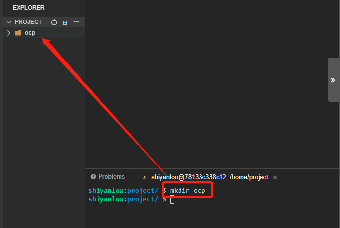
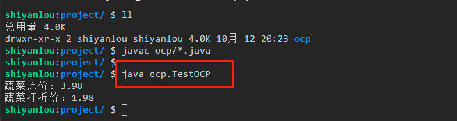
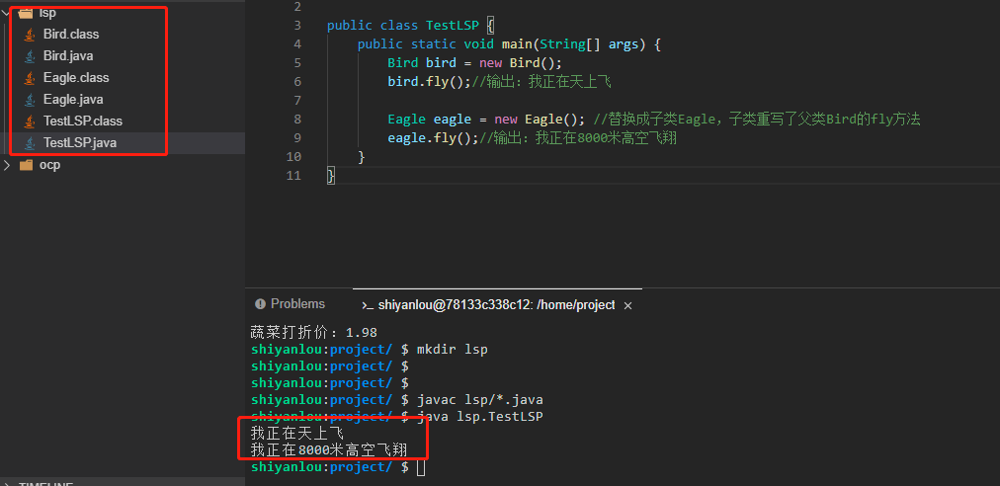
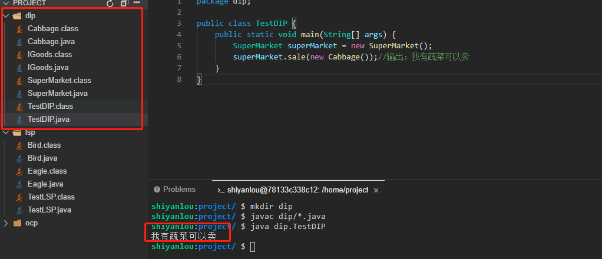
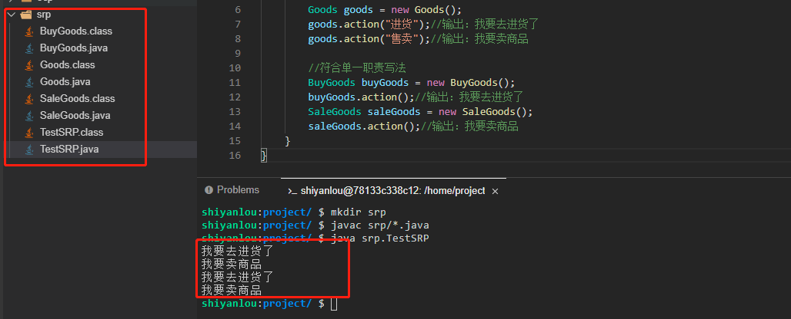
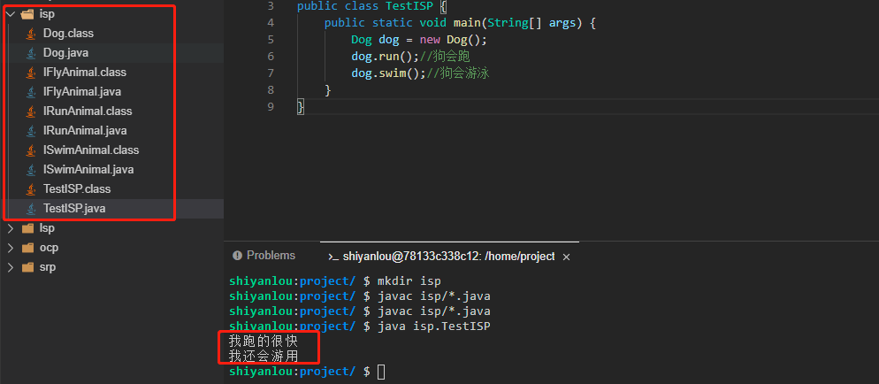
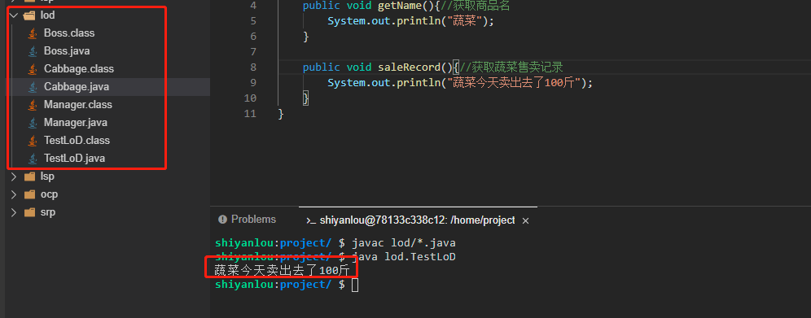

实验介绍

学习设计模式之前，我们必须要知道为什么要学习设计模式，设计模式能为我们解决什么问题。而软件设计七大原则又是设计模式绕不开的话题，只有掌握并且可以灵活运用软件设计七大原则，学习设计模式时才能如鱼得水。

#### 知识点

- 为什么要学习设计模式
- 软件设计七大原则

为什么要学习设计模式


设计模式并不是什么新的知识，它只是一种经验的总结，所以必然是先有人这么去做了，然后才有人去总结提炼，从而变成了设计模式。那么既然设计模式是前人总结的经验，我们何不站在巨人的肩膀上，去体会经验带来的好处呢？所以我们在学习设计模式的过程中，最重要的是掌握其中的设计思想，而设计模式最重要的思想就是解耦。所以我们需要将其解耦思想为自己所用，从而提升自己编码能力，使自己的代码更加容易维护、扩展。

## 软件设计八大原则

在软件开发过程中，为了提高系统的可维护性、可复用性、可扩展性以及灵活性，产生了七大设计原则，这些原则也会贯穿体现在设计模式中。设计模式会尽量遵循这些原则，不会为了遵守而遵守。

### 开闭原则

开闭原则：`Open-Closed Principle`，简称为 `OCP`。其核心是指在一个软件实体中（如类，函数等），我们应该==对扩展开放、对修改关闭==，这样就可以提高软件系统的可复用性和可维护性。

开闭原则是面向对象设计的最基本原则，而遵守开闭原则的核心思想就是面向抽象编程。

下面我们以超市中的商品为例进行说明，请大家跟着我一起完成这个实验。

因为我们有七大原则需要讲解，有些原则之间类会同名，为了方便区分，我们以每一个原则的简称来新建一个目录，比如开闭原则新建的目录名为 `ocp`，然后相关的类就创建在 `ocp` 目录下。



- 新建一个商品接口 `IGoods.java`，接口中定义了两个方法：一个获取商品名，一个获取商品出售价。

```java
package ocp;

import java.math.BigDecimal;

public interface IGoods {
    String getName();//获取商品名称
    BigDecimal getSalePrice();//获取商品每kg出售价格
}
```

- 新建一个具体商品蔬菜类 `Cabbage.java` 来实现商品接口。

```java
package ocp;

import java.math.BigDecimal;

public class Cabbage implements IGoods {
    @Override
    public String getName() {//获取商品名称
        return "蔬菜";
    }

    @Override
    public BigDecimal getSalePrice() {//获取商品每kg出售价格
        return new BigDecimal("3.98");
    }
}
```

上面我们看到，蔬菜售价是 3.98/kg，那么这时候到了晚上，需要打折，售价要改为 1.98/kg，这时候普通的做法有三种选择：

- 直接修改 `Cabbage` 类的 `getSalePrice`。
- 接口中再新增一个打折价方法。
- 直接在 `Cabbage` 方法中新增一个获取打折后价钱的方法。

这三种方法中：

1. 第一种可能影响到其它不需要打折的地方或者后面不打折了又要改回来，那么就需要反复修改源码，不可行。
2. 第二种直接修改接口，影响就太大了，每个实现类都被迫需要改动（当然如果是 JDK 1.8 之后的版本可以选择新增 `default` 方法，这样方法二就和第三种方法等价了）。
3. 第三种方法貌似改动是最小的，但毕竟还是修改了源码。

简而言之，这三种方法都需要修改源码，违背了开闭原则中的对修改关闭这一条。所以如果要遵循开闭原则，那么我们的做法应该是再新建一个蔬菜打折类来实现 `IGoods` 商品。

- 新建一个打折蔬菜类 `DiscountCabbage.java`。

```java
package ocp;

import java.math.BigDecimal;

public class DiscountCabbage implements IGoods {
    @Override
    public String getName() {//获取商品名称
        return "蔬菜";
    }

    @Override
    public BigDecimal getSalePrice() {//获取商品每kg出售价格
        return new BigDecimal("1.98");
    }
}
```

- 最后让我们新建一个测试类 `TestOCP.java` 来看看运行结果。

```java
package ocp;

public class TestOCP {
    public static void main(String[] args) {
        System.out.println("蔬菜原价：" + new Cabbage().getSalePrice());//获取蔬菜原价
        System.out.println("蔬菜打折价：" + new DiscountCabbage().getSalePrice());//获取蔬菜打折价
    }
}
```

接下来需要执行 `javac ocp/*.java` 命令进行编译，最后再执行 `java ocp.TestOCP` 命令运行测试类（大家一定要自己动手运行哦，只有自己实际去运行了才能更深入体会其中的思想）。



这样就符合开闭原则了，而且后面有其它商品需要打折或者其它活动，都可以通过新建一个类来实现，扩展非常方便。


### 里氏替换原则

里氏替换原则：`Liskov Substitution Principle`，简称为 `LSP`。其指的是继承必须确保超类所拥有的性质在子类中仍然成立，也就是说如果对每一个类型为 T1 的对象 o1 都有类型为 T2 的对象 o2，使得以 T1 所定义的程序 P 在所有的对象 o1 都替换成为 o2 时，程序 P 的行为没有发生改变。

里氏替换原则具体可以总结为以下 4 点：

- 子类可以实现父类的抽象方法，但是不能覆盖父类的非抽象方法。
- 子类中可以增加自己的特有方法。
- 当子类方法重载父类的方法时，方法的前置条件（即方法的输入/入参）要比父类方法输入的参数更宽松。
- 当子类实现父类的方法（重载/重写/实现抽象方法），方法的后置条件（即方法的输出/返回值）要比父类更严格或者相等。

我们以动物鸟类飞翔举例进行说明。同样的，这里需要新建一个 `lsp` 目录，相关类创建在 `lsp` 目录下。

- 新建一个鸟类 `Bird.java`。

```java
package lsp;

public class Bird {
    public void fly() {
        System.out.println("我正在天上飞");
    }
}
```

- 再新建一个鹰类 `Eagle.java` 来继承 Bird，并重写其中的 fly 方法。

```java
package lsp;

public class Eagle extends Bird {
    @Override
    public void fly() {
        System.out.println("我正在8000米高空飞翔");
    }
}
```

- 新建一个测试类 `TestLSP.java` 来测试。

```java
package lsp;

public class TestLSP {
    public static void main(String[] args) {
        Bird bird = new Bird();
        bird.fly();//输出：我正在天上飞

        Eagle eagle = new Eagle(); //替换成子类Eagle，子类重写了父类Bird的fly方法
        eagle.fly();//输出：我正在8000米高空飞翔
    }
}
```

接下来我们需要先执行 `javac lsp/*.java` 命令进行编译。然后再执行 `java lsp.TestLSP` 命令运行测试类（大家一定要自己动手运行哦，只有自己实际去运行了才会更能体会其中的思想）。



可以看到上面的例子中将父类替换成子类之后，`fly` 方法变成了在 8000 米高空飞翔（普通鸟类达不到），这就改变了父类的行为，导致替换不成立，所以这个例子就违背了里氏替换原则。

### 依赖倒置原则

依赖倒置原则：`Dependence Inversion Principle`，简称为 `DIP`。其指的是在设计代码结构时，高层模块不应该依赖低层模块，而是都应该依赖其抽象。抽象不应该依赖细节，细节应该依赖抽象。通过依赖倒置原则可以减少类与类之间的耦合性，提高系统的稳定性，提高代码的可读性和可维护性，而且能够降低修改程序所带来的风险。

我们以超市出售商品举例进行说明（同样的，这里我们需要新建一个 `dip` 目录，相关类创建在 `dip` 目录下）。

- 假设一家超市刚开张，只有青菜卖，所以我们新建一个超市类 `SuperMarket.java`，里面只定义一个卖蔬菜的方法。

```java
package dip;

public class SuperMarket {
    public void saleCabbage(){
        System.out.println("我有蔬菜可以卖");
    }
}
```

这个超市类直接和蔬菜绑定了，也就是依赖了具体的商品。假如要卖其它商品就需要修改源码，违背了开闭原则，我们应该修改超市类依赖于抽象商品，而不能直接绑定具体商品。

- 新增一个商品接口 `IGoods.java`，接口中定义一个出售商品方法。

```java
package dip;

public interface IGoods {
    void sale();
}
```

- 再新建一个蔬菜类 `Cabbage.java` 实现商品接口。

```java
package dip;

public class Cabbage implements IGoods{
    @Override
    public void sale() {
        System.out.println("我有蔬菜可以卖");
    }
}
```

- 然后还需要编辑 `SuperMarket.java` 文件，将原先的超市类 SuperMarket 修改一下。

```java
package dip;

public class SuperMarket {
    public void sale(IGoods goods){
        goods.sale();
    }
}
```

- 最后让我们新建一个测试类 `TestDIP.java` 来测试结果。

```java
package dip;

public class TestDIP {
    public static void main(String[] args) {
        SuperMarket superMarket = new SuperMarket();
        superMarket.sale(new Cabbage());//输出：我有蔬菜可以卖
    }
}
```

接下来我们需要先执行 `javac dip/*.java` 命令进行编译。然后再执行 `java dip.TestDIP` 命令运行测试类（大家一定要自己动手运行哦，只有自己实际去运行了才会更能体会其中的思想）。



这时候如果需要新增其它商品，只需要新建一个具体商品类来实现 `IGoods` 接口，并作为参数传入 `sale` 方法就可以了。

### 单一职责原则


单一职责原则：`Single Responsibility Principle`，简称为 `SRP`。其指的是不要存在多于一个导致类变更的原因。假如我们有一个类里面有两个职责，一旦其中一个职责发生需求变更，那我们修改其中一个职责就有可能导致另一个职责出现问题，在这种情况应该把两个职责放在两个 Class 对象之中。

单一职责可以降低类的复杂度，提高类的可读性和系统的可维护性，也降低了变更职责引发的风险。

我们以超市的进货和出售举例进行说明（同样的，这里我们需要新建一个 `srp` 目录，相关类创建在 `srp` 目录下）。

- 新建一个商品类 `Goods.java`。

```java
package srp;

public class Goods {
    public void action(String type){
        if ("进货".equals(type)){
            System.out.println("我要去进货了");
        }else if("售卖".equals(type)){
            System.out.println("我要卖商品");
        }
    }
}
```

这个方法里面有两个分支：进货和售卖。也就是一个方法里面有两个功能（职责），假如业务逻辑非常复杂，那么一个功能发生变化需要修改有很大的风险导致另一个功能也发生异常。所以为了符合单一职责原则我们应该进行如下改写，将这两个职责拆分成两个类。

- 商品进货类 `BuyGoods.java`。

```java
package srp;

public class BuyGoods {
    public void action(){
        System.out.println("我要去进货了");
    }
}
```

- 商品售卖类 `SaleGoods.java`。

```java
package srp;

public class SaleGoods {
    public void action(){
        System.out.println("我要卖商品");
    }
}
```

- 最后我们写一个测试类 `TestSRP.java` 来对比一下两种写法。

```java
package srp;

public class TestSRP {
    public static void main(String[] args) {
        //不符合单一职责写法
        Goods goods = new Goods();
        goods.action("进货");//输出：我要去进货了
        goods.action("售卖");//输出：我要卖商品

        //符合单一职责写法
        BuyGoods buyGoods = new BuyGoods();
        buyGoods.action();//输出：我要去进货了
        SaleGoods saleGoods = new SaleGoods();
        saleGoods.action();//输出：我要卖商品
    }
}
```

接下来我们需要先执行 `javac srp/*.java` 命令进行编译。然后再执行 `java srp.TestSRP` 命令运行测试类（大家一定要自己动手运行哦，只有自己实际去运行了才会更能体会其中的思想）。



这样对比之后大家应该一目了然，单一职责原则的两个行为是两个独立的类，修改其中一个功能，就绝对不会导致另一个功能出现异常，符合了单一职责原则。

### 接口隔离原则

接口隔离原则：`Interface Segregation Principle`，简称为 `ISP`。接口隔离原则符合我们所说的高内聚低耦合的设计思想，从而使得类具有很好的可读性、可扩展性和可维护性，在设计接口的时候应该注意以下三点：

- 一个类对其它类的依赖应建立在最小的接口之上。
- 建立单一的接口，不建立庞大臃肿的接口。
- 尽量细化接口，接口中的方法应适度。

我们以常见的动物的行为举例进行说明（同样的，这里我们需要新建一个 `isp` 目录，相关类创建在 `isp` 目录下）。

- 新建一个动物接口 `IAnimal.java`，定义三个方法：run，swim，fly。

```java
package isp;

public interface IAnimal {
    void run();//地上跑
    void swim();//水里游
    void fly();//天上飞
}
```

- 新建一个 Dog 类 `Dog.java` 来实现 IAnimal 接口。

```java
package isp;

public class Dog implements IAnimal {
    @Override
    public void run() {
        System.out.println("我跑的很快");
    }

    @Override
    public void swim() {
        System.out.println("我还会游泳");
    }

    @Override
    public void fly() {

    }
}
```

可以看到，fly 方法我什么也没做，因为狗不会飞，但是因为 fly 方法和其它方法定义在了同一个接口里面，所以使得狗具备了不该具有的行为，这就属于接口没有隔离，我们应该把不同特征的行为进行隔离，即拆分成不同的接口。

- 新建一个接口 `IFlyAnimal.java`，只定义一个 fly 方法。

```java
package isp;

public interface IFlyAnimal {
    void fly();
}
```

- 新建一个接口 `IRunAnimal.java`，只定义一个 run 方法。

```java
package isp;

public interface IRunAnimal {
    void run();
}
```

- 新建一个接口 `ISwimAnimal.java`，只定义一个 swim 方法。

```java
package isp;

public interface ISwimAnimal {
    void swim();
}
```

- 然后对上面的 Dog 类 `Dog.java` 进行改写。

```java
package isp;

public class Dog implements IRunAnimal,ISwimAnimal {
    @Override
    public void run() {
        System.out.println("我跑的很快");
    }

    @Override
    public void swim() {
        System.out.println("我还会游泳");
    }
}
```

- 最后我们新建一个测试类 `TestISP.java` 来看一下运行效果。

```java
package isp;

public class TestISP {
    public static void main(String[] args) {
        Dog dog = new Dog();
        dog.run();//狗会跑
        dog.swim();//狗会游泳
    }
}
```

接下来我们需要先执行 `javac isp/*.java` 命令进行编译。然后再执行 `java isp.TestISP` 命令运行测试类（大家一定要自己动手运行哦，只有自己实际去运行了才会更能体会其中的思想）。



这时候 Dog 需要什么行为就实现什么行为，不会再具有自己不该有的行为 fly 了。

### 迪米特法则（最少知道原则）

迪米特法则：`Law of Demeter`，简称为 `LoD`，又叫作最少知道原则（`Least Knowledge Principle`，`LKP`)。是指一个对象对其它对象应该保持最少的了解，尽量降低类与类之间的耦合。

我们以超市售卖青菜，老板和经理想知道卖出去了多少斤举例进行说明（同样的，这里我们需要新建一个 `lod` 目录，相关类创建在 `lod` 目录下）。

- 新建一个蔬菜商品类 `Cabbage.java`。

```java
package lod;

public class Cabbage {
    public void getName(){//获取商品名
        System.out.println("蔬菜");
    }

    public void saleRecord(){//获取蔬菜售卖记录
        System.out.println("蔬菜今天卖出去了100斤");
    }
}
```

这时候经理和老板都需要知道商品出售情况，那么是不是经理和老板都需要直接和商品打交道呢？实际上不需要，按常理老板只需要向经理询问就可以了，而经理直接和商品打交道就行了。

- 新建一个经理类 `Manager.java`。

```java
package lod;

public class Manager {
    private Cabbage cabbage;
    public Manager(Cabbage cabbage) {
        this.cabbage = cabbage;
    }
    public void getCabbageSaleMoney(){
        cabbage.saleRecord();
    }
}
```

可以看到经理类里面集成了具体的商品，然后调用了商品的方法获得商品的出售记录。

- 新建老板类 `Boss.java`。

```java
package lod;

public class Boss {
    public void getCabbageSaleRecord(Manager manager){
        manager.getCabbageSaleMoney();
    }
}
```

- 新建一个测试类 `TestLoD.java` 来看看运行结果。

```java
package lod;

public class TestLoD {
    public static void main(String[] args) {
        Boss boss = new Boss();//构建Boss实例
        Manager manager = new Manager(new Cabbage());//构建经理实例，经理需要和商品打交道

        //这里老板只需要和经理打交道就行了
        boss.getCabbageSaleRecord(manager);//获得蔬菜售卖机记录
    }
}
```

接下来我们需要先执行 `javac lod/*.java` 命令进行编译。然后再执行 `java lod.TestLoD` 命令运行测试类（大家一定要自己动手运行哦，只有自己实际去运行了才会更能体会其中的思想）。



上面 Boss 类不会直接和商品打交道，而是通过经理去获取想要的接口，这就是迪米特法则。不该知道的不要知道，我只要让该知道的人知道就好了，你想知道那你就去找那个该知道的人。后面我们要介绍的中介者模式就是一种典型的遵守了迪米特法则的设计模式。

### 合成复用原则

合成复用原则：Composite Reuse Principle，简称为 CRP，又叫组合/聚合复用原则（Composition/Aggregate Reuse Principle，CARP）。指的是在软件复用时，要尽量先使用组合（has-a）或者聚合（contains-a）等关联关系来实现，这样可以使系统更加灵活，降低类与类之间的耦合度，一个类的变化对其它类造成的影响相对较少。

继承通常也称之为白箱复用，相当于把所有的实现细节都暴露给子类。组合/聚合也称之为黑箱复用，对类以外的对象是无法获取到实现细节的。

这个原则还是非常好理解的，像我们开发中经常用的依赖注入，其实就是组合，还有上面的迪米特法则中的经理类就是组合了商品类，所以在这里就不再单独举例子了。

### 针对接口编程， 而不是针对实现编程

