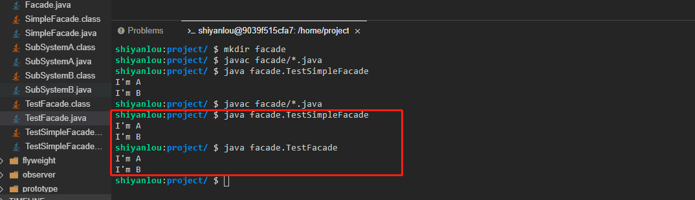

# 门面模式

2022年10月12日20:02:55

---

什么是门面模式


门面模式（Facade Pattern），又被称之为外观模式。门面模式提供了一个统一的接口，这个接口可以用来访问相同子系统或者不同子系统中的一群接口。门面模式使得系统更加容易调用，属于结构型模式。

#### 示例

下面就让我们以多个系统互相调用为例，看看如何实现门面模式（这里我们需要新建一个 `facade` 目录，相关类创建在 `facade` 目录下）。

- 首先新建一个子系统 `SubSystemA.java`，这里面只定义一个方法。

```java
package facade;

public class SubSystemA {
    public void doSomething(){
        System.out.println("I'm A");
    }
}
```

- 再新建一个子系统 `SubSystemB.java`，同样也只定义一个方法。

```java
package facade;

public class SubSystemB {
    public void doSomething(){
        System.out.println("I'm B");
    }
}
```

- 现在假设这两个系统的方法我们不想对所有人都开放，所以我们就新建一个门面类 `SimpleFacade.java` 来集成这两个子系统，并对外开放统一接口。

```java
package facade;

public class SimpleFacade {
    private SubSystemA systemA = new SubSystemA();
    private SubSystemB systemB = new SubSystemB();

    public void doA(){
        this.systemA.doSomething();
    }
    public void doB(){
        this.systemB.doSomething();
    }
}
```

- 最后我们新建一个测试类 `TestSimpleFacade.java` 来测试一下。

```java
package facade;

public class TestSimpleFacade {
    public static void main(String[] args) {
        SimpleFacade simpleFacade = new SimpleFacade();
        simpleFacade.doA();
        simpleFacade.doB();
    }
}
```

执行 `javac facade/*.java` 命令进行编译，然后再执行 `java facade.TestSimpleFacade` 命令运行测试类（大家一定要自己动手运行哦，只有自己实际去运行了才会更能体会其中的思想）。


可以看到，测试类中不会直接调用子系统，而是通过门面类来进行统一调用。通过这个例子，<u>**大家可能会有一种这也是设计模式的感慨**</u>，正如我们在实验一提到的，其实设计模式并不是新的高深的知识，只是一种经验总结而已。

上面的示例中门面类中提供的方法和子系统方法是一对一关系，现在假如我们一个流程里面需要很多个子系统的方法一起调用才能完成，那么这时候我们对上面的门面类进行稍加改造就可以了。

- 重新新建一个门面类 `Facade.java`。

```java
package facade;

public class Facade {
    private SubSystemA systemA = new SubSystemA();
    private SubSystemB systemB = new SubSystemB();

    public void doAB(){
        this.systemA.doSomething();
        this.systemB.doSomething();
    }
}
```

- 新建测试类 `TestFacade.java` 进行测试。

```java
package facade;

public class TestFacade {
    public static void main(String[] args) {
        Facade facade = new Facade();
        facade.doAB();
    }
}
```

再次执行 `javac facade/*.java` 命令进行编译，然后再执行 `java facade.TestSimpleFacade` 命令运行测试类（大家一定要自己动手运行哦，只有自己实际去运行了才会更能体会其中的思想）。



#### 门面模式适用场景

门面模式一般可以适用于以下两种场景：

1. 当各个子系统越来越复杂时，可以提供门面接口来统一调用。
2. 构建多层系统结构时，利用门面对象来作为每层的入口，这样可以简化分层间的接口调用。

#### 门面模式优点

1. 简化了调用过程，调用者无需深入了解子系统，以防给子系统带来风险。
2. 减少了系统间的依赖，松散了耦合度。
3. 将系统划分了层次，提高了安全性。
4. 通过门面类隐藏了各个子系统，使得子系统只对门面类可知，所以遵循了迪米特法则。

#### 门面模式缺点

1. 当增加子系统或者扩展子系统功能时，可能容易带来未知风险。
2. 当我们需要新增或者修改调用逻辑时，需要修改门面类，不符合开闭原则。

