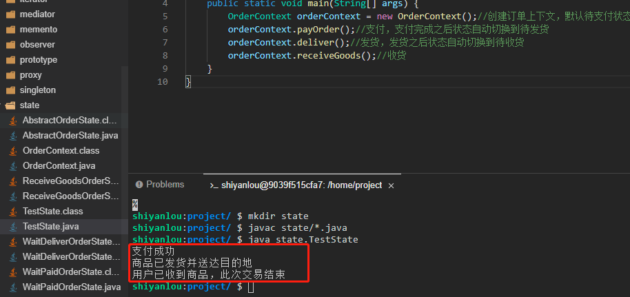

# 状态模式 State Machine Pattern

行为随对象状态改变而改变，把状态的判断逻辑转移到表示不同状态的一系列类中， 以把复杂的逻辑简单化

2022年10月12日20:26:35

---

实验介绍

本实验会介绍 GoF 23 种设计模式的第 22 种设计模式：状态模式。我们开发者对于状态应该是相当熟悉的，平常开发中总是离不开各种对象的状态，比如我们审核流程，就是一个状态不断流转的过程，订单流程也是一个状态不断流转的过程，而状态模式就是为了更好地解决我们**状态流转**过程中的业务处State Machine Pattern理逻辑。

#### 知识点

- 状态模式的定义
- 状态模式示例
- 状态模式和策略模式及责任链模式区别
- 状态模式适用场景
- 状态模式的优缺点
- 状态模式能解决什么问题

---

### 什么是状态模式

状态模式（State Pattern）又称为状态机模式（State Machine Pattern），是允许对象在内部状态发生改变的同时改变对象的行为，使得看起来像是修改了类一样，其核心就是给每一种状态绑定一种行为。

状态模式中的类的行为是由状态决定的，不同的状态有不同的行为。状态模式的意图是让一个对象在其内部改变时行为也随之一起改变。

#### 示例

下面我们就以订单状态的流转来实现一个状态模式。为了方便，我们假设订单只有三个状态：待支付，待收货，已收货（这里我们需要新建一个 `state` 目录，相关类创建在 `state` 目录下）。

- 首先建立一个抽象的订单状态类 `AbstractOrderState.java`，这个类需要定义所有状态的所有行为。

```java
package state;

public abstract class AbstractOrderState {
    protected OrderContext orderContext;//订单上下文，用来负责状态切换

    public AbstractOrderState(OrderContext orderContext) {
        this.orderContext = orderContext;
    }

    public abstract void payOrder();//待支付状态订单对应的行为：支付

    public abstract void deliver();//已支付状态订单对应的行为：发货

    public abstract void receiveGoods();//已收货状态订单对应的行为：收货
}
```

接下来我们需要为每一种状态建一个状态类，并继承抽象订单状态类，每个状态完成自己的行为之后会自动切换到下一个状态。

- 新建一个待支付状态类 `WaitPaidOrderState.java`，继承抽象订单状态类 AbstractOrderState。

```java
package state;

public class WaitPaidOrderState extends AbstractOrderState {
    public WaitPaidOrderState(OrderContext orderContext) {
        super(orderContext);
    }

    @Override
    public void payOrder() {//相当于待支付的状态绑定了支付行为
        System.out.println("支付成功");
        this.orderContext.setState(this.orderContext.waitDeliver);//切换状态
    }

    @Override
    public void deliver() {//不是待支付状态订单的行为
        System.out.println("对不起，请先付钱");
    }

    @Override
    public void receiveGoods() {//不是待支付状态订单的行为
        System.out.println("对不起，请先付钱");
    }
}    public abstract void payOrder();//待支付状态订单对应的行为：支付

    public abstract void deliver();//已支付状态订单对应的行为：发货

    public abstract void receiveGoods();//已收货状态订单对应的行为：收货
```

- 新建一个待发货状态类 `WaitDeliverOrderState.java`，继承抽象订单状态类 AbstractOrderState。

```java
package state;

public class WaitDeliverOrderState extends AbstractOrderState {
    public WaitDeliverOrderState(OrderContext orderContext) {
        super(orderContext);
    }

    @Override
    public void payOrder() {//不是待发货状态订单的行为
        System.out.println("你已经付过钱了");
    }

    @Override
    public void deliver() {
        System.out.println("商品已发货并送达目的地");
        this.orderContext.setState(this.orderContext.receiveGoods);//切换状态
    }

    @Override
    public void receiveGoods() {//不是待发货状态订单的行为
        System.out.println("请稍等，商品即将发货");
    }
}
```

- 新建一个待收货状态类 `ReceiveGoodsOrderState.java`，继承抽象订单状态类 AbstractOrderState。

```java
package state;

public class ReceiveGoodsOrderState extends AbstractOrderState{
    public ReceiveGoodsOrderState(OrderContext orderContext) {
        super(orderContext);
    }

    @Override
    public void payOrder() {//不是待收货状态订单的行为
        System.out.println("您已经付过钱啦，不要重复付钱哦");
    }

    @Override
    public void deliver() {//不是待收货状态订单的行为
        System.out.println("商品已发货并送达，请不要重复发货");
    }

    @Override
    public void receiveGoods() {
        System.out.println("用户已收到商品，此次交易结束");
    }
}
```

- 新建订单上下文类 `OrderContext.java`，用来管理订单状态。

```java
package state;

public class OrderContext {
    AbstractOrderState waitPaid;//待支付状态
    AbstractOrderState waitDeliver;//待发货状态
    AbstractOrderState receiveGoods;//待收货状态

    AbstractOrderState currState;//当前状态

    public OrderContext() {
        this.waitPaid = new WaitPaidOrderState(this);//初始化待支付状态订单
        this.waitDeliver = new WaitDeliverOrderState(this);//初始化待发货状态订单
        this.receiveGoods = new ReceiveGoodsOrderState(this);//初始化待收货状态订单
        currState = waitPaid;//当前状态，默认待支付
    }

    void setState(AbstractOrderState state){
        this.currState = state;
    }

    public void payOrder(){//支付
        currState.payOrder();
    }


    public void deliver(){//发货
        currState.deliver();
    }

    public void receiveGoods(){//收货
        currState.receiveGoods();
    }
}
```

可以看到，这个类里面也有点委派模式的影子，不同的行为委派给对应的状态订单对象进行处理而自己不做处理，只负责状态的切换及转发。

- 最后新建一个测试类 `TestState.java` 进行测试。

```java
package state;

public class TestState {
    public static void main(String[] args) {
        OrderContext orderContext = new OrderContext();//创建订单上下文，默认待支付状态
        orderContext.payOrder();//支付，支付完成之后状态自动切换到待发货
        orderContext.deliver();//发货，发货之后状态自动切换到待收货
        orderContext.receiveGoods();//收货
    }
}
```

执行 `javac state/*.java` 命令进行编译，然后再执行 `java state.TestState` 命令运行测试类（大家一定要自己动手运行哦，只有自己实际去运行了才会更能体会其中的思想）。



这样就完成了一个状态的全部流程，这就是状态模式，看起来就是一个状态一个状态往下走，似乎有点类似于责任链模式，然而这两种模式肯定是不等价的。

#### 状态模式、责任链模式和策略模式

##### 状态模式和责任链模式

状态模式、责任链模式都是一条链去处理，可以这么说在某种场景下这两种模式可以互相替换，但是这两种模式也是有本质区别的：

- 状态模式的下一个节点是各个状态对象已经了解的，而且状态的流转就是由内部进行流转，客户端无法决定。
- 责任链模式“链路”上的对象并不知道下一个节点处理人是谁，而是由客户端自行组装决定的。

##### 状态模式和策略模式

状态模式和策略模式都能用来消除大量的 if/else 场景，但是也有本质区别：

- 策略模式中各个策略之间是独立的，相互可以替换，任意选择其中一个策略就能满足需求，而且是由客户端自己做出选择。
- 而状态模式客户端只能选择初始节点，后续就会自动流转，各个状态是一个整体，不存在可以互相替换的状态。

#### 状态模式适用场景

当控制一个对象状态的条件表达式过于复杂的时候，就可以考虑使用状态模式，通过把状态的判断逻辑转移到表示不同状态的一系列类中，这样就可以把复杂的逻辑简单化，使得对象的行为依赖于它的状态，并且会随着状态的改变而同时改变行为。

#### 状态模式优点

1. 通过将每个状态设置为独立的对象，消除了代码中存在的大量 if/else 等判断分支，使得代码更加简洁，更容易维护。
2. 将不同的状态通过不同的类来表示，使得状态切换时相比较于用数字或者字符串来表示时更加直观，转换目的也更加明确。
3. 每个状态类的职责单一明确，符合单一职责原则。

#### 状态模式缺点

1. 状态过多会引起类膨胀。
2. 状态模式的结构与实现相对较为复杂，容易造成代码混乱。
3. 对于支持状态切换的状态类违反了开闭原则，因为一旦状态修改或者中间要新增状态，则需要修改对应的源代码，否则会出现状态切换错误。