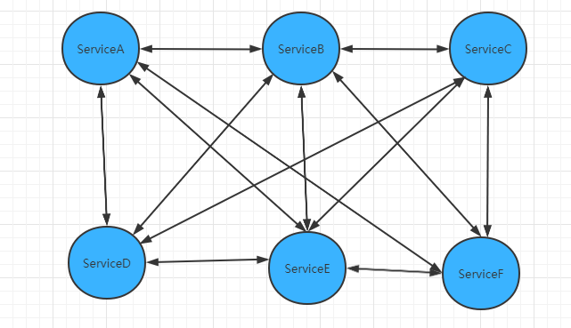
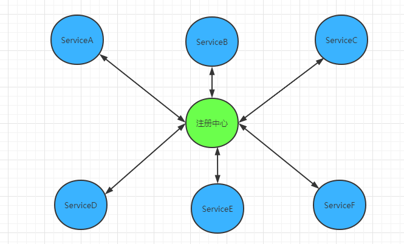
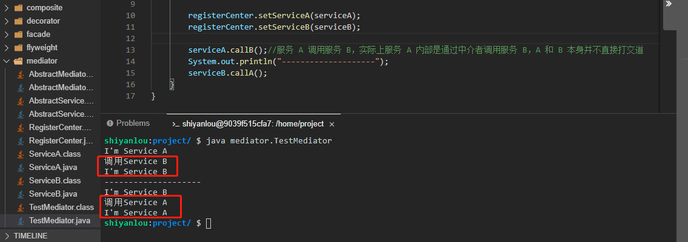

# 中介者模式

2022年10月12日21:45:48

---

实验介绍

本实验会介绍 GoF 23 种设计模式的第 17 种设计模式：中介者模式。上一个实验我们介绍桥接模式的时候知道，桥接模式就是通过一个桥接者来实现抽象和具体之间的联系，而中介者也是通过一个中间对象来实现各个对象之间的联系。

#### 知识点

- 中介者模式的定义
- 中介者模式示例
- 中介者模式和桥接模式的区别
- 中介者模式适用场景
- 中介者模式的优缺点
- 中介者模式能解决什么问题

什么是中介者模式

中介者模式（Mediator Pattern）又称为调节者模式或者调停者模式，是用来降低多个对象和类之间的通信复杂性。中介者模式中用一个中介对象封装一系列的对象交互，从而使各个对象不需要显示的相互作用，达到松耦合的目的。这样如果某些对象之间的作用发生改变时，不会立刻影响其它的一些对象之间的作用，保证了对象之间的相互作用可以独立的变化。

中介者模式属于行为型模式，其核心思想是通过中介者对象解耦各层次对象的直接耦合，层次对象的对外依赖通信全部交由中介者转发。

#### 为什么需要中介者模式

我们以现在最流行的微服务为例，微服务刚开始诞生的时候是下面这个现象：



可以看到，各个微服务之间你调用我、我调用你，好不热闹，整个关系就是一个混乱的网状，非常难以管理。所以就发明了注册中心来统一管理微服务，有了注册中心之后，就会变成下图这样：



整个微服务之间的关系都通过注册中心来沟通，这样就避免了各个微服务之间互相依赖的乱像，这里的注册中心就充当了中介者的角色。

#### 示例

以上面的注册中心为例来实现一个中介者模式（这里我们需要新建一个 `mediator` 目录，相关类创建在 `mediator` 目录下）。

- 首先新建一个抽象服务类 `AbstractService.java`，这里也并非一定要用抽象类，只是为了后面方便扩展。我们一般选择面向抽象编程，因为每个服务都需要依赖中介者，所以直接把中介者写在抽象服务类里面。

```java
package mediator;

public abstract class AbstractService {
    protected AbstractMediator mediator;//这个就是中介者对象，后面会建立这个对象

    public AbstractService(AbstractMediator mediator) {
        this.mediator = mediator;
    }

    public abstract void doSomething();
}
```

- 新建一个具体服务 `ServiceA.java` 继承抽象服务类 AbstractService。

```java
package mediator;

public class ServiceA extends AbstractService {

    public ServiceA(AbstractMediator mediator) {
        super(mediator);
    }

    @Override
    public void doSomething() {//这个方法是服务 A 自己干的活
        System.out.println("I'm Service A");
    }

    public void callB(){//服务A中需要调用服务 B 的方法
        this.doSomething();//做点自己的事情先，这个可以不用，实际开发中看需求
        System.out.println("调用Service B");
        mediator.callServiceB();//通过中介者调用服务B的方法
    }
}
```

- 再新建一个具体服务 `ServiceB.java` 同样继承抽象服务类 AbstractService。

```java
package mediator;

public class ServiceB extends AbstractService {
    public ServiceB(AbstractMediator mediator) {
        super(mediator);
    }

    @Override
    public void doSomething() {//这个方法是服务 B 自己干的活
        System.out.println("I'm Service B");
    }

    public void callA(){//服务B中需要调用服务A的方法
        this.doSomething();
        System.out.println("调用Service A");//做点自己的事情先，这个可以不用，实际开发中看需求
        mediator.callServiceA();//通过中介者调用服务 A 的方法
    }
}
```

- 同样的，中介者对象我们也面向抽象编程，新建抽象中介者对象 `AbstractMediator.java`，中介者对象需要持有所有具体微服务，我们这里因为只有两个，所以就持有了 ServiceA 和 ServiceB。

```java
package mediator;

public abstract class AbstractMediator {
    protected AbstractService serviceA;//持有服务 A
    protected AbstractService serviceB;//持有服务 B

    public void setServiceA(AbstractService serviceA) {
        this.serviceA = serviceA;
    }

    public void setServiceB(AbstractService serviceB) {
        this.serviceB = serviceB;
    }

    /**
    * 下面这两个方法也一样，一般每个微服务都需要对应一个方法
    **/
    public abstract void callServiceA();//调用服务 A 方法

    public abstract void callServiceB();//调用服务 B 方法
}
```

- 新建一个具体的中介者对象注册中心类 `RegisterCenter.java`。

```java
package mediator;

public class RegisterCenter extends AbstractMediator{
    @Override
    public void callServiceA() {//调用服务 A
        super.serviceA.doSomething();

    }

    @Override
    public void callServiceB() {//调用服务 B
        super.serviceB.doSomething();
    }
}
```

- 新建测试类 `TestMediator.java` 进行测试。

```java
package mediator;

public class TestMediator {
    public static void main(String[] args) {
        AbstractMediator registerCenter = new RegisterCenter();//构建一个中介者对象
        //将每个对象初始化进中介者对象
        ServiceA serviceA = new ServiceA(registerCenter);
        ServiceB serviceB = new ServiceB(registerCenter);

        registerCenter.setServiceA(serviceA);
        registerCenter.setServiceB(serviceB);

        serviceA.callB();//服务 A 调用服务 B，实际上服务 A 内部是通过中介者调用服务 B，A 和 B 本身并不直接打交道
        System.out.println("--------------------");
        serviceB.callA();
    }
}
```

再次执行 `javac mediator/*.java` 命令进行编译，然后再执行 `java mediator.TestMediator` 命令运行测试类（大家一定要自己动手运行哦，只有自己实际去运行了才会更能体会其中的思想）。



可以看到，在这个例子中我们实现了 ServiceA 和 ServiceB 的互相调用，但是相互都不持有对方的引用，而是通过一个中介者对象来统一管理，如果后续需要新增其它服务的调用，那么只需要改变中介者对象就可以了。

#### 中介者模式和桥接模式的区别

上一个实验我们分析了桥接模式，看起来和这里的中介者模式有点相似的感觉。其实这两种设计模式的思想是一样的，只是这两种模式的侧重点和应用场景不一致。

桥接模式侧重的是将抽象和具体进行解耦，一般就是特指 2 个维度之间的解耦：一个抽象，一个具体。而中介者模式侧重的是将多个相同类型对象之间的关联关系进行统一管理。

#### 中介者模式适用场景

中介者模式在我们日常生活中非常常见，比如租房中介、买房中介等，还有像我们的群聊、聊天室等等都有中介者的身影。中介者模式主要适用于以下场景：

1. 系统中的对象存在非常复杂的引用关系，而且相互依赖，导致依赖关系非常复杂时。
2. 当我们想要使用多个类之间的行为时，为了避免过多的使用继承，可以考虑使用中介者来实现。

#### 中介者模式优点

1. 减少了类之间的相互依赖性，将多对多依赖转化成为了一对多依赖，降低了类间的耦合。
2. 使用了中介者模式之后，各个类都各司其职，符合了迪米特法则。

#### 中介者模式缺点

中介者模式各个对象之间也称之为同事对象，而当我们的同事角色非常多的时候，中介者对象需要维护非常多的同事角色对象，会使得中介者变得非常庞大，导致难以维护。

