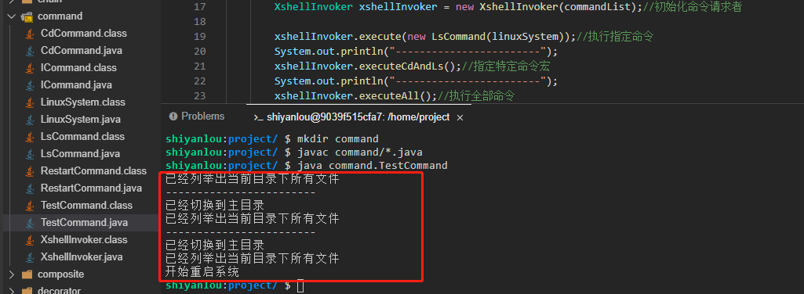

# 命令模式

发送命令与执行命令的解耦

2022年10月12日23:58:47

---

实验介绍

---

本实验会介绍 GoF 23 种设计模式的第 19 种设计模式：命令模式。命令模式主要是要来解耦发送命令方和接收命令方。

知识点
命令模式的定义
命令模式示例
命令模式、桥接模式和中介者模式对比
命令模式适用场景
命令模式的优缺点
命令模式能解决什么问题

---

什么是命令模式

命令模式（Command Pattern）是对命令的封装，每一个命令都是一个操作。首先请求的一方发出请求要求执行一个操作，然后接收的一方收到请求，并执行操作。

命令模式属于行为型模式，解耦了请求方和接收方，请求方只需要发送命令而不需要关心命令是如何被接收的、不关心命令怎么操作、也不关心命令是否被执行等。

#### 为什么需要命令模式

在我们的软件开发系统中，行为请求者和真正的执行者通常都是一种紧耦合关系，但是当我们需要修改行为时，如需要撤销或者重做时，只能修改请求者的源代码。而命令模式会通过在行为请求者和执行者之间引入一个抽象接口来将请求者和执行者进行解耦，这样如果需要修改行为时，只需要增加对应行为的命令就可以了，完全不需要修改请求者的源代码。

#### 示例

命令模式比较典型的场景就是 DOS 命令、Shell 命令，像大家在实验楼学习时使用的就是一种 Shell 命令，我们通过控制台发送命令，然后控制台将命令交给真正的执行者，控制台在这里的作用就是充当了一个中间联系人。

下面就以发送 Shell 命令为例，来完成一个命令模式（这里我们需要新建一个 `command` 目录，相关类创建在 `command` 目录下）。

- 首先新建一个 Linux 操作系统类 `LinuxSystem.java`，这个类就是真正执行命令者。

```java
package command;
public class LinuxSystem {
    public void cd(){
        System.out.println("已经切换到主目录");
    }

    public void ls(){
        System.out.println("已经列举出当前目录下所有文件");
    }

    public void restart(){
        System.out.println("开始重启系统");
    }
}
```

- 接下来新建一个命令接口 `ICommand.java`，定义了一个执行命令的方法，当然，这里也可以使用抽象类。

```java
package command;

public interface ICommand {
    void execute();//执行命令
}
```

- 在这里我们只用三个命令来举例，所以需要分别为这三个命令都新建一个类，首先新建一个 cd 命令类 `CdCommand.java` 实现命令接口 ICommand。

```java
package command;

public class CdCommand implements ICommand {
    private LinuxSystem linuxSystem;//持有真正的命令执行者 Linux 操作系统

    public CdCommand(LinuxSystem linuxSystem) {
        this.linuxSystem = linuxSystem;
    }

    @Override
    public void execute() {
        linuxSystem.cd();//调用真正的执行者来执行命令
    }
}
```

- 继续建立一个 ls 命令类 `LsCommand.java` 实现命令接口 ICommand。

```java
package command;

public class LsCommand implements ICommand {
    private LinuxSystem linuxSystem;//持有真正的命令执行者 Linux 操作系统

    public LsCommand(LinuxSystem linuxSystem) {
        this.linuxSystem = linuxSystem;
    }

    @Override
    public void execute() {
        linuxSystem.ls();//调用真正的执行者来执行命令
    }
}
```

- 继续建立一个 restart 命令类 `RestartCommand.java` 实现命令接口 ICommand。

```java
package command;

public class RestartCommand implements ICommand {
    private LinuxSystem linuxSystem;//持有真正的命令执行者 Linux 操作系统

    public RestartCommand(LinuxSystem linuxSystem) {
        this.linuxSystem = linuxSystem;
    }

    @Override
    public void execute() {
        this.linuxSystem.restart();//调用真正的执行者来执行命令
    }
}
```

上面的 LinuxSystem 属于命令的具体执行者，而另外的命令接口和具体命令类属于具体命令类，所以接下来我们还需要一个命令的请求者，用来接收客户端的命令，并执行命令。

- 新建一个命令的请求者类 `XshellInvoker.java`。

```java
package command;

import java.util.ArrayList;
import java.util.List;

public class XshellInvoker {
    private List<ICommand> commandList = new ArrayList<>();//封装了命令的 list 集合

    public XshellInvoker(List<ICommand> commandList) {
        this.commandList = commandList;
    } 

    /**
     * 执行指定命令
     * @param command
     */
    public void execute(ICommand command){
        command.execute();
    }

    /**
     * 执行命令宏,即执行特定的几个命令组合
     */
    public void executeCdAndLs(){
        for (ICommand command : commandList){
            //只执行特定的命令宏
            if (command instanceof LsCommand || command instanceof CdCommand){
                command.execute();
            }
        }
    }

    public void executeAll(){//执行全部命令
        for (ICommand command : commandList){//通过循环的方式执行每一个命令
            command.execute();
        }
    }
}
```

- 新建测试类 `TestCommand.java` 进行测试。

```java
package command;

import java.util.ArrayList;
import java.util.List;

public class TestCommand {

    public static void main(String[] args) {
        LinuxSystem linuxSystem = new LinuxSystem();//创建命令真正的执行者

        //创建三个命令
        List<ICommand> commandList = new ArrayList<>();
        commandList.add(new CdCommand(linuxSystem));
        commandList.add(new LsCommand(linuxSystem));
        commandList.add(new RestartCommand(linuxSystem));

        XshellInvoker xshellInvoker = new XshellInvoker(commandList);//初始化命令请求者

        xshellInvoker.execute(new LsCommand(linuxSystem));//执行指定命令
        System.out.println("------------------------");
        xshellInvoker.executeCdAndLs();//指定特定命令宏
        System.out.println("------------------------");
        xshellInvoker.executeAll();//执行全部命令
    }
}
```

再次执行 `javac command/*.java` 命令进行编译，然后再执行 `java command.TestCommand` 命令运行测试类（大家一定要自己动手运行哦，只有自己实际去运行了才会更能体会其中的思想）。



上面就是一个命令模式的标准写法。可以看到，因为控制器已经与命令执行者实现了解耦，后面如果想要继续扩展新的命令，那么再增加一个命令类就行了。

#### 桥接模式、中介者模式、命令模式

这三种模式我特意放在一起讲解，因为这三种模式有一个共性，都是通过一个中间者来实现解耦，初学者有时候会很容易误解：

- 桥接模式：注重的是两个维度之间的解耦，一个抽象维度，一个实现维度。
- 中介者模式：注重的是同事对象之间的解耦，各个同事对象是属于同一种类型的平级对象。
- 命令模式：其侧重的是发送方和请求方，也就是必须要有发送方和请求方才能构成一个完整的整体。像桥接如果缺少某一方只是缺少了功能，但是依然可以正常使用；而中介者就更不用说了，同事多一个少一个在技术上完全不影响。

#### 命令模式适用场景

1. 现实语义中存在具备“命令”的操作，如：dos 命令，shell 命令。
2. 请求调用者和请求接收者需要解耦，使得调用者和接收者不直接互相调用。

#### 命令模式优点

1. 通过引入中间件（抽象接口）解耦了请求与实现。
2. 扩展方便，增加新命令直接增加一个对象即可。
3. 可以支持命令的组合操作，比较灵活方便。

#### 命令模式缺点

1. 如果命令过多的时候，会多出非常庞大的对象。
2. 命令的接受者如果需要新增命令或者命令组合则需要修改源码，不符合开闭原则。