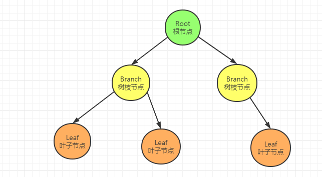
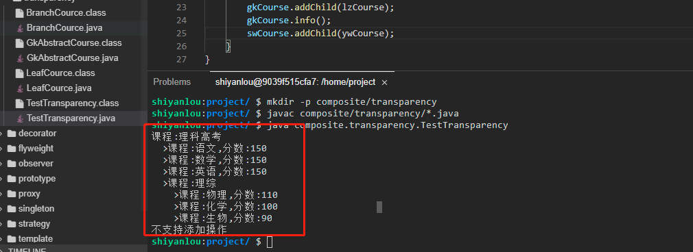
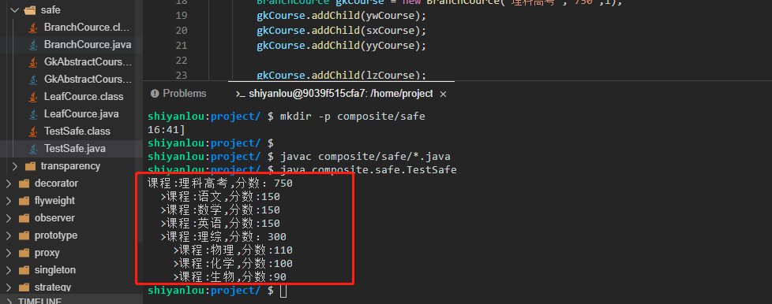

# 组合模式

聚合对象不具备相同生命周期，而组合的对象具有相同的生命周期。

2022年10月13日10:11:23

----

本实验会介绍 GoF 23 种设计模式的第 14 种设计模式：组合模式。在编码原则中，有一条是：多用组合，少用继承。当然这里的组合和我们今天要讲的组合模式并不等价，这里的组合其实就是一种聚合，组合和聚合有本质的区别。

#### 知识点

- 组合和聚合
- 组合模式的定义
- 组合模式透明写法和安全写法
- 组合模式适用场景
- 组合模式的优缺点
- 组合模式能解决什么问题

### 组合和聚合

“人在一起叫团伙，心在一起叫团队”。用这句话来诠释组合与聚合的区别是比较恰当的。聚合就是说各个对象聚合在一起工作，但是我没有你也行，我照样可以正常运行。但是组合呢，关系就比较密切，组合中的各个对象之间组成了一个整体，缺少了某一个对象就不能正常运行或者说功能会有很大缺陷。

换言之：聚合对象不具备相同生命周期，而组合的对象具有相同的生命周期。

举个例子：比如电脑和 U 盘就是聚合（离开之后彼此都能正常使用），而电脑显示器和主机就是组合（没了主机或者没了显示器电脑都是不完整的）。

### 什么是组合模式

组合模式（Composite Pattern）也称之为整体-部分（Part-Whole）模式。组合模式的核心是通过将单个对象（叶子节点）和组合对象（树枝节点）用相同的接口进行表示，使得单个对象和组合对象的使用具有一致性，组合模式属于结构型模式。

组合模式一般用来描述整体与部分的关系，它将对象组织到树形结构中，最顶层的节点称为根节点，根节点下面可以包含树枝节点和叶子节点，树枝节点下面又可以包含树枝节点和叶子节点如下图所示：



组合模式有两种写法，分别是**透明模式**和**安全模式**。下面我们会分别示范这两种写法，并对其进行对比分析。


### 透明模式示例

下面我们以高考的科目为例，来看看组合模式中的透明模式该如何实现（这里我们需要新建 `composite/transparency` 目录，相关类创建在 `composite/transparency` 目录下）。

- 首先新建一个高考科目的抽象类 `GkAbstractCourse.java`，里面提供了三个方法。

```java
package composite.transparency;

public abstract class GkAbstractCourse {
    public void addChild(GkAbstractCourse course){//添加子节点
        System.out.println("不支持添加操作");
    }

    public String getName() throws Exception {//获取当前节点名称
        throw new Exception("不支持获取名称");
    }

    public void info() throws Exception{//获取高考科目信息
        throw new Exception("不支持查询信息操作");
    }
}
```

这个类是抽象类，但是在这里并没有将这些方法定义为抽象方法，而是默认都抛出异常。这么做的原因是假如定义为抽象方法，那么所有的子类都必须重写父类方法。但是这种通过抛异常的方式，如果子类需要用到的功能就重写覆盖父类方法即可，不需要用到的方法直接无需重写。

- 新增一个叶子节点，普通高考科目类 `LeafCource.java` 来继承 GkAbstractCourse 类，这个类就是最底层，无法包含其它科目，比如语文，正因为其无法包含其它课程所以不需要重写 addChild 方法。

```java
package composite.transparency;

public class LeafCource extends GkAbstractCourse {
    private String name;//课程名称
    private String score;//课程分数

    public LeafCource(String name, String score) {
        this.name = name;
        this.score = score;
    }

    @Override
    public String getName(){
        return this.name;
    }

    @Override
    public void info() {
        System.out.println("课程:" + this.name + ",分数:" + score);
    }
}
```

- 接下来新建一个树枝类 `BranchCource.java`，当前类可以包含其它科目的类，比如理综可以包括物理、化学和生物，这个类将父类的 3 个方法全部进行了重写。

```java
package composite.transparency;

import java.util.ArrayList;
import java.util.List;

public class BranchCource extends GkAbstractCourse{
    private List<GkAbstractCourse> courseList = new ArrayList<>();
    private String name;//科目名称
    private int level;//层级

    public BranchCource(String name, int level) {
        this.name = name;
        this.level = level;
    }

    @Override
    public void addChild(GkAbstractCourse course) {//添加子课程
        courseList.add(course);
    }

    @Override
    public String getName(){//获取课程名称
        return this.name;
    }

    @Override
    public void info() throws Exception {//打印课程信息
       System.out.println("课程:" + this.name);
       for (GkAbstractCourse course : courseList){
           for (int i=0;i<level;i++){//根据层级关系打印空格，这样打印结果可以明显看出层级关系
               System.out.print("  ");
           }
           System.out.print(">");
           course.info();
       }
    }
}
```

- 最后我们新建一个测试类 `TestTransparency.java` 来测试一下。

```java
package composite.transparency;

public class TestTransparency {
    public static void main(String[] args) throws Exception {
            GkAbstractCourse ywCourse = new LeafCource("语文","150");
            GkAbstractCourse sxCourse = new LeafCource("数学","150");
            GkAbstractCourse yyCourse = new LeafCource("英语","150");

            GkAbstractCourse wlCourse = new LeafCource("物理","110");
            GkAbstractCourse hxCourse = new LeafCource("化学","100");
            GkAbstractCourse swCourse = new LeafCource("生物","90");

        GkAbstractCourse lzCourse = new BranchCource("理综",2);
        lzCourse.addChild(wlCourse);
        lzCourse.addChild(hxCourse);
        lzCourse.addChild(swCourse);

        GkAbstractCourse gkCourse = new BranchCource("理科高考",1);
        gkCourse.addChild(ywCourse);
        gkCourse.addChild(sxCourse);
        gkCourse.addChild(yyCourse);

        gkCourse.addChild(lzCourse);
        gkCourse.info();
        swCourse.addChild(ywCourse);//这里会报错，因为生物已经是叶子节点，无法继续添加子节点
    }
}
```

执行 `javac composite/transparency/*.java` 命令进行编译，然后再执行 `java composite.transparency.TestTransparency` 命令运行测试类（大家一定要自己动手运行哦，只有自己实际去运行了才会更能体会其中的思想）。



上面就是一个透明模式的写法，之所以称之为透明模式就是因为父类将所有方法都定义好了，对各个子类完全透明。这样做的好处是客户端无需分辨当前对象是属于树枝节点还是叶子节点，因为它们具备了完全一致的接口，不过缺点就是叶子节点得到了一些不属于它的方法，比如上面的 addChild 方法，这个很明显违背了接口隔离性原则。

而组合模式只是规定了系统各个层次的最基础的一致性行为，而把组合（树节点）本身的方法（如树枝节点管理子类的 addChild 等方法）放到自身当中。接下来我们再看看安全模式应该如何实现。


### 安全模式示例


这里我们新建一个 `composite/safe` 目录，相关类创建在 `composite/safe` 目录下。

- 首先还是新建一个顶层的抽象课程类 `GkAbstractCourse.java`，不过这次只定义了一个通用的查询课程信息的方法，而且是抽象方法，同时又多具备了课程名字和课程分数两个属性。

```java
package composite.safe;

public abstract class GkAbstractCourse {
    protected String name;//课程名称
    protected String score;//课程分数

    public GkAbstractCourse(String name, String score) {
        this.name = name;
        this.score = score;
    }

    public abstract void info();//获取课程信息
}
```

- 新增一个叶子节点，普通高考科目类 `LeafCource.java` 来继承 GkAbstractCourse 类，这个类就是最底层，无法包含其它科目，比如语文，所以它没什么其它特殊的自定义方法。

```java
package composite.safe;

public class LeafCource extends GkAbstractCourse {
    public LeafCource(String name, String score) {
        super(name,score);
    }

    @Override
    public void info() {//获取课程信息
        System.out.println("课程:" + this.name + ",分数:" + this.score);
    }
}
```

- 接下来新建一个树枝类 `BranchCource.java`，当前类可以包含其它科目的类，比如理综可以包括物理、化学和生物，所以这个类额外自定义了一个层级属性和一个添加子课程 addChild 方法。

```java
package composite.safe;

import java.util.ArrayList;
import java.util.List;

public class BranchCource extends GkAbstractCourse{
    private List<GkAbstractCourse> courseList = new ArrayList<>();//子课程
    private int level;//层级

    public BranchCource(String name, String score, int level) {
        super(name,score);
        this.level = level;
    }

    public void addChild(GkAbstractCourse course) {//添加子课程
        courseList.add(course);
    }

    @Override
    public void info() {//打印课程信息
       System.out.println("课程:" + this.name + ",分数：" + this.score);
       for (GkAbstractCourse course : courseList){
           for (int i=0;i<level;i++){//根据层级关系打印空格，这样打印结果可以明显看出层级关系
               System.out.print("  ");
           }
           System.out.print(">");
           course.info();
       }
    }
}
```

- 最后我们新建一个测试类 `TestSafe.java` 来测试一下。

```java
package composite.safe;

public class TestSafe {
    public static void main(String[] args) throws Exception {
        LeafCource ywCourse = new LeafCource("语文","150");
        LeafCource sxCourse = new LeafCource("数学","150");
        LeafCource yyCourse = new LeafCource("英语","150");

        LeafCource wlCourse = new LeafCource("物理","110");
        LeafCource hxCourse = new LeafCource("化学","100");
        LeafCource swCourse = new LeafCource("生物","90");

        BranchCource lzCourse = new BranchCource("理综","300",2);
        lzCourse.addChild(wlCourse);
        lzCourse.addChild(hxCourse);
        lzCourse.addChild(swCourse);

        BranchCource gkCourse = new BranchCource("理科高考","750",1);
        gkCourse.addChild(ywCourse);
        gkCourse.addChild(sxCourse);
        gkCourse.addChild(yyCourse);

        gkCourse.addChild(lzCourse);
        gkCourse.info();
    }
}
```

执行 `javac composite/safe/*.java` 命令进行编译，然后再执行 `java composite.safe.TestSafe` 命令运行测试类（大家一定要自己动手运行哦，只有自己实际去运行了才会更能体会其中的思想）。



这里和透明方式不一样，叶子节点不具备 addChild 功能，所以无法调用，而上面的示例中时可以被调用，但是调用之后显示不支持，这就是这两种写法最大的区别。

#### 组合模式适用场景

组合模式一般应用在有层级关系的场景，最经典的就是树形菜单、文件和文件夹的管理等。

#### 组合模式优点

组合模式清楚的定义了分层次的复杂对象，让客户端可以忽略层次的差异，方便对整个层次进行动态控制。

#### 组合模式缺点

组合模式的叶子和树枝的声明是实现类而不是接口，违反了依赖倒置原则，而且组合模式会使设计更加抽象不好理解。


下一步