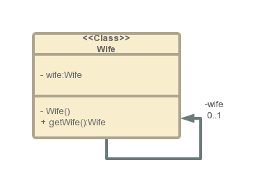

# 单例模式

2022年10月13日23:38:19

---

### 什么是单例模式


单例模式（Singleton Pattern），顾名思义，就是被单例的对象只能有一个实例存在。单例模式的实现方式是，一个类能返回对象的一个引用（永远是同一个）和一个获得该唯一实例的方法（必须是静态方法）。通过单例模式，我们可以保证系统中只有一个实例，从而在某些特定的场合下达到节约或者控制系统资源的目的。



Java 设计模式系列课程，到这节课就是最后一节啦。相信大家一路学下来还是收获颇丰的，现在回想一下学过的那些设计模式吧，我相信你很快就会有类似于这样的联想片段：

> - 工厂模式：女娲娘娘...

- 抽象工厂模式：厨房、食物、吃货...
- 适配器模式：港版 iphone6、充电头、转接头...
- 装饰者模式：好多各式各样的女朋友...
- 观察者模式：视频网站、美剧...

发现没有？通过这样的记忆方式，把知识点都串联起来了，你会记得更牢固更清楚，这也正是我们用心良苦的地方。（不谦虚了...）所以希望大家好好学习、天天向上！

虽然编故事很累，但为了造福广大童鞋们，故事还得继续。Let's go!

本次实验我们将介绍单例模式的相关知识。

#### 知识点

- 单例模式定义
- 单例模式类图
- 单例模式示例
- 单例模式应用

**1.饿汉模式**

最常见、最简单的单例模式写法之一。顾名思义，“饿汉模式” 就是很 “饥渴”，所以一上来就需要给它新建一个实例。但这种方法有一个明显的缺点，那就是不管有没有调用过获得实例的方法（本例中为 `getWife()` ），每次都会新建一个实例。

```java
// 饿汉模式
public class Wife {

    // 一开始就新建一个实例
    private static final Wife wife = new Wife();

    // 默认构造方法
    private Wife() {}

    // 获得实例的方法
    public static Wife getWife() {
        return wife;
    }
}
```

------

**2.懒汉模式**

最常见、最简单的单例模式之二，跟 “饿汉模式” 是 “好基友”。再次顾名思义，“懒汉模式” 就是它很懒，一开始不新建实例，只有当它需要使用的时候，会先判断实例是否为空，如果为空才会新建一个实例来使用。

```java
// 懒汉模式
public class Wife {

    //一开始没有新建实例
    private static Wife wife;

    private Wife() { }

    // 需要时再新建
    public static Wife getWife() {
        if (wife == null) {
            wife = new Wife();
        }
        return wife;
    }
}
```

------

**3.线程安全的懒汉模式**

是不是感觉很简单？但是上面的懒汉模式却存在一个严重的问题。那就是如果有多个线程并行调用 `getWife()` 方法的时候，还是会创建多个实例，单例模式就失效了。

Bug 来了，改改改！

简单，我们在基本的懒汉模式上，把它设为线程同步（`synchronized`）就好了。`synchronized` 的作用就是保证在同一时刻最多只有一个线程运行，这样就避免了多线程带来的问题。关于 `synchronized` 关键字，你可以 [点击这里](http://www.cnblogs.com/gnagwang/archive/2011/02/27/1966606.html) 了解更多。

```java
// 懒汉模式（线程安全）
public class Wife {
    private static Wife wife;

    private Wife() { }

    // 添加了 synchronized 关键字
    public static synchronized Wife getWife() {
        if (wife == null) {
            wife = new Wife();
        }
        return wife;
    }
}
```

------

**4.双重检验锁（double check）**

线程安全的懒汉模式解决了多线程的问题，看起来完美了。但是它的效率不高，每次调用获得实例的方法 `getWife()` 时都要进行同步，但是多数情况下并不需要同步操作（例如我的 wife 实例并不为空可以直接使用的时候，就不需要给 `getWife()` 加同步方法，直接返回 wife 实例就可以了）。所以只需要在第一次新建实例对象的时候，使用同步方法。

不怕，程序猿总是有办法的。于是，在前面的基础上，又有了 “双重检验锁” 的方法。

```java
// 双重锁的 getWife() 方法
public static Wife getWife() {

    // 第一个检验锁，如果不为空直接返回实例对象，为空才进入下一步
    if (wife == null) {
        synchronized (Wife.class) {

            //第二个检验锁，因为可能有多个线程进入到 if 语句内
            if (wife == null) {
                wife = new Wife();
            }
        }
    }
    return wife ;
}
```

你以为这终于圆满了？NO...Too young, too naive! 主要问题在于 `wife = new Wife()` 这句代码，因为在 JVM（Java 虚拟机）执行这句代码的时候，要做好几件事情，而 JVM 为了优化代码，有可能造成做这几件事情的执行顺序是不固定的，从而造成错误。（为了不把问题更加复杂化，这里没有深入讲解在 JVM 中具体是怎么回事，有兴趣的同学可以点击 [这里](http://www.cnblogs.com/techyc/p/3529983.html) 自行了解下。）

这个时候，我们需要给实例加一个 `volatile` 关键字，它的作用就是防止编译器自行优化代码。最后，我们的“双重检验锁”版本终于出炉了。

```java
// 双重检验锁
public class Wife {
    private volatile static Wife wife;

    private Wife() { }

    public static Wife getWife() {
        if (wife == null) {
            synchronized(Wife.class) {
                if (wife == null) {
                    wife = new Wife();
                }
            }
        }

        return wife;
    }
}
```

------

**5.静态内部类**

上面的方法，修修补补，实在是太复杂了... 而且 `volatile` 关键字在某些老版本的 JDK 中无法正常工作。咱们得换一种方法，即 “静态内部类”。这种方式，利用了 JVM 自身的机制来保证线程安全，因为 `WifeHolder` 类是私有的，除了 `getWife()` 之外没有其它方式可以访问实例对象，而且只有在调用 `getWife()` 时才会去真正创建实例对象。（这里类似于 “懒汉模式”）

```java
// 静态内部类
public class Wife {
    private static class WifeHolder {
        private static final Wife wife = new Wife();
    }

    private Wife() { }

    public static Wife getWife() {
        return WifeHolder.wife;
    }
}
```

------

**6.枚举**

还不懂什么是枚举的，先 [点这里](http://www.cnblogs.com/hyl8218/p/5088287.html) 补补课。

如下，代码简直是简单得不能再简单了。我们可以通过 `Wife.INSTANCE` 来访问实例对象，这比 `getWife()` 要简单得多，而且创建枚举默认就是线程安全的，还可以防止反序列化带来的问题。这么优（niu）雅（bi）的方法，来自于新版 [《Effective Java》](http://book.douban.com/subject/3360807/) 这本书。这种方式虽然不常用，但是最为推荐。

```java
// 枚举
public enum Wife {
    INSTANCE;
    
    // 自定义的其他任意方法
    public void whateverMethod() { }
}
```

> ordinal 可以获取枚举变量的值

当你只需要一个实例对象的时候，就可以考虑使用单例模式。比如在资源共享的情况下，避免由于多个资源操作导致的性能或损耗等就可以使用单例模式。