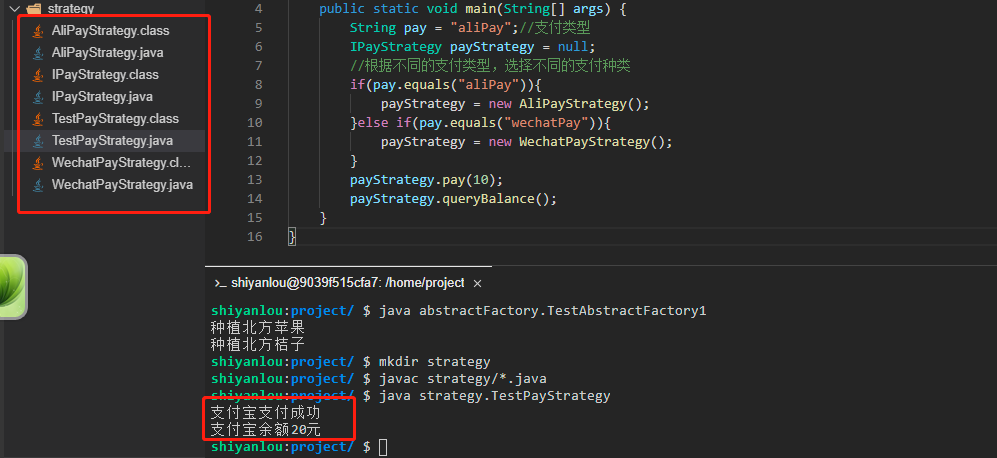
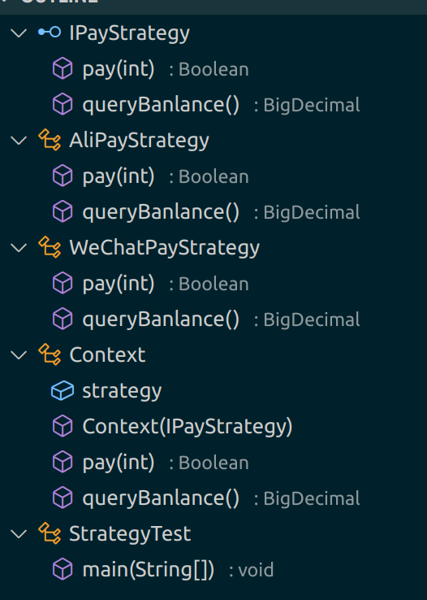

# 策略模式

2022年10月09日00:24:07

2022年10月18日20:23:48


---

### 知识点

策略模式定义
策略模式的两种常见写法示例
策略模式适用场景
策略模式的优缺点
策略模式能解决什么问题


---

#### 什么是策略模式

策略模式（Strategy Pattern）是指定义了不同的算法逻辑，并将不同的算法分别封装起来，让它们之间可以互相替换，使用者可以使用任意一种算法。策略模式可以让算法逻辑发生变化时不会影响到使用算法逻辑的用户，**一般常用来改造代码中大量的 if 逻辑**。

#### 示例

日常生活中，我们经常使用支付宝、微信、京东支付、云闪付等等支付方式，这些支付方式就相当于策略模式中的算法，也就是说我们任意使用一种支付模式都不会影响最终的结果。接下来我们就以支付为例来看看怎么使用策略模式（这里我们需要新建一个 `strategy` 目录，相关类创建在 `strategy` 目录下）。

- 首先创建一个顶层的策略接口 `IPayStrategy.java`，接口中定义了两个方法：一个支付，一个查询余额。

```java
package strategy;

import java.math.BigDecimal;

public interface IPayStrategy {
    boolean pay(int money);//支付
    BigDecimal queryBalance();//查询余额
}
```

- 接下来定义一个支付宝支付类 `AliPayStrategy.java` 来实现商品接口。

```java
package strategy;

import java.math.BigDecimal;

public class AliPayStrategy implements IPayStrategy {
    @Override
    public boolean pay(int money) {
        System.out.println("支付宝支付成功");
        return true;
    }

    @Override
    public BigDecimal queryBalance() {
        System.out.println("支付宝余额20元");
        return new BigDecimal("20");
    }
}
```

- 然后再创建一个微信支付类 `WechatPayStrategy.java`。

```java
package strategy;

import java.math.BigDecimal;

public class WechatPayStrategy implements IPayStrategy {
    @Override
    public boolean pay(int money) {
        System.out.println("微信支付成功");
        return true;
    }

    @Override
    public BigDecimal queryBalance() {
        System.out.println("微信余额10元");
        return new BigDecimal(10);
    }
}
```

- 最后让我们新建一个测试类 `TestPayStrategy.java` 来看看怎么运行结果。

```java
package strategy;

public class TestPayStrategy {
    public static void main(String[] args) {
        String pay = "aliPay";//支付类型
        IPayStrategy payStrategy = null;
        //根据不同的支付类型，选择不同的支付种类
        if(pay.equals("aliPay")){
            payStrategy = new AliPayStrategy();
        }else if(pay.equals("wechatPay")){
            payStrategy = new WechatPayStrategy();
        }
        payStrategy.pay(10);
        payStrategy.queryBalance();
    }
}
```

接下来我们需要先执行 `javac strategy/*.java` 命令进行编译。然后再执行 `java strategy.TestPayStrategy` 命令运行测试类（大家一定要自己动手运行哦，只有自己实际去运行了才会更能体会其中的思想）。



上面就是一个策略模式的简单用法，但是上面的写法存在一个很大的问题，就是假如有很多策略，那么我们的 if 判断就会很庞大，这明显不利于维护，所以需要再对上面的例子进行改造。

- 新建一个枚举类 `PayEnum.java`，将所有的策略和 key 值对应关系维护在枚举类。

```java
package strategy;

public enum PayEnum {
    AliPay("aliPay",new AliPayStrategy()),
    WechatPay("wechatPay",new WechatPayStrategy());

    private String key;
    private IPayStrategy value;

    PayEnum(String key, IPayStrategy value) {
        this.key = key;
        this.value = value;
    }

    public static IPayStrategy getValue(String key){
        for (PayEnum payEnum : PayEnum.values()){//遍历枚举类
            if (payEnum.key.equals(key)){
                return payEnum.value;
            }
        }
       return new AliPayStrategy();//没有合适key则默认支付宝支付
    }
}
```

- 再重新新建一个测试类 `TestPayStrategy2.java` 来看看现在应该选择策略。

```java
package strategy;

public class TestPayStrategy2 {
    public static void main(String[] args) {
        IPayStrategy IPayStrategy = PayEnum.getValue("aliPay");
        IPayStrategy.pay(10);
        IPayStrategy.queryBalance();
    }
}
```

然后我们再次执行 `javac strategy/*.java` 命令进行编译。然后再执行 `java strategy.TestPayStrategy2` 命令运行测试类（大家一定要自己动手运行哦，只有自己实际去运行了才会更能体会其中的思想）。


可以看到，两种写法得到的结果都是一样的，但是第二种写法非常的优雅方便，本人自己在实际开发中也是用的第二种方式来实现策略模式。

#### 策略模式适用场景

同一个系统假如存在场景可能有很多分支，而每次又只可能是一种分支，那么这种情况就非常适合于用策略模式来进行编码，彼此策略之间独立又可互相替换。

#### 策略模式优点

1. 策略模式各个算法之间彼此独立，新增算法只需新增类就好了，符合开闭原则。
2. 可以简化代码中存在的大量 if 或者 switch 循环分支，提升了代码的可读性，方便维护和扩展。

#### 策略模式缺点

1. 当系统中存在很多策略的时候，会产生很多类，增加了系统的复杂性。
2. 使用者需要自行选择策略，故而其必须清楚的知道每种策略，否则无法做出合适的选择。

### 更好的代码示范



```java
import java.math.BigDecimal;

interface IPayStrategy{
    public Boolean pay(int money);
    public BigDecimal queryBanlance();
}


class AliPayStrategy implements IPayStrategy{

    @Override
    public Boolean pay(int money) {
        System.out.println("AliPay pay " + money); 
        return true;
    }

    @Override
    public BigDecimal queryBanlance() {
       System.out.println("Alipy Banlance is 20") ; 
       return new BigDecimal(20);
    }
}

class WeChatPayStrategy implements IPayStrategy{
    @Override
    public Boolean pay(int money) {
        System.out.println("WeChatPay pay " + money); 
        return true;
    }

    @Override
    public BigDecimal queryBanlance() {
       System.out.println("WeChatPay Banlance is 290") ; 
       return new BigDecimal(290);
    }
}

class Context implements IPayStrategy{
    private IPayStrategy strategy ;
    public Context( IPayStrategy strategy ){
        this.strategy = strategy;
    }
    @Override
    public Boolean pay(int money) {
        return strategy.pay(money);
    }
    @Override
    public BigDecimal queryBanlance() {
        return strategy.queryBanlance();
    }
}
public class StrategyTest {
    public static void main(String[] args) {
        Context context1 = new Context(new WeChatPayStrategy());
        Context context2 = new Context(new AliPayStrategy());
        context1.pay(200);
        context2.pay(19);
        context1.queryBanlance();
        context2.queryBanlance();
    }
}
```

