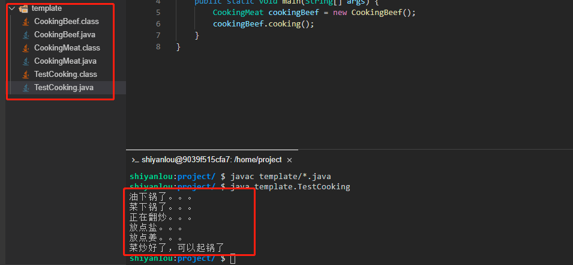

# 模板方法模式

模板模式最重要的思想就是封装复用不可变部分（父类），保留了可扩展点（子类）。

钩子函数。

2022年10月09日11:29:27

2022年10月18日20:24:22


----

模板方法模式（Template Method Pattern）是指定义一个算法的总体流程步骤，然后允许子类为其中一个或者多个步骤提供特定的实现方式。模板方法模式可以使得子类在不改变算法总体流程的情况下，重新定义算法的某些步骤。模板方法模式属于行为设计模式。

#### 示例

模板方法模式运用的也非常广泛，本实验就以我们日常生活中最熟悉的炒菜进行举例、体会一下模板方法模式（这里我们需要新建一个 `template` 目录，相关类创建在 `template` 目录下）。

为了方便统一，我们假设炒菜从前到后依次需要经过如下 6 个步骤：

1. 放油。
2. 放入蔬菜。
3. 翻炒。
4. 放盐。
5. 放点其它佐料。
6. 出锅。

- 首先创建一个抽象炒肉类 `CookingMeat.java`。

```java
package template;

public abstract class CookingMeat {

    protected final void cooking(){
        //1.放油
        this.putOil();
        //2.放入蔬菜
        this.putMeat();
        //3.翻炒
        this.stirFry();
        //4.放点盐
        this.putSalt();
        //5.放入佐料，如果有些菜还需要放入其他如葱姜蒜之类的佐料的话就可以，如果没有就直接起锅了
        if (this.needSeasoning()){
            this.putSeasoning();
        }
        //6.起锅
        this.dishUp();

    }

    //放油
    final void putOil(){
        System.out.println("油下锅了。。。");
    }

    //放入
    final void putMeat(){
        System.out.println("菜下锅了。。。");
    }

    //翻炒
    final void stirFry(){
        System.out.println("正在翻炒。。。");
    }

    //放点盐
    final void putSalt(){
        System.out.println("放点盐。。。");
    }

    //放入其他佐料
    abstract void putSeasoning();

    //是否需要佐料，这个是钩子方法，用于流程微调
    protected boolean needSeasoning(){
        return true;
    }

    //起锅
    final void dishUp(){
        System.out.println("菜炒好了，可以起锅了");
    }
}
```

这个抽象类中，我们定义了一个炒菜的方法，方法内部定义好了一些步骤，仅仅只留了一个步骤来放到子类进行微调。大家注意到上面有一个方法 `needSeasoning`，这个方法称之为**钩子方法**。

**钩子方法的主要目的是用来决定是否需要干预执行流程**，采用钩子方法可以使得我们的流程更加灵活。钩子方法的返回值一般为适合条件分支语句的返回值（如 `boolean` 和 `int` 等类型）。当然，钩子方法也并非一定需要，我们也可以不用钩子方法，直接固定预留一些抽象方法放到子类实现就可以了。

- 接下来定义一个炒牛肉类 `CookingBeef.java` 来实现 CookingMeat。

```java
package template;

public class CookingBeef extends CookingMeat {
    @Override
    void putSeasoning() {
        System.out.println("放点姜。。。");
    }
}
```

这个子类里面就实现了 CookingMeat 中的唯一一个抽象方法。

- 最后我们新建一个测试类 `TestCooking.java`。

```java
package template;

public class TestCooking {
    public static void main(String[] args) {
        CookingMeat cookingBeef = new CookingBeef();
        cookingBeef.cooking();
    }
}
```

写完了，又到了我们验证结果的时候了，先执行 `javac template/*.java` 命令进行编译。然后再执行 `java template.TestCooking` 命令运行测试类（大家一定要自己动手运行哦，只有自己实际去运行了才会更能体会其中的思想）。



#### 模板方法模式适用场景

模板方法模式适用于相对流程比较固定，而大部分步骤又都具有通用性，仅仅需要保留小部分可变动部分交给子类去实现。

#### 模板方法模式优点

1. 由于流程具有通用型，可以将大部分步骤放到父类实现，这样能提高代码的复用性。
2. 将个性化的步骤留到子类实现，子类可以扩展不同的行为，这也从一定程度上提升了代码的扩展性。
3. 因为父类都是封装相对固定的流程，而经常变动的放到子类，我们可以通过扩展子类来实现不同业务场景，而无需修改源码，符合开闭原则。

#### 模板方法模式缺点

1. 当变动部分有较多场景时，会导致子类数量不断增多，导致系统更复杂。
2. 模板方法模式是使用继承来实现的，违反了合成复用原则，一旦流程发生变化导致父类修改，可能所有子类都需要变动。