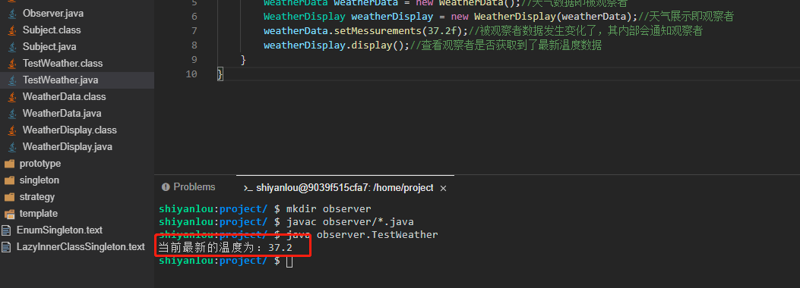

# 观察者模式

2022年10月09日11:49:56


---

本实验会介绍 GoF 23 种设计模式的第 7 种设计模式：观察者模式。观察者顾名思义就是有监听的意思，可以用来实现对象的监听。观察者模式主要有两种写法：

1. 监听到消息之后主动获取
2. 对方主动推送消息到观察者。

#### 知识点

- 观察者模式定义
- 观察者模式示例
- JDK 自带观察者模式局限性
- 观察者模式适用场景
- 观察者模式的优缺点
- 观察者模式能解决什么问题

观察者模式（Observer Pattern）也叫做发布订阅模式，其定义了对象之间的==一对多依赖==，让多个观察者对象同观察者模式适用场景
观察者模式一般适用于需要实时监听数据的场景，比如事件监听器等。

下面我们就以获取天气预报中的气温举例进行说明，看看观察者模式应该如何实现

- 新建一个观察者接口 `Observer.java`。

```java
package observer;

public interface Observer {
    void update(float temperature);//更新天气信息
}
```

- 接下来新建一个 `Subject.java` 类，用来管理观察者，主要定义了三个方法。

```java
package observer;

public interface Subject {
    void registerObserver(Observer o);//注册观察对象
    void removeObserver(Observer o);//移除观察对象
    void notifyObservers();//通知观察对象
}
```

- 接下来再建立一个 `WeatherData.java` 类，实现 Subject 接口。

```java
package observer;

import java.util.ArrayList;
import java.util.List;

public class WeatherData implements Subject {
    private List<Observer> observers;//观察者不止一个，所以用list进行维护

    private float temperature;//温度

    public void setMessurements(float temperature){
        this.temperature = temperature;

        notifyObservers();//气温信息发生变化时，通知所有观察者
    }


    public WeatherData() {//初始化list
        this.observers = new ArrayList<>();
    }

    /**
     * 注册观察者
     * @param o
     */
    @Override
    public void registerObserver(Observer o) {
        observers.add(o);
    }

    /**
     * 移除观察者
     * @param o
     */
    @Override
    public void removeObserver(Observer o) {
        int i = observers.indexOf(o);
        if(i >= 0){
            observers.remove(i);
        }

    }

    /**
     * 通知所有观察者
     */
    @Override
    public void notifyObservers() {
        for (Observer observer : observers){//遍历所有观察者
            observer.update(temperature);//通知观察者更新数据信息
        }
    }
}
```

WeatherData 类就相当于是一个被观察者，所以接下来我们还需要一个观察者。

- 新建一个观察者类 `WeatherDisplay.java`，需要实现 Observer 接口。

```java
package observer;

public class WeatherDisplay implements Observer {
    private Subject subject;//维护观察者
    private float temperature;//温度

    public WeatherDisplay(Subject subject) {//注册监听对象
        this.subject = subject;
        subject.registerObserver(this);
    }

    @Override
    public void update(float temperature) {//当被观察者气温发生变化会调用这个方法，也就等于更新了观察者对象的数据
        this.temperature = temperature;
    }

    public void display(){
        System.out.println("当前最新的温度为：" + temperature);
    }
}
```

- 最后我们新建一个测试类 `TestWeather.java` 来测试一下。

```java
package observer;

public class TestWeather {
    public static void main(String[] args) {
        WeatherData weatherData = new WeatherData();//天气数据即被观察者
        WeatherDisplay weatherDisplay = new WeatherDisplay(weatherData);//天气展示即观察者
        weatherData.setMessurements(37.2f);//被观察者数据发生变化了，其内部会通知观察者
        weatherDisplay.display();//查看观察者是否获取到了最新温度数据
    }
}
```

现在我们需要验证一下结果，先执行 `javac observer/*.java` 命令进行编译。然后再执行 `java observer.TestWeather` 命令运行测试类（大家一定要自己动手运行哦，只有自己实际去运行了才会更能体会其中的思想）。



可以看到，我们只是设置了 WeatherData 对象中的温度，但是 WeatherDisplay 中也实时改变了温度，这就是观察者模式。但是我们这里是观察者主动推的数据给观察者，也就是 push 模式，这样不论观察者是不是需要数据，都会被推送，那么假如数据信息很多，但是我只要其中一种呢？能不能只是观察者自己去拿数据，这是可以的，也就是 pull 写法。


#### 观察者模式适用场景

观察者模式一般适用于需要实时监听数据的场景，比如事件监听器等。

#### 观察者模式的优点

观察者和被观察者之间建立了一个抽象的耦合，要扩展观察者只需要新建观察者并注册进去就可以，扩展性好。

#### 观察者模式的缺点

观察者之间有过多的细节依赖、提高时间消耗及程序的复杂度，此外，当被观察者对象过多时，会使得系统非常复杂难以维护。


