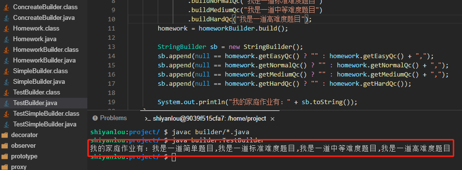

# 实验七 建造者模式

2022年10月10日23:31:31

----

本实验会介绍 GoF 23 种设计模式的第 11 种设计模式：建造者模式。当我们创建一个复杂对象时，可能大家的第一反应就是使用工厂模式，但是如果构建一个对象非常复杂，而且有些比如说属性之类的是可选的，且需要支持随意的动态搭配，那么这时候如果要用工厂设计模式就不太好实现了，使用建造者模式来实现就会比较方便。

#### 知识点

- 建造者模式的定义
- 建造者模式示例
- 建造者模式适用场景
- 建造者模式的优缺点
- 建造者模式能解决什么问题

章节

步骤

报告

讨论


### 什么是建造者模式

建造者模式（Builder Pattern）是将一个复杂对象的构建与它的表示分离，使得同样的构建过程可以创建不同的表示。建造者模式属于创建型模式，对使用者而言，只需要指定需要建造的类型就可以获得对象，建造过程和细节不需要了解。

建造者模式的概念听上去有点抽象，但是实际上可以这么说，基本上只要做 Web 开发的基本都用过，只是可能自己不知道这就是建造者模式而已。

#### 示例

我们以家庭作业为例，假设老师会根据每个不同基础的同学布置不同难度的题目来实现一个简单的建造者模式（这里我们需要新建一个 `builder` 目录，相关类创建在 `builder` 目录下）。

- 首先建造一个家庭作业类 `Homework.java`，这个类里面有四个属性，分别代表四种不同难度的家庭作业。

```java
package builder;

public class Homework {
    private String easyQc;//简答题目

    private String normalQc;//正常题目

    private String MediumQc;//中等难度题目

    private String HardQc;//困难题目

    public String getEasyQc() {
        return easyQc;
    }

    public void setEasyQc(String easyQc) {
        this.easyQc = easyQc;
    }

    public String getNormalQc() {
        return normalQc;
    }

    public void setNormalQc(String normalQc) {
        this.normalQc = normalQc;
    }

    public String getMediumQc() {
        return MediumQc;
    }

    public void setMediumQc(String mediumQc) {
        MediumQc = mediumQc;
    }

    public String getHardQc() {
        return HardQc;
    }

    public void setHardQc(String hardQc) {
        HardQc = hardQc;
    }
}
```

- 然后新建一个建造者类 `SimpleBuilder.java`，建造者类就是用来创建对象的。

```java
package builder;

public class SimpleBuilder {
    private Homework homework;

    public SimpleBuilder(Homework homework) {
        this.homework = homework;
    }

    public void buildEasyQc(String easyQc){
        homework.setEasyQc(easyQc);
    }

    public void buildNormalQc(String normalQc){
        homework.setNormalQc(normalQc);
    }

    public void buildMediumQc(String mediumQc){
        homework.setMediumQc(mediumQc);
    }

    public void buildHardQc(String hardQc){
        homework.setHardQc(hardQc);
    }

    public Homework build(){
        return homework;
    }
}
```

这个建造者类里面持有了家庭作业对象，并且为其每个属性都提供了一个方法进行赋值。

- 最后我们新建一个测试类 `TestSimpleBuilder.java` 来测试一下。

```java
package builder;

public class TestSimpleBuilder {
    public static void main(String[] args) {
        SimpleBuilder simpleBuilder = new SimpleBuilder(new Homework());
        simpleBuilder.buildEasyQc("简单题目");//1
        simpleBuilder.buildNormalQc("标准难度题目");//2
        simpleBuilder.buildMediumQc("中等难度题目");//3
        simpleBuilder.buildHardQc("高难度题目");//4
        Homework homework = simpleBuilder.build();

        StringBuilder sb = new StringBuilder();
        sb.append(null == homework.getEasyQc() ? "" : homework.getEasyQc() + ",");
        sb.append(null == homework.getNormalQc() ? "" : homework.getNormalQc() + ",");
        sb.append(null == homework.getMediumQc() ? "" : homework.getMediumQc() + ",");
        sb.append(null == homework.getHardQc() ? "" : homework.getHardQc());

        System.out.println("我的家庭作业有：" + sb.toString());
    }
}
```

执行 `javac builder/*.java` 命令进行编译，然后再执行 `java builder.TestSimpleBuilder` 命令运行测试类（大家一定要自己动手运行哦，只有自己实际去运行了才会更能体会其中的思想）。


这就是一个简单的建造者模式，测试代码中的 1 2 3 4 四行代码可以随意搭配或者取消，这就是建造者模式的灵活性，但是我们可以发现，这里面是直接面向了具体的建造者来编程，在以后的扩展会比较困难，而我们一般都是选择面向抽象编程，所以接下来需要再看一下面向抽象的标准建造者模式写法。

- 建立一个抽象的建造者类 `HomeworkBuilder.java`。

```java
package builder;

public abstract class HomeworkBuilder {
    public abstract HomeworkBuilder buildEasyQc(String easyQc);

    public abstract HomeworkBuilder buildNormalQc(String normalQc);

    public abstract HomeworkBuilder buildMediumQc(String mediumQc);

    public abstract HomeworkBuilder buildHardQc(String hardQc);

    public abstract Homework build();
}
```

这个类和之前一样都是分别为四个属性提供了一个方法，区别是这些方法都返回了建造者本身，这是为了实现后面的链式写法。

- 新建一个具体的建造者类 `ConcreateBuilder.java` 继承抽象建造者类 HomeworkBuilder。

```java
package builder;

public class ConcreateBuilder extends HomeworkBuilder {
    private Homework homework;

    public ConcreateBuilder(Homework homework) {
        this.homework = homework;
    }

   @Override
    public HomeworkBuilder buildEasyQc(String easyQc) {
        homework.setEasyQc(easyQc);
        return this;
    }

    @Override
    public HomeworkBuilder buildNormalQc(String normalQc) {
        homework.setNormalQc(normalQc);
        return this;
    }

    @Override
    public HomeworkBuilder buildMediumQc(String mediumQc) {
        homework.setMediumQc(mediumQc);
        return this;
    }

    @Override
    public HomeworkBuilder buildHardQc(String hardQc) {
        homework.setHardQc(hardQc);
        return this;
    }

    @Override
    public Homework build() {
        return homework;
    }
}
```

- 最后新建一个测试类 `TestBuilder.java` 来测试一下。

```java
package builder;

public class TestBuilder {
    public static void main(String[] args) {
        Homework homework = new Homework();
        HomeworkBuilder homeworkBuilder = new ConcreateBuilder(homework);
        homeworkBuilder.buildEasyQc("我是一道简单题目")
                .buildNormalQc("我是一道标准难度题目")
                .buildMediumQc("我是一道中等难度题目")
                .buildHardQc("我是一道高难度题目");
        homework = homeworkBuilder.build();

        StringBuilder sb = new StringBuilder();
        sb.append(null == homework.getEasyQc() ? "" : homework.getEasyQc() + ",");
        sb.append(null == homework.getNormalQc() ? "" : homework.getNormalQc() + ",");
        sb.append(null == homework.getMediumQc() ? "" : homework.getMediumQc() + ",");
        sb.append(null == homework.getHardQc() ? "" : homework.getHardQc());

        System.out.println("我的家庭作业有：" + sb.toString());
    }
}
```

再次执行 `javac builder/*.java` 命令进行编译，然后再执行 `java builder.TestBuilder` 命令运行测试类（大家一定要自己动手运行哦，只有自己实际去运行了才会更能体会其中的思想）。



#### 建造者模式适用场景

建造者模式适用于一个具有较多属性的复杂产品创建过程，而且产品的各个属性还需要支持动态变化，但属性的种类却总体稳定的场景。所以建造者和工厂模式的区别也很明显，工厂模式是返回一个完整的产品，不支持自由组合属性，而建造者更加灵活，完全可以由使用者自由搭配从而使同一个建造者可以建造出不同的产品。

#### 建造者模式优点

1. 封装性好，创建和使用分离。
2. 扩展性好，各个建造类之间相互独立，实现了解耦。

#### 建造者模式缺点

1. 创建产品过程中会产生多余的 Builder 对象。
2. 产品内部发生变化时，建造者都需要修改，成本较大，所以建造者模式的前提需要产品总体稳定，细节自由搭配的场景。


下一步