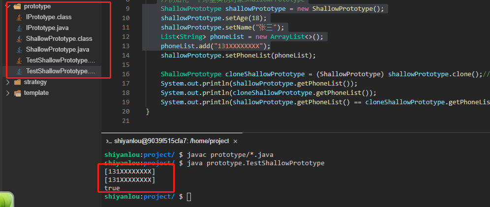
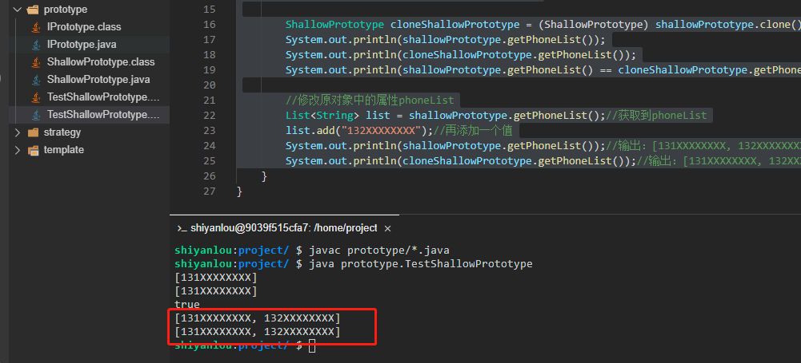
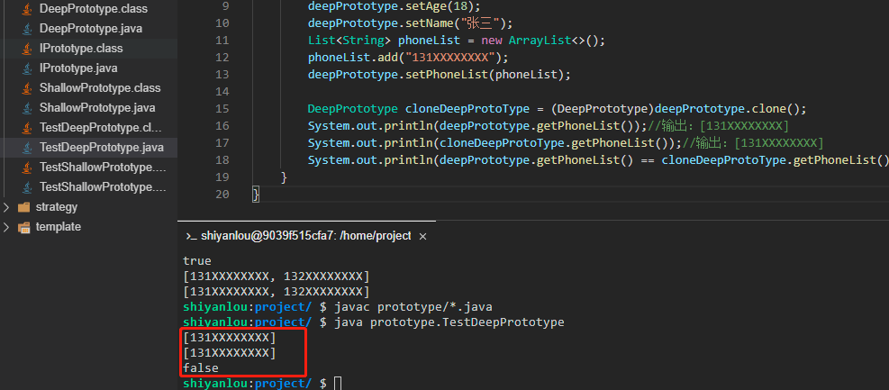
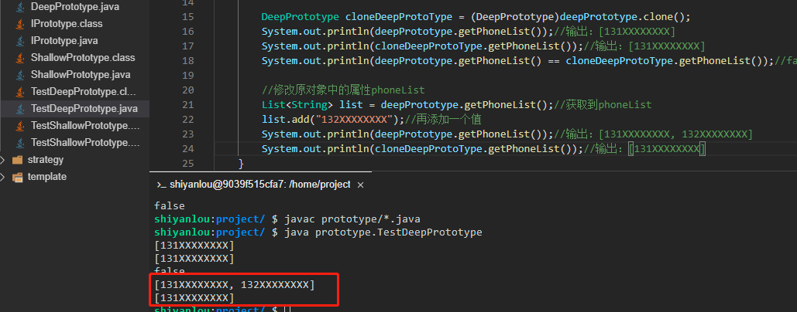

# 原型模式

一般指的是我们通过一个原型实例，然后创建出和原型实例一样的重复对象，主要就是用来实现对象的克隆。

2022年10月11日11:46:27

---

实验介绍


本文会介绍 GoF 23 种设计模式的第 6 种设计模式：原型模式。提到原型模式，就不得不提深克隆和浅克隆的区别，所以本文也会向大家分别介绍利用深克隆和浅克隆两种方式来实现原型模式。

#### 知识点

- 原型模式定义
- 深克隆和浅克隆
- 原型模式示例
- 原型模式适用场景
- 原型模式的优缺点
- 原型模式能解决什么问题

---

深克隆和浅克隆


原型模式的实质就是克隆对象，而克隆又可以分为浅克隆和深克隆。

浅克隆是指拷贝对象时仅仅拷贝对象本身和对象中的基本变量，但是不拷贝对象包含的引用类型。假如对象中含有一个引用属性，那么拷贝的时候只会把引用属性的地址拷贝过来，这样的缺点就是一旦原型实例对象的引用属性发生了修改，那么克隆过来的对象也会一起变动。

深克隆不仅拷贝对象本身，而且会将引用对象也一起实现拷贝，这样一旦原型实例中的引用属性发生变化，不会影响到克隆后的对象。

如果大家对这两个概念还是有点模糊，也没有关系，继续往下面看示例，示例中我会采用浅克隆和深克隆来分别实现原型模式，通过代码实现来对比两种克隆方式，大家就会更容易明白了。

#### 示例

这里我们需要新建一个 `prototype` 目录，相关类创建在 `prototype` 目录下。

- 新建一个原型接口 `IPrototype.java`。

```java
package prototype;

public interface IPrototype {
    IPrototype clone();//克隆方法
}
```

这个抽象接口中，我们只定义了一个克隆方法，用来克隆对象。

- 接下来定义一个原型实例类 `ShallowPrototype.java` 来实现 IPrototype 接口。

```java
package prototype;

import java.util.List;

public class ShallowPrototype implements IPrototype {
    private String name;

    private int age;

    private List<String> phoneList;

    public String getName() {
        return name;
    }

    public void setName(String name) {
        this.name = name;
    }

    public int getAge() {
        return age;
    }

    public void setAge(int age) {
        this.age = age;
    }

    public List<String> getPhoneList() {
        return phoneList;
    }

    public void setPhoneList(List<String> phoneList) {
        this.phoneList = phoneList;
    }

    @Override
    public IPrototype clone() {
        ShallowPrototype shallowPrototype = new ShallowPrototype();
        shallowPrototype.setAge(this.age);
        shallowPrototype.setName(this.name);
        shallowPrototype.setPhoneList(this.phoneList);
        return shallowPrototype;
    }
}
```

这个类里面定义了 3 个属性，其中 1 个是属于引用类型。

- 最后我们新建一个测试类 `TestShallowPrototype.java`。

```java
package prototype;

import java.util.ArrayList;
import java.util.List;

public class TestShallowPrototype {
    public static void main(String[] args){
         //初始化一个原型实例对象ShallowPrototype
        ShallowPrototype shallowPrototype = new ShallowPrototype();
        shallowPrototype.setAge(18);
        shallowPrototype.setName("张三");
        List<String> phoneList = new ArrayList<>();
        phoneList.add("131XXXXXXXX");
        shallowPrototype.setPhoneList(phoneList);

        ShallowPrototype cloneShallowPrototype = (ShallowPrototype) shallowPrototype.clone();//克隆原型对象
        System.out.println(shallowPrototype.getPhoneList());
        System.out.println(cloneShallowPrototype.getPhoneList());
        System.out.println(shallowPrototype.getPhoneList() == cloneShallowPrototype.getPhoneList());//true
    }
}
```

现在我们需要验证一下结果，先执行 `javac prototype/*.java` 命令进行编译。然后再执行 `java prototype.TestShallowPrototype` 命令运行测试类（大家一定要自己动手运行哦，只有自己实际去运行了才会更能体会其中的思想）。



可以看到，最后两个对象中的 `phoneList` 属性是相等的，说明这两个属性实际上指向的是同一个内存地址，所以一旦一个对象修改了这个属性，那么另一个对象也会随之改变。

- 接下来我们改造一下测试类 `TestShallowPrototype.java`，来验证一下是不是只要改变了 `list`，两个对象都会同时发生改变。

```java
package prototype;

import java.util.ArrayList;
import java.util.List;

public class TestShallowPrototype {
    public static void main(String[] args){
        //初始化一个原型实例对象ShallowPrototype
        ShallowPrototype shallowPrototype = new ShallowPrototype();
        shallowPrototype.setAge(18);
        shallowPrototype.setName("张三");
        List<String> phoneList = new ArrayList<>();
        phoneList.add("131XXXXXXXX");
        shallowPrototype.setPhoneList(phoneList);

        ShallowPrototype cloneShallowPrototype = (ShallowPrototype) shallowPrototype.clone();//克隆原型对象
        System.out.println(shallowPrototype.getPhoneList());
        System.out.println(cloneShallowPrototype.getPhoneList());
        System.out.println(shallowPrototype.getPhoneList() == cloneShallowPrototype.getPhoneList());//true

        //修改原对象中的属性phoneList
        List<String> list = shallowPrototype.getPhoneList();//获取到phoneList
        list.add("132XXXXXXXX");//再添加一个值
        System.out.println(shallowPrototype.getPhoneList());//输出：[131XXXXXXXX, 132XXXXXXXX]
        System.out.println(cloneShallowPrototype.getPhoneList());//输出：[131XXXXXXXX, 132XXXXXXXX]
    }
}
```

重新执行 `javac prototype/*.java` 命令进行编译。然后再执行 `java prototype.TestShallowPrototype` 命令运行测试类（大家一定要自己动手运行哦，只有自己实际去运行了才会更能体会其中的思想）。



可以看到，当我们把 `phoneList` 修改之后，两个对象都一同被修改了。

- 我们再看另一种操作方式，还是修改一下上面的测试类 `TestShallowPrototype.java`。

```java
package prototype;

import java.util.ArrayList;
import java.util.List;

public class TestShallowPrototype {
    public static void main(String[] args){
        //初始化一个原型实例对象ShallowPrototype
        ShallowPrototype shallowPrototype = new ShallowPrototype();
        shallowPrototype.setAge(18);
        shallowPrototype.setName("张三");
        List<String> phoneList = new ArrayList<>();
        phoneList.add("131XXXXXXXX");
        shallowPrototype.setPhoneList(phoneList);

        ShallowPrototype cloneShallowPrototype = (ShallowPrototype) shallowPrototype.clone();//克隆原型对象
        System.out.println(shallowPrototype.getPhoneList());
        System.out.println(cloneShallowPrototype.getPhoneList());
        System.out.println(shallowPrototype.getPhoneList() == cloneShallowPrototype.getPhoneList());//true

        //直接修改prototypeA对象的phoneList指向
        shallowPrototype.setPhoneList(new ArrayList<>());
    }
}
```

不知道有没有人有这种误解，以为上面说的修改属性，是直接修改的 `phoneList`，但是这种修改方式并没有修改到其所指向的地址，只是把 `phoneList` 属性修改了一个指向，而原 `list` 对象还在内存中，并且被 `cloneShallowPrototype` 对象所持有的，所以这种修改是不会影响到克隆对象的，只有修改了 `phoneList` 属性所指向的对象本身才有效。

上面就是一个浅克隆的示例，浅克隆存在的问题使它有些时候并不适合我们的业务需求，所以接下来让我们再看一个深克隆的示例。

- 新建一个深克隆原型实例对象 `DeepPrototype.java` 实现 Cloneable 和 Serializable 两个接口。

```java
package prototype;

import java.io.*;
import java.util.List;

public class DeepPrototype implements Cloneable, Serializable {
    private String name;

    private int age;

    private List<String> phoneList;

    public String getName() {
        return name;
    }

    public void setName(String name){
        this.name = name;
    }

    public int getAge() {
        return age;
    }

    public void setAge(int age) {
        this.age = age;
    }

    public List<String> getPhoneList() {
        return phoneList;
    }

    public void setPhoneList(List<String> phoneList) {
        this.phoneList = phoneList;
    }

    public Object clone(){
        return this.deepClone();
    }

    public DeepPrototype deepClone(){
        try {
            ByteArrayOutputStream bos = new ByteArrayOutputStream();
            ObjectOutputStream oos = new ObjectOutputStream(bos);
            oos.writeObject(this);

            ByteArrayInputStream bis = new ByteArrayInputStream(bos.toByteArray());
            ObjectInputStream ois = new ObjectInputStream(bis);

            DeepPrototype clone = (DeepPrototype)ois.readObject();

            return clone;
        }catch (Exception e){
            System.out.println("深克隆异常");
            e.printStackTrace();
        }
       return null;
    }
}
```

可以看到，深克隆类相比较于浅克隆，多定义了一个 `deepClone` 方法，而 `deepClone` 内部是通过序列化来克隆一个对象。

- 新建一个测试类 `TestDeepPrototype.java` 来测试一下。

```java
package prototype;

import java.util.ArrayList;
import java.util.List;

public class TestDeepPrototype {
    public static void main(String[] args) throws CloneNotSupportedException {
        DeepPrototype deepPrototype = new DeepPrototype();
        deepPrototype.setAge(18);
        deepPrototype.setName("张三");
        List<String> phoneList = new ArrayList<>();
        phoneList.add("131XXXXXXXX");
        deepPrototype.setPhoneList(phoneList);

        DeepPrototype cloneDeepProtoType = (DeepPrototype)deepPrototype.clone();
        System.out.println(deepPrototype.getPhoneList());//输出：[131XXXXXXXX]
        System.out.println(cloneDeepProtoType.getPhoneList());//输出：[131XXXXXXXX]
        System.out.println(deepPrototype.getPhoneList() == cloneDeepProtoType.getPhoneList());//false
    }
}
```

重新执行 `javac prototype/*.java` 命令进行编译。然后再执行 `java prototype.TestDeepPrototype` 命令运行测试类（大家一定要自己动手运行哦，只有自己实际去运行了才会更能体会其中的思想）。



可以看到，这里虽然输出的值是相同的，但是最后的结果却是 `false` 了，这就说明原对象和克隆对象之间是完全独立，`phoneList` 属性没有共用同一个内存地址。

- 同样的，我们修改一下 phoneList 来测试一下是不是真的实现了深克隆，修改 `TestDeepPrototype.java` 文件。

```java
package prototype;

import java.util.ArrayList;
import java.util.List;

public class TestDeepPrototype {
    public static void main(String[] args) throws CloneNotSupportedException {
        DeepPrototype deepPrototype = new DeepPrototype();
        deepPrototype.setAge(18);
        deepPrototype.setName("张三");
        List<String> phoneList = new ArrayList<>();
        phoneList.add("131XXXXXXXX");
        deepPrototype.setPhoneList(phoneList);

        DeepPrototype cloneDeepProtoType = (DeepPrototype)deepPrototype.clone();
        System.out.println(deepPrototype.getPhoneList());//输出：[131XXXXXXXX]
        System.out.println(cloneDeepProtoType.getPhoneList());//输出：[131XXXXXXXX]
        System.out.println(deepPrototype.getPhoneList() == cloneDeepProtoType.getPhoneList());//false

        //修改原对象中的属性phoneList
        List<String> list = deepPrototype.getPhoneList();//获取到phoneList
        list.add("132XXXXXXXX");//再添加一个值
        System.out.println(deepPrototype.getPhoneList());//输出：[131XXXXXXXX, 132XXXXXXXX]
        System.out.println(cloneDeepProtoType.getPhoneList());//输出：[131XXXXXXXX]
    }
}
```

重新执行 `javac prototype/*.java` 命令进行编译。然后再执行 `java prototype.TestDeepPrototype` 命令运行测试类（大家一定要自己动手运行哦，只有自己实际去运行了才会更能体会其中的思想）。



结果一目了然，修改了原对象的引用属性之后，并没有影响到克隆对象。

#### 关于深克隆不得不说的事

上面我们的深克隆实现了两个接口：`Cloneable` 和 `Serializable`。为什么要实现这两个接口呢？

`Serializable` 接口大家应该比较好理解，因为我们的 `deepClone` 方法是通过序列化来实现对象克隆的，所以必须要实现序列化接口，否则会抛出异常 `NotSerializableException`。

对于 `Cloneable` 接口，因为 `clone` 方法我们知道其实是 `Object` 对象的，而 Java 中所有的对象默认都是 `Object` 对象的子类，所以我们的类中也同样的具有 `clone` 方法，但是默认的 `clone` 方法实现的是浅克隆，为了使得我们的深克隆对象中不会同时具备深克隆和浅克隆两个功能，我这里选择了重写 `clone` 方法，而 Java 中的规范约定，如果我们需要实现 `clone` 功能，那么必须要实现 `Cloneable` 接口，否则就会抛出 `CloneNotSupportedException` 异常。

#### 原型模式适用场景

原型模式的作用就是克隆对象，而如果一个对象本身的创建就非常简单，那么没必要使用克隆模式，所以原型模式一般适用于类初始化消耗资源较多时或者就是创建一个对象非常复杂的场景。

#### 原型模式优点

1. 当我们创建一个对象比较复杂时，使用原型对象通常效率会更高也更方便快捷。

#### 原型模式缺点

1. 每个对象都需要单独实现克隆的方法。
2. 深克隆和浅克隆需要灵活应用，否则可能会导致业务出错。


