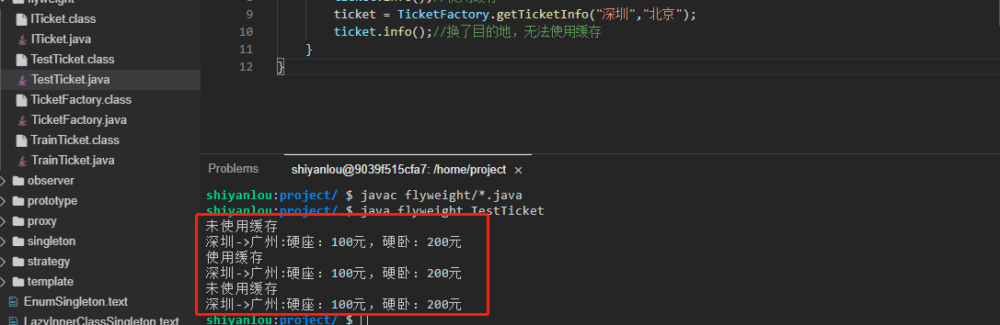
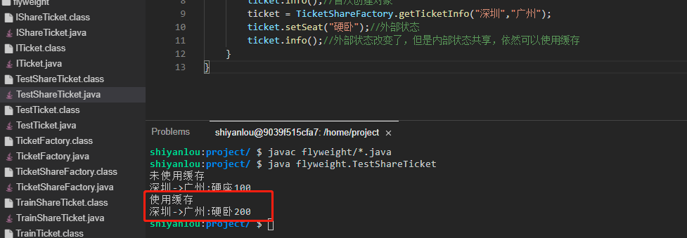

# 享元模式

2022年10月11日13:35:42

2022年10月18日21:32:00


---

实验介绍

本实验会介绍 GoF 23 种设计模式的第 13 种设计模式：享元模式。我们知道，数据库的连接非常消耗性能，所以需要连接池来减少连接操作的性能消耗，而线程池的出现也是为了减少创建线程带来的消耗。本实验介绍的享元模式正是基于这种思想的设计模式。

知识点
享元模式的定义
享元模式示例
内部状态和外部状态
享元模式能解决什么问题

---


### 什么是享元模式

享元模式（Flyweight Pattern），又称之为蝇量模式，是对象池的一种实现。主要用于减少创建对象的数量，以减少内存占用和提高性能。类似于我们的数据库连接池和线程池。

享元模式的宗旨就是共享细粒度对象，将多个对同一对象的访问集中起来，不必为每个访问者创建一个单独的对象，以此来降低内存的消耗，享元模式属于结构型模式。

#### 示例

下面就让我们以购买火车票为例，来看看享元模式是怎么实现的（这里我们需要新建一个 `flyweight` 目录，相关类创建在 `flyweight` 目录下）。

- 首先新建一个车票接口 `ITicket.java`，只定义了一个查询车票信息的方法。

```java
package flyweight;

public interface ITicket {
    void info();
}
```

- 再定义一个火车票类 `TrainTicket.java` 来实现车票接口 ITicket。

```java
package flyweight;

public class TrainTicket implements ITicket{
    private String from;
    private String to;

    public TrainTicket(String from, String to) {
        this.from = from;
        this.to = to;
    }

    @Override
    public void info() {
        System.out.println(from + "->" + to + ":硬座：100元，硬卧：200元");
    }
}
```

- 定义一个工厂类 `TicketFactory.java`，用来管理享元对象，其内部使用了一个 Map 来存储对象，把火车票的出发地和目的地作为 key 值，如果存在则直接从 Map 取，否则就新创建一个对象，并且加入到 Map 中。

```java
package flyweight;

import java.util.HashMap;
import java.util.Map;

public class TicketFactory {
    private static Map<String,ITicket> CACHE_POOL = new HashMap<>();//缓存对象

    public static ITicket getTicketInfo(String from,String to){
        String key = from + "->" + to;
        if (TicketFactory.CACHE_POOL.containsKey(key)){//对象存在缓存
            System.out.println("使用缓存");
            return TicketFactory.CACHE_POOL.get(key);
        }
        //对象不存在缓存则创建一个对象，并加入缓存
        System.out.println("未使用缓存");
        ITicket ticket = new TrainTicket("深圳","广州");
        CACHE_POOL.put(key,ticket);
        return ticket;
    }
}
```

- 最后来创建一个测试类 `TestTicket.java` 进行测试。

```java
package flyweight;

public class TestTicket {
    public static void main(String[] args) {
        ITicket ticket = TicketFactory.getTicketInfo("深圳","广州");
        ticket.info();//首次创建对象
        ticket = TicketFactory.getTicketInfo("深圳","广州");
        ticket.info();//使用缓存
        ticket = TicketFactory.getTicketInfo("深圳","北京");
        ticket.info();//换了目的地，无法使用缓存
    }
}
```

执行 `javac flyweight/*.java` 命令进行编译，然后再执行 `java flyweight.TestTicket` 命令运行测试类（大家一定要自己动手运行哦，只有自己实际去运行了才会更能体会其中的思想）。



上面就是一个简单的享元模式的示例，可能大家会觉得这不就是一个简单的缓存的使用吗？确实如此，享元模式核心思想就是使用缓存，享元模式看起来和单例有点相似，但是单例关注的是整个对象只能有一个实例；而享元模式关注的是状态，也就是说同一个类，只有状态一致，比如上面示例中深圳到广州的火车票，这就属于状态一致，所以使用缓存，而深圳到北京又是另一个状态，所以就无法使用缓存。

那么享元模式的状态究竟是什么呢？

---

享元模式的状态分为两种：

- 内部状态：指对象共享出来的信息，存储在享元对象内部并且不会随环境的改变而改变。
- 外部状态：指对象需要依赖的一个标记，是随环境改变而改变的、不可共享的状态。

前面的例子中，我们可以把实例对象划分一下，比如上面车票的对象，可以把 from 和 to 两个属性作为可共享状态，不可改变。然后再新增一个属性用来对应座位，这个就属于外部状态。

#### 享元模式状态示例

下面我们利用内部状态和外部状态将前面的示例进行一次改造。

- 首先还是新建一个车票接口 `IShareTicket.java`，比上面的接口新增了一个设置车票座位的方法。

```java
package flyweight;

public interface IShareTicket {
    void info();//获取车票信息

    void setSeat(String seatType);//设置车票座位
}
```

- 依然是定义一个火车票类 `TrainShareTicket.java` 来实现车票接口 IShareTicket。

```java
package flyweight;

import java.math.BigDecimal;

public class TrainShareTicket implements IShareTicket {
    private String from;//内部状态
    private String to;//内部状态

    private String seatType = "站票";//外部状态

    public TrainShareTicket(String from, String to) {
        this.from = from;
        this.to = to;
    }

    @Override
    public void setSeat(String seatType){//设置座位，即设置外部状态
        this.seatType = seatType;
    }

    @Override
    public void info() {
        System.out.println(from + "->" + to + ":" + seatType + this.getPrice(seatType));
    }

    private BigDecimal getPrice(String seatType){//获取不同座位的价格
        BigDecimal value = null;
        switch (seatType){
            case "硬座":
                value = new BigDecimal("100");
                break;
            case "硬卧":
                value = new BigDecimal("200");
                break;
            default:
                value = new BigDecimal("50");
        }
        return value;
    }
}
```

- 定义一个工厂类 `TicketShareFactory.java`，用来管理享元对象，其内部使用了一个 Map 来存储对象，把火车票的出发地和目的地作为 key 值，如果存在了则直接从 Map 取，否则就新创建一个对象，并且加入到 Map 中。

```java
package flyweight;

import java.util.HashMap;
import java.util.Map;

public class TicketShareFactory {
    private static Map<String,IShareTicket> CACHE_POOL = new HashMap<>();//存储对象

    public static IShareTicket getTicketInfo(String from,String to){
        String key = from + "->" + to;
        if (TicketShareFactory.CACHE_POOL.containsKey(key)){//缓存中存在
            System.out.println("使用缓存");
            return TicketShareFactory.CACHE_POOL.get(key);
        }
        //对象不存在缓存则创建一个对象，并加入缓存
        System.out.println("未使用缓存");
        IShareTicket ticket = new TrainShareTicket(from,to);
        CACHE_POOL.put(key,ticket);
        return ticket;
    }
}
```

- 最后我们新建一个测试类 `TestShareTicket.java` 来测试一下。

```java
package flyweight;

public class TestShareTicket {

    public static void main(String[] args) {
        IShareTicket ticket = TicketShareFactory.getTicketInfo("深圳","广州");
        ticket.setSeat("硬座");//外部状态
        ticket.info();//首次创建对象
        ticket = TicketShareFactory.getTicketInfo("深圳","广州");
        ticket.setSeat("硬卧");//外部状态
        ticket.info();//外部状态改变了，但是内部状态共享，依然可以使用缓存
    }
}
```

执行 `javac flyweight/*.java` 命令进行编译，然后再执行 `java flyweight.TestShareTicket` 命令运行测试类（大家一定要自己动手运行哦，只有自己实际去运行了才会更能体会其中的思想）。



可以看到，将状态分离之后，外部状态的修改并不影响内部状态，也就是对象依然可以被缓存。

#### 享元模式适用场景

1. 当系统中多处需要用到一些公共信息时，可以把这些信息封装到一个对象实现享元模式，避免重复创建对象带来系统的开销。
2. 享元模式主要用于系统中存在大量相似对象，且需要缓冲池的场景，一般情况下享元模式用于底层开发较多，以便提升系统性能。

#### 享元模式优点

减少对象的创建，降低了系统中对象的数量，故而可以降低系统的使用内存，提高效率。

#### 享元模式缺点

1. 提高了系统的复杂度，需要注意分离出外部状态和内部状态。
2. 享元模式默认是线程不安全的，所以如果是并发场景需要考虑线程安全性问题。

本实验主要介绍了享元模式的基本用法，随之介绍了将对象分离成内部状态和外部状态之后享元模式又是如何实现的，享元模式一般都是和工厂模式同时出现，因为我们的享元对象需要用工厂进行管理，享元模式的思想说到底就是缓存思想，所以还是非常实用的一种设计模式。

---

