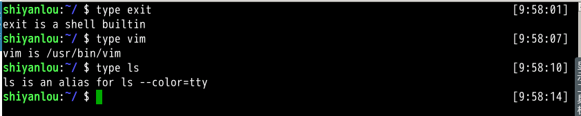

#### `type`重命名文件

`mv` 命令除了能移动文件外，还能给文件重命名。命令格式为 `mv 旧的文件名 新的文件名`。

例如将文件“ file1 ”重命名为“ myfile ”：

```bash
mv file1 myfile
```

#### 批量重命名

要实现批量重命名，`mv` 命令就有点力不从心了，我们可以使用一个看起来更专业的命令 `rename` 来实现。不过它要用 perl 正则表达式来作为参数，关于正则表达式我们要在后面才会介绍到，这里只做演示，你只要记得这个 `rename` 命令可以批量重命名就好了，以后再重新学习也不会有任何问题，毕竟你已经掌握了一个更常用的 `mv` 命令。

`rename` 命令并不是内置命令，若提示无该命令可以使用 `sudo apt-get install rename` 命令自行安装。

```bash
cd /home/shiyanlou/

# 使用通配符批量创建 5 个文件:
touch file{1..5}.txt

# 批量将这 5 个后缀为 .txt 的文本文件重命名为以 .c 为后缀的文件:
rename 's/\.txt/\.c/' *.txt

# 批量将这 5 个文件，文件名和后缀改为大写:
rename 'y/a-z/A-Z/' *.c
```

---

#### `type`内建命令与外部命令

简单来说就是：一个是天生自带的天赋技能，一个是后天得来的附加技能。我们可以使用 type 命令来区分命令是内建的还是外部的。例如这两个得出的结果是不同的

```bash
type exit

type vim
```

得到的是两种结果，若是对 ls 你还能得到第三种结果



```bash
# 得到这样的结果说明是内建命令，正如上文所说内建命令都是在 bash 源码中的 builtins 的.def中
xxx is a shell builtin
# 得到这样的结果说明是外部命令，正如上文所说，外部命令在/usr/bin or /usr/sbin等等中
xxx is /usr/bin/xxx
# 若是得到alias的结果，说明该指令为命令别名所设定的名称；
xxx is an alias for xx --xxx
```

**内建命令**实际上是 shell 程序的一部分，其中包含的是一些比较简单的 Linux 系统命令，这些命令是写在 bash 源码的 builtins 里面的，

**外部命令**是 Linux 系统中的实用程序部分，
