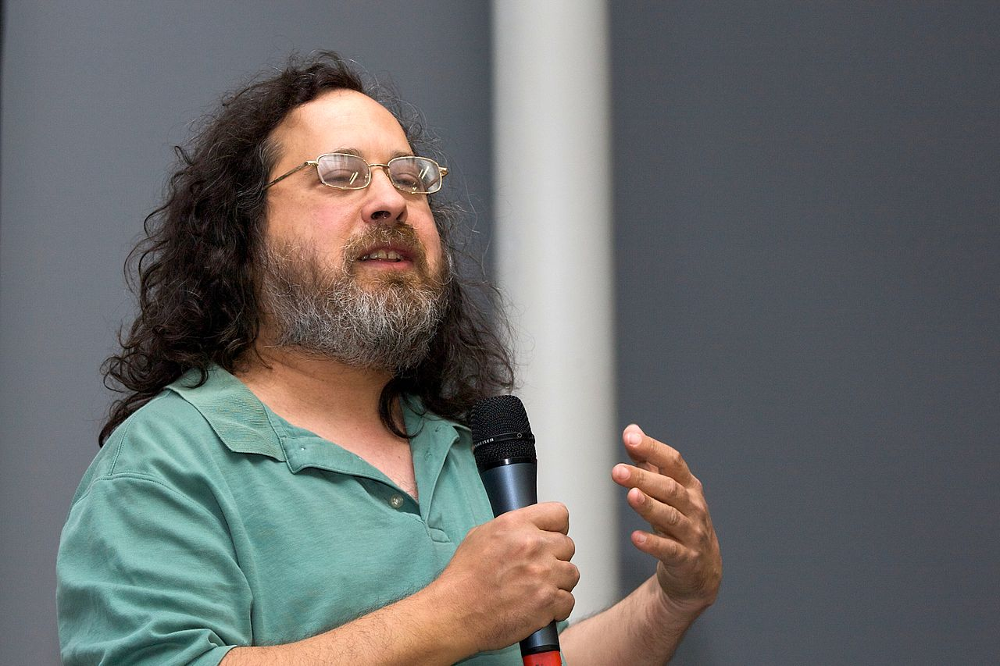
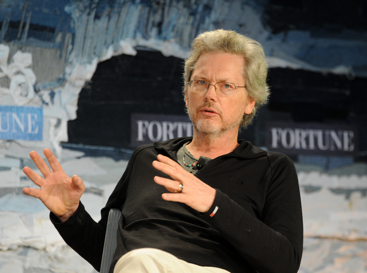

#### 2.2 Linux 重要人物

2022年3月28日19:03:38

---

#### 1. Ken Thompson：C 语言之父和 UNIX 之父

#### 2. Dennis Ritchie：C 语言之父和 UNIX 之父

#### 3. Stallman：著名黑客，GNU 创始人，开发了 Emacs、gcc、bash shell

#### 4. Bill Joy：BSD 开发者

#### 5. Tanenbaum：Minix 开发者

#### 6. Linus Torvalds：Linux 之父，芬兰赫尔辛基大学

