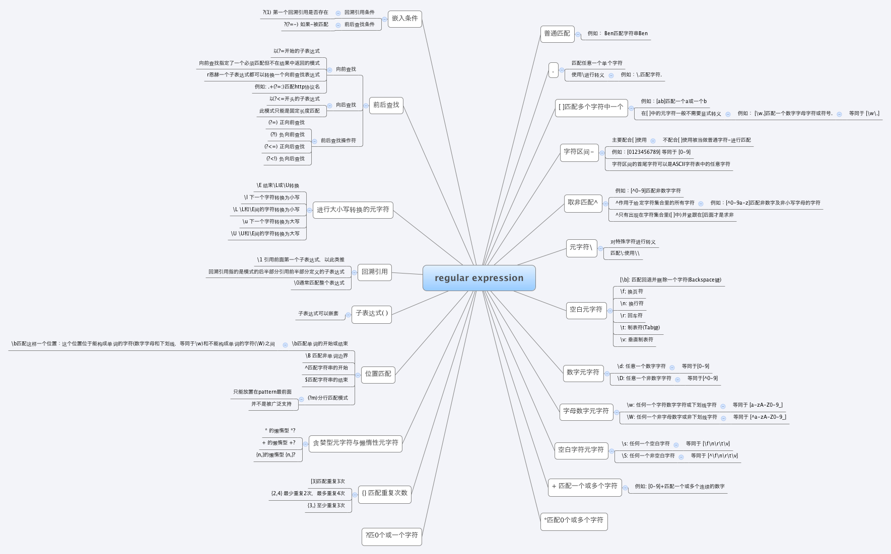
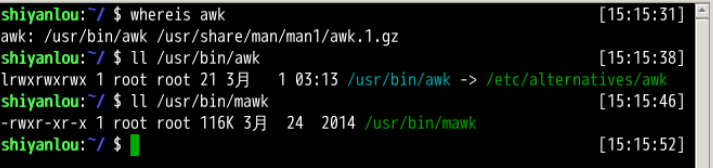

# 正则表达式

2022年06月20日02:10:57

---

一个正则表达式通常被称为一个模式（**pattern**），为用来描述或者匹配一系列符合某个句法规则的字符串。

#### 选择

`|` 竖直分隔符表示选择，例如 `boy|girl` 可以匹配 `boy` 或者 `girl`。

#### 数量限定

数量限定除了我们举例用的 `*` 还有 `+` 加号 `?` 问号，如果在一个模式中不加数量限定符则表示出现一次且仅出现一次：

- `+` 表示前面的字符必须出现至少一次(1 次或多次)，例如 `goo+gle` 可以匹配 `gooogle`，`goooogle` 等；
- `?` 表示前面的字符最多出现一次（0 次或 1 次），例如，`colou?r`，可以匹配 `color` 或者 `colour`;
- `*` 星号代表前面的字符可以不出现，也可以出现一次或者多次（0 次、或 1 次、或多次），例如，`0*42` 可以匹配 42、042、0042、00042 等。

#### 范围和优先级

`()` 圆括号可以用来定义模式字符串的范围和优先级，这可以简单的理解为是否将括号内的模式串作为一个整体。例如，`gr(a|e)y` 等价于 `gray|grey`，（这里体现了优先级，竖直分隔符用于选择 `a` 或者 `e` 而不是 `gra` 和 `ey`），`(grand)?father` 匹配 `father` 和 `grandfather`（这里体现了范围，`?` 将圆括号内容作为一个整体匹配）。

#### 语法（部分）

正则表达式有多种不同的风格，下面列举一些常用的作为 PCRE 子集的适用于 `perl` 和 `python` 编程语言及 `grep` 或 `egrep` 的正则表达式匹配规则：

> PCRE（Perl Compatible Regular Expressions 中文含义：perl 语言兼容正则表达式）是一个用 C 语言编写的正则表达式函数库，由菲利普.海泽(Philip Hazel)编写。PCRE 是一个轻量级的函数库，比 Boost 之类的正则表达式库小得多。PCRE 十分易用，同时功能也很强大，性能超过了 POSIX 正则表达式库和一些经典的正则表达式库。

**(由于 markdown 表格解析的问题，下面的竖直分隔符 `|` 用全角字符代替，实际使用时请换回半角字符。**

| 字符        | 描述                                                         |
| ----------- | ------------------------------------------------------------ |
| `\`         | **将下一个字符标记为一个特殊字符、或一个原义字符。** 例如 `n` 匹配字符 `n`。`\n` 匹配一个换行符。序列 `\\` 匹配 `\` 而 `\(` 则匹配 `(`。 |
| `^`         | **匹配输入字符串的开始位置。**                               |
| `$`         | **匹配输入字符串的结束位置。**                               |
| `{n}`       | n 是一个非负整数。**匹配确定的 n 次**。例如 `o{2}` 不能匹配 `Bob` 中的 `o`，但是能匹配 `food` 中的两个 `o`。 |
| `{n,}`      | n 是一个非负整数。**至少匹配 n 次**。例如 `o{2,}` 不能匹配 `Bob` 中的 `o`，但能匹配 `foooood` 中的所有 `o`。`o{1,}` 等价于 `o+`。`o{0,}` 则等价于 `o*`。 |
| `{n,m}`     | m 和 n 均为非负整数，其中 `n<=m`。**最少匹配 n 次且最多匹配 m 次**。例如，`o{1,3}` 将匹配 `fooooood` 中的前三个 `o`。`o{0,1}` 等价于 `o?`。请注意在逗号和两个数之间不能有空格。 |
| `*`         | **匹配前面的子表达式零次或多次**。例如，`zo*` 能匹配 `z`、`zo` 以及 `zoo`。`*` 等价于 `{0,}`。 |
| `+`         | **匹配前面的子表达式一次或多次**。例如，`zo+` 能匹配 `zo` 以及 `zoo`，但不能匹配 `z`。`+` 等价于 `{1,}`。 |
| `?`         | **匹配前面的子表达式零次或一次**。例如，`do(es)?` 可以匹配 `do` 或 `does` 中的 `do`。`?` 等价于 `{0,1}`。 |
| `?`         | 当该字符紧跟在任何一个其他限制符（`*`，`+`，`?`，`{n}`，`{n,}`，`{n,m}`）后面时，匹配模式是非贪婪的。非贪婪模式尽可能少的匹配所搜索的字符串，而默认的贪婪模式则尽可能多的匹配所搜索的字符串。例如，对于字符串 `oooo`，`o+?` 将匹配单个 `o`，而 `o+` 将匹配所有 `o`。 |
| `.`         | **匹配除 `\n` 之外的任何单个字符**。要匹配包括 `\n` 在内的任何字符，请使用类似 `(.｜\n)` 的模式。 |
| `(pattern)` | **匹配 pattern 并获取这一匹配的子字符串**。该子字符串用于向后引用。要匹配圆括号字符，请使用 `\(` 和 `\)`。 |
| x ｜ y      | **匹配 x 或 y**。例如，“z ｜ food”能匹配 `z` 或 `food`。“(z ｜ f)ood”则匹配 `zood` 或 `food`。 |
| `[xyz]`     | 字符集合（character class）。**匹配所包含的任意一个字符**。例如，`[abc]` 可以匹配 `plain` 中的 `a`。其中特殊字符仅有反斜线 `\` 保持特殊含义，用于转义字符。其它特殊字符如星号、加号、各种括号等均作为普通字符。脱字符^如果出现在首位则表示负值字符集合；如果出现在字符串中间就仅作为普通字符。**连字符 `-` 如果出现在字符串中间表示字符范围描述；如果出现在首位则仅作为普通字符。** |
| `[^xyz]`    | 排除型（negate）字符集合。**匹配未列出的任意字符。**例如，`[^abc]` 可以匹配 `plain` 中的 `plin`。 |
| `[a-z]`     | 字符范围。**匹配指定范围内的任意字符。**例如，`[a-z]` 可以匹配 `a` 到 `z` 范围内的任意小写字母字符。 |
| `[^a-z]`    | 排除型的字符范围。**匹配任何不在指定范围内的任意字符**。例如，`[^a-z]` 可以匹配任何不在 `a` 到 `z` 范围内的任意字符。 |

#### 优先级

优先级为从上到下从左到右，依次降低：

| 运算符                                | 说明         |
| ------------------------------------- | ------------ |
| `\`                                   | 转义符       |
| `()`，`(?:)`，`(?=)`，`[]`            | 括号和中括号 |
| `*`，`+`，`?`，`{n}`，`{n,}`，`{n,m}` | 限定符       |
| `^`，`$`，`\` 任何元字符              | 定位点和序列 |
| ｜                                    | 选择         |

更多正则表达式的内容可以参考以下链接：

- [正则表达式 wiki](http://zh.wikipedia.org/wiki/正则表达式)
- [几种正则表达式引擎的语法差异](http://www.greenend.org.uk/rjk/tech/regexp.html)
- [各语言各平台对正则表达式的支持](http://en.wikipedia.org/wiki/Comparison_of_regular_expression_engines)

regex 的思导图：



上面空谈了那么多正则表达式的内容也并没有提及具体该如何使用它，实在枯燥，如果说正则表达式是一门武功，那它也只能算得上一些口诀招式罢了，要把它真正练起来还得需要一些兵器在手才行，这里我们要介绍的 `grep` 命令以及后面要讲的 `sed`，`awk` 这些就该算作是这样的兵器了。

#### 特殊符号

为什么不用 [a-z] 因为他可能在某些地方不能用而用下面的方式是通用的、

| 特殊符号     | 说明                                                         |
| ------------ | ------------------------------------------------------------ |
| `[:alnum:]`  | 代表英文大小写字母及数字，亦即 0-9，A-Z，a-z                 |
| `[:alpha:]`  | 代表任何英文大小写字母，亦即 A-Z，a-z                        |
| `[:blank:]`  | 代表空白键与 `[Tab]` 按键两者                                |
| `[:cntrl:]`  | 代表键盘上面的控制按键，亦即包括 CR，LF，Tab，Del...         |
| `[:digit:]`  | 代表数字而已，亦即 0-9                                       |
| `[:graph:]`  | 除了空白字节（空白键与 [Tab] 按键）外的其他所有按键          |
| `[:lower:]`  | 代表小写字母，亦即 a-z                                       |
| `[:print:]`  | 代表任何可以被列印出来的字符                                 |
| `[:punct:]`  | 代表标点符号（punctuation symbol），即：`"`，`'`，`?`，`!`，`;`，`:`，`#`，`$`... |
| `[:upper:]`  | 代表大写字母，亦即 A-Z                                       |
| `[:space:]`  | 任何会产生空白的字符，包括空格键，`[Tab]`，CR 等等           |
| `[:xdigit:]` | 代表 16 进位的数字类型，因此包括： 0-9，A-F，a-f 的数字与字节 |

#### sed 命令基本格式：

```bash
sed [参数]... [执行命令] [输入文件]...
# 形如：
$ sed -i 's/sad/happy/' test # 表示将test文件中的"sad"替换为"happy"
```

| 参数          | 说明                                                         |
| ------------- | ------------------------------------------------------------ |
| `-n`          | 安静模式，只打印受影响的行，默认打印输入数据的全部内容       |
| `-e`          | 用于在脚本中添加多个执行命令一次执行，在命令行中执行多个命令通常不需要加该参数 |
| `-f filename` | 指定执行 filename 文件中的命令                               |
| `-r`          | 使用扩展正则表达式，默认为标准正则表达式                     |
| `-i`          | 将直接修改输入文件内容，而不是打印到标准输出设备             |

#### sed 执行命令格式：

```bash
[n1][,n2]command
[n1][~step]command
```

其中一些命令可以在后面加上作用范围，形如：

```bash
sed -i 's/sad/happy/g' test # g 表示全局范围
sed -i 's/sad/happy/4' test # 4 表示指定行中的第四个匹配字符串
```

其中 `n1,n2` 表示输入内容的行号，它们之间为 `,` 逗号则表示从 n1 到 n2 行，如果为 `~` 波浪号则表示从 n1 开始以 step 为步进的所有行；command 为执行动作，下面为一些常用动作指令：

| 命令 | 说明                                 |
| ---- | ------------------------------------ |
| `s`  | 行内替换                             |
| `c`  | 整行替换                             |
| `a`  | 插入到指定行的后面                   |
| `i`  | 插入到指定行的前面                   |
| `p`  | 打印指定行，通常与 `-n` 参数配合使用 |
| `d`  | 删除指定行                           |


#### awk 介绍

AWK 是一种优良的文本处理工具，Linux 及 Unix 环境中现有的功能最强大的数据处理引擎之一。其名称得自于它的创始人 Alfred Aho（阿尔佛雷德·艾侯）、Peter Jay Weinberger（彼得·温伯格）和 Brian Wilson Kernighan（布莱恩·柯林汉)姓氏的首个字母 `AWK`，三位创建者已将它正式定义为“样式扫描和处理语言”。它允许你创建简短的程序，这些程序读取输入文件、为数据排序、处理数据、对输入执行计算以及生成报表，还有无数其他的功能。最简单地说，AWK 是一种用于处理文本的编程语言工具。

在大多数 Linux 发行版上面，实际我们使用的是 gawk（GNU awk，awk 的 GNU 版本），在我们的环境中 ubuntu 上，默认提供的是 mawk，不过我们通常可以直接使用 awk 命令（awk 语言的解释器），因为系统已经为我们创建好了 awk 指向 mawk 的符号链接。

```bash
ll /usr/bin/awk
```



> nawk： 在 20 世纪 80 年代中期，对 awk 语言进行了更新，并不同程度地使用一种称为 nawk(new awk) 的增强版本对其进行了替换。许多系统中仍然存在着旧的 awk 解释器，但通常将其安装为 oawk (old awk) 命令，而 nawk 解释器则安装为主要的 awk 命令，也可以使用 nawk 命令。Dr. Kernighan 仍然在对 nawk 进行维护，与 gawk 一样，它也是开放源代码的，并且可以免费获得;

> gawk： 是 GNU Project 的 awk 解释器的开放源代码实现。尽管早期的 GAWK 发行版是旧的 AWK 的替代程序，但不断地对其进行了更新，以包含 NAWK 的特性;

> mawk 也是 awk 编程语言的一种解释器，mawk 遵循 POSIX 1003.2 （草案 11.3）定义的 AWK 语言，包含了一些没有在 AWK 手册中提到的特色，同时 mawk 提供一小部分扩展，另外、据说 mawk 是实现最快的 awk。

#### awk格式

awk 所有的操作都是基于 pattern(模式)—action(动作)对来完成的，如下面的形式：

```bash
pattern {action}
```

你可以看到就如同很多编程语言一样，它将所有的动作操作用一对 `{}` 花括号包围起来。其中 pattern 通常是表示用于匹配输入的文本的“关系式”或“正则表达式”，action 则是表示匹配后将执行的动作。在一个完整 awk 操作中，这两者可以只有其中一个，如果没有 pattern 则默认匹配输入的全部文本，如果没有 action 则默认为打印匹配内容到屏幕。

**`awk` 处理文本的方式，是将文本分割成一些“字段”，然后再对这些字段进行处理**，默认情况下，awk 以空格作为一个字段的分割符，不过这不是固定的，你可以任意指定分隔符，下面将告诉你如何做到这一点。

```bash
awk [-F fs] [-v var=value] [-f prog-file | 'program text'] [file...]
```

其中 `-F` 参数用于预先指定前面提到的字段分隔符（还有其他指定字段的方式），`-v` 用于预先为 `awk` 程序指定变量，`-f` 参数用于指定 `awk` 命令要执行的程序文件，或者在不加 `-f` 参数的情况下直接将程序语句放在这里，最后为 `awk` 需要处理的文本输入，且可以同时输入多个文本文件。现在我们还是直接来具体体验一下吧。

先创建一个文件

` echo "I like linux \nwww.shiyanlou.com" > test`

```awk
awk -F'.' '{
> if(NR==2){
> print $1 "\t" $2 "\t" $3
> }}' test

# 或者
awk '
> BEGIN{
> FS="."
> OFS="\t"  # 如果写为一行，两个动作语句之间应该以";"号分开
> }{
> if(NR==2){
> print $1, $2, $3
> }}' test

$ awk '{
> if(NR==1){
> print $1 "\n" $2 "\n" $3
> } else {
> print}
> }' test

# 或者
$ awk '{
> if(NR==1){
> OFS="\n"
> print $1, $2, $3
> } else {
> print}
> }' test

```

#### AWK 内置的变量

| 变量名     | 说明                                                         |
| ---------- | ------------------------------------------------------------ |
| `FILENAME` | 当前输入文件名，若有多个文件，则只表示第一个。如果输入是来自标准输入，则为空字符串 |
| `$0`       | 当前记录的内容                                               |
| `$N`       | N 表示字段号，最大值为`NF`变量的值                           |
| `FS`       | 字段分隔符，由正则表达式表示，默认为空格                     |
| `RS`       | 输入记录分隔符，默认为 `\n`，即一行为一个记录                |
| `NF`       | 当前记录字段数                                               |
| `NR`       | 已经读入的记录数                                             |
| `FNR`      | 当前输入文件的记录数，请注意它与 NR 的区别                   |
| `OFS`      | 输出字段分隔符，默认为空格                                   |
| `ORS`      | 输出记录分隔符，默认为 `\n`                                  |