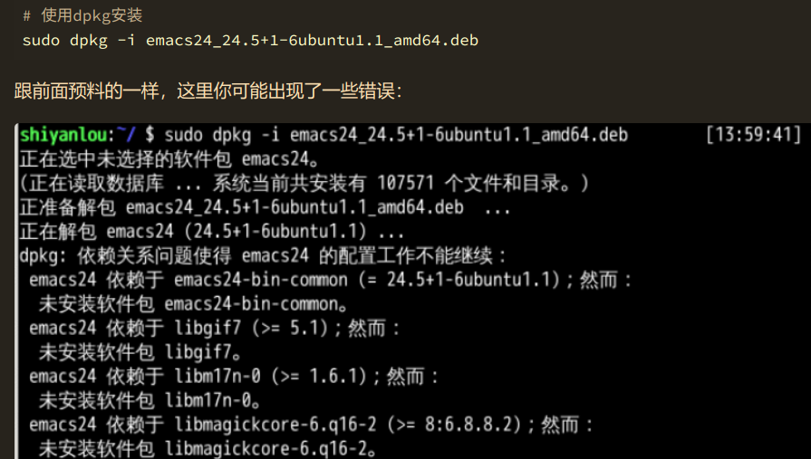

#### 四种类型安装

- 在线安装
- 从磁盘安装 deb 软件包
- 从二进制软件包安装
- 从源代码编译安装

#### 一 apt

`apt-get` 是用于处理 `apt`包的公用程序集，我们可以用它来在线安装、卸载和升级软件包等，下面列出一些 `apt-get` 包含的常用的一些工具：

| 工具           | 说明                                                         |
| -------------- | ------------------------------------------------------------ |
| `install`      | 其后加上软件包名，用于安装一个软件包                         |
| `update`       | 从软件源镜像服务器上下载/更新用于更新本地软件源的软件包列表  |
| `upgrade`      | 升级本地可更新的全部软件包，但存在依赖问题时将不会升级，通常会在更新之前执行一次 `update` |
| `dist-upgrade` | 解决依赖关系并升级（存在一定危险性）                         |
| `remove`       | 移除已安装的软件包，包括与被移除软件包有依赖关系的软件包，但不包含软件包的配置文件 |
| `autoremove`   | 移除之前被其他软件包依赖，但现在不再被使用的软件包           |
| `purge`        | 与 remove 相同，但会完全移除软件包，包含其配置文件           |
| `clean`        | 移除下载到本地的已经安装的软件包，默认保存在 `/var/cache/apt/archives/` |
| `autoclean`    | 移除已安装的软件的旧版本软件包                               |

#### `apt-get`常用的参数：

| 参数                 | 说明                                                         |
| -------------------- | ------------------------------------------------------------ |
| `-y`                 | 自动回应是否安装软件包的选项，在一些自动化安装脚本中使用这个参数将十分有用 |
| `-s`                 | 模拟安装                                                     |
| `-q`                 | 静默安装方式，指定多个 `q` 或者 `-q=#`，`#` 表示数字，用于设定静默级别，这在你不想要在安装软件包时屏幕输出过多时很有用 |
| `-f`                 | 修复损坏的依赖关系                                           |
| `-d`                 | 只下载不安装                                                 |
| `--reinstall`        | 重新安装已经安装但可能存在问题的软件包                       |
| `--install-suggests` | 同时安装 APT 给出的建议安装的软件包                          |

#### 软件重新安装

很多时候我们需要重新安装一个软件包，比如你的系统被破坏，或者一些错误的配置导致软件无法正常工作。你可以使用如下方式重新安装

sudo apt-get --reinstall install <packagename>

当自己刚知道了一个软件，想下载使用，需要确认软件仓库里面有没有，就需要用到搜索功能了，命令如下：

```bash
sudo apt-cache search softname1 softname2 softname3……
```


#### 二  dpkg 介绍

> dpkg 是 Debian 软件包管理器的基础，它被伊恩·默多克创建于 1993 年。dpkg 与 RPM 十分相似，同样被用于安装、卸载和供给和 .deb 软件包相关的信息。

> dpkg 本身是一个底层的工具。上层的工具，像是 APT，被用于从远程获取软件包以及处理复杂的软件包关系。"dpkg"是"Debian Package"的简写。

我们经常可以在网络上见到以`deb`形式打包的软件包，就需要使用`dpkg`命令来安装。

#### `dpkg`常用参数介绍：

| 参数 | 说明                                              |
| ---- | ------------------------------------------------- |
| `-i` | 安装指定 deb 包                                   |
| `-R` | 后面加上目录名，用于安装该目录下的所有 deb 安装包 |
| `-r` | remove，移除某个已安装的软件包                    |
| `-I` | 显示 `deb` 包文件的信息                           |
| `-s` | 显示已安装软件的信息                              |
| `-S` | 搜索已安装的软件包                                |
| `-L` | 显示已安装软件包的目录信息                        |

很可能遇到下面这样的错误



`sudo apt-get -f install -y`

#### 三 从二进制包安装

二进制包的安装比较简单，我们需要做的只是将从网络上下载的二进制包解压后放到合适的目录，**<u>然后将包含可执行的主程序文件的目录添加进`PATH`环境变量即可</u>**，如果你不知道该放到什么位置，请重新复习第四节关于 Linux 目录结构的内容。