2022年07月02日04:21:38
---

- 查看进程的运行状态
- 进程的结束控制
- 进程的执行顺序

`ps`  `pstree`

我们看到 top 显示的第一排，

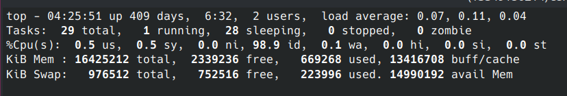

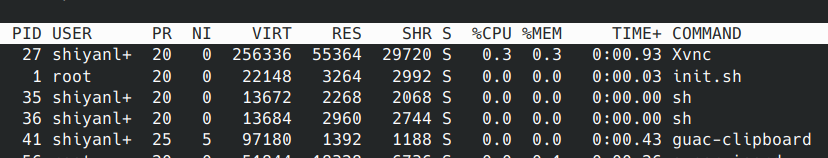

| 内容                         | 解释                                    |
| ---------------------------- | --------------------------------------- |
| top                          | 表示当前程序的名称                      |
| 11:05:18                     | 表示当前的系统的时间                    |
| up 8 days,17:12              | 表示该机器已经启动了多长时间            |
| 1 user                       | 表示当前系统中只有一个用户              |
| load average: 0.29,0.20,0.25 | 分别对应 1、5、15 分钟内 cpu 的平均负载 |

| 列名    | 解释                                         |
| ------- | -------------------------------------------- |
| PID     | 进程 id                                      |
| USER    | 该进程的所属用户                             |
| PR      | 该进程执行的优先级 priority 值               |
| NI      | 该进程的 nice 值                             |
| VIRT    | 该进程任务所使用的虚拟内存的总数             |
| RES     | 该进程所使用的物理内存数，也称之为驻留内存数 |
| SHR     | 该进程共享内存的大小                         |
| S       | 该进程进程的状态: S=sleep R=running Z=zombie |
| %CPU    | 该进程 CPU 的利用率                          |
| %MEM    | 该进程内存的利用率                           |
| TIME+   | 该进程活跃的总时间                           |
| COMMAND | 该进程运行的名字                             |


#### ps 也是我们最常用的查看进程的工具之一，我们通过这样的一个命令来了解一下，它能给我们带来哪些信息：

```bash
ps aux
```

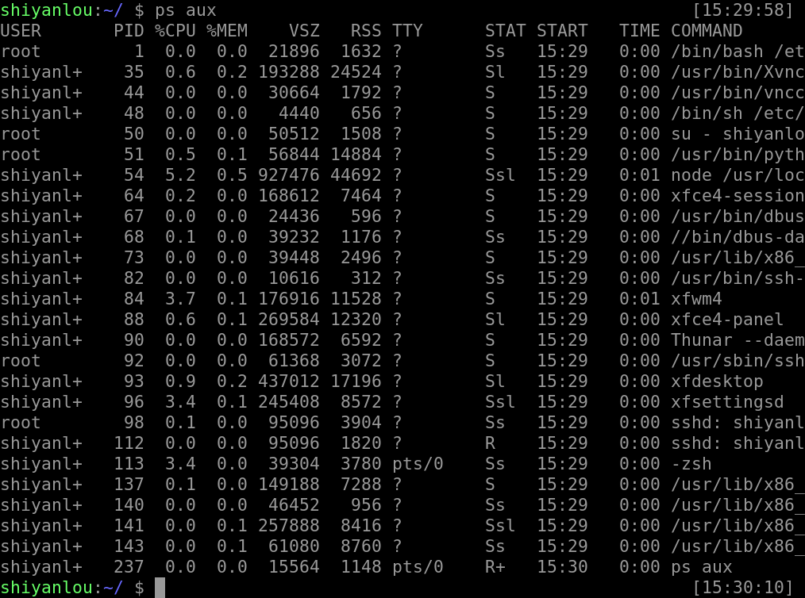

```bash
ps axjf
```

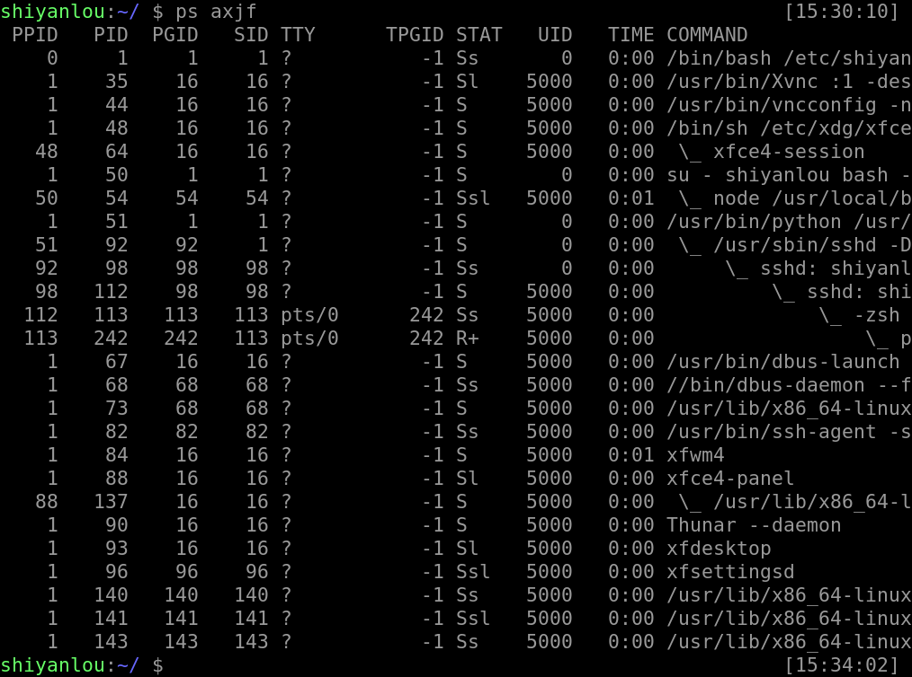

我们来总体了解下会出现哪些信息给我们，这些信息又代表着什么（更多的 keywords 大家可以通过 `man ps` 了解）。

| 内容        | 解释                                                         |
| ----------- | ------------------------------------------------------------ |
| `F`         | 进程的标志（process flags），当 flags 值为 1 则表示此子程序只是 fork 但没有执行 exec，为 4 表示此程序使用超级管理员 root 权限 |
| `USER`      | 进程的拥有用户                                               |
| `PID`       | 进程的 ID                                                    |
| `PPID`      | 其父进程的 PID                                               |
| `SID`       | session 的 ID                                                |
| `TPGID`     | 前台进程组的 ID                                              |
| `%CPU`      | 进程占用的 CPU 百分比                                        |
| `%MEM`      | 占用内存的百分比                                             |
| `NI`        | 进程的 NICE 值                                               |
| `VSZ`       | 进程使用虚拟内存大小                                         |
| `RSS`       | 驻留内存中页的大小                                           |
| `TTY`       | 终端 ID                                                      |
| `S or STAT` | 进程状态                                                     |
| `WCHAN`     | 正在等待的进程资源                                           |
| `START`     | 启动进程的时间                                               |
| `TIME`      | 进程消耗 CPU 的时间                                          |
| `COMMAND`   | 命令的名称和参数                                             |

> **TPGID**栏写着-1 的都是没有控制终端的进程，也就是守护进程

> **STAT**表示进程的状态，而进程的状态有很多，如下表所示

| 状态 | 解释                               |
| ---- | ---------------------------------- |
| `R`  | Running.运行中                     |
| `S`  | Interruptible Sleep.等待调用       |
| `D`  | Uninterruptible Sleep.不可中断睡眠 |
| `T`  | Stoped.暂停或者跟踪状态            |
| `X`  | Dead.即将被撤销                    |
| `Z`  | Zombie.僵尸进程                    |
| `W`  | Paging.内存交换                    |
| `N`  | 优先级低的进程                     |
| `<`  | 优先级高的进程                     |
| `s`  | 进程的领导者                       |
| `L`  | 锁定状态                           |
| `l`  | 多线程状态                         |
| `+`  | 前台进程                           |

> 其中的 D 是不能被中断睡眠的状态，处在这种状态的进程不接受外来的任何 signal，所以无法使用 kill 命令杀掉处于 D 状态的进程，无论是 `kill`，`kill -9` 还是 `kill -15`，一般处于这种状态可能是进程 I/O 的时候出问题了。

ps 工具有许多的参数，下面给大家解释部分常用的参数。

使用 `-l` 参数可以显示自己这次登录的 bash 相关的进程信息罗列出来：

```bash
ps -l
```

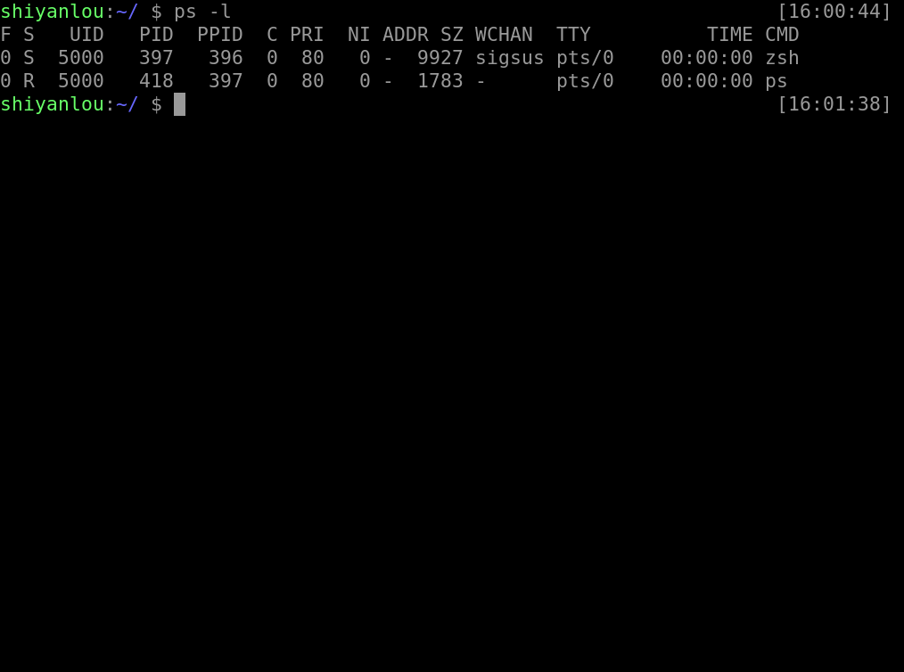

相对来说我们更加常用下面这个命令，他将会罗列出所有的进程信息：

```bash
ps aux
```

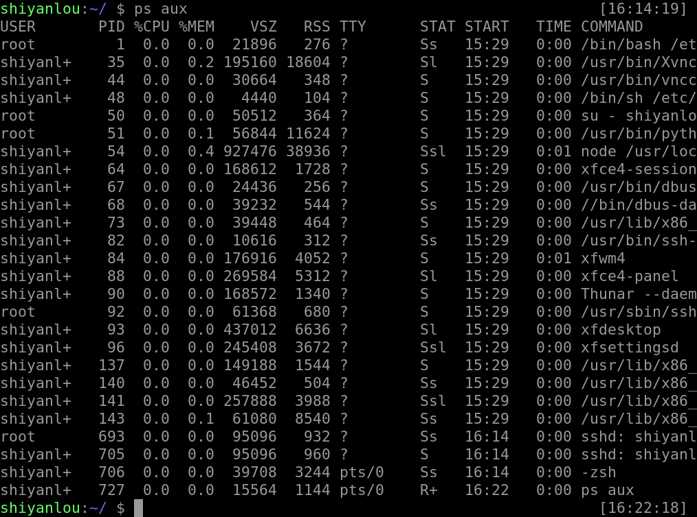

若是查找其中的某个进程的话，我们还可以配合着 `grep` 和正则表达式一起使用：

```bash
ps aux | grep zsh
```

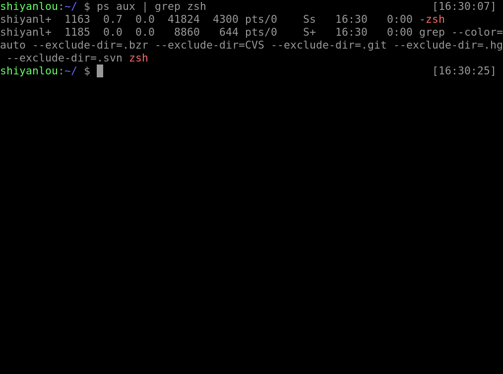

此外我们还可以查看时，将连同部分的进程呈树状显示出来：

```bash
ps axjf
```

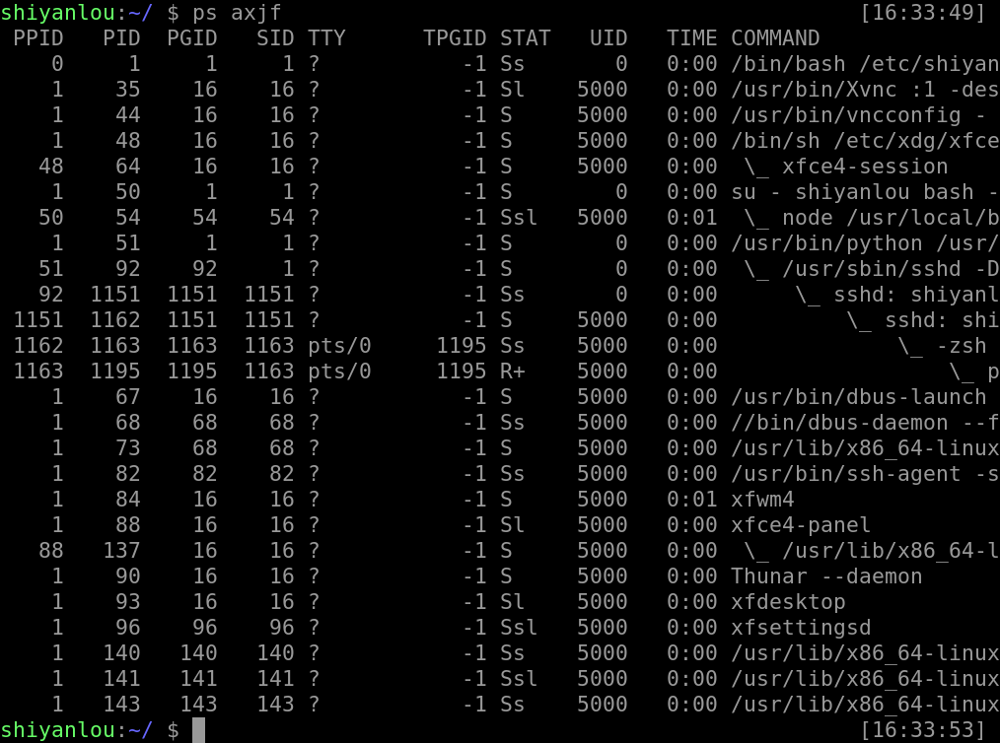

当然如果你觉得使用这样的此时没有把你想要的信息放在一起，我们也可以是用这样的命令，来自定义我们所需要的参数显示：

```bash
ps -afxo user,ppid,pid,pgid,command
```

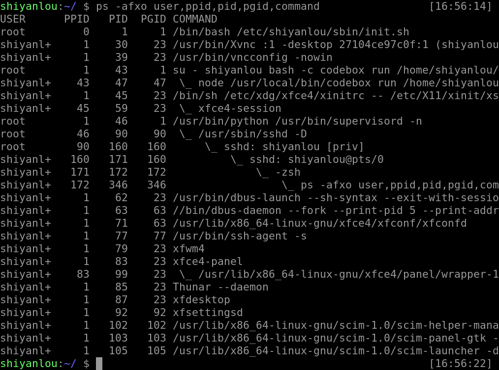

这是一个简单而又实用的工具，想要更灵活的使用，想要知道更多的参数我们可以使用 man 来获取更多相关的信息。

ps 也是我们最常用的查看进程的工具之一，我们通过这样的一个命令来了解一下，它能给我们带来哪些信息：

```bash
ps aux
```


```bash
ps axjf
```


我们来总体了解下会出现哪些信息给我们，这些信息又代表着什么（更多的 keywords 大家可以通过 `man ps` 了解）。

| 内容        | 解释                                                         |
| ----------- | ------------------------------------------------------------ |
| `F`         | 进程的标志（process flags），当 flags 值为 1 则表示此子程序只是 fork 但没有执行 exec，为 4 表示此程序使用超级管理员 root 权限 |
| `USER`      | 进程的拥有用户                                               |
| `PID`       | 进程的 ID                                                    |
| `PPID`      | 其父进程的 PID                                               |
| `SID`       | session 的 ID                                                |
| `TPGID`     | 前台进程组的 ID                                              |
| `%CPU`      | 进程占用的 CPU 百分比                                        |
| `%MEM`      | 占用内存的百分比                                             |
| `NI`        | 进程的 NICE 值                                               |
| `VSZ`       | 进程使用虚拟内存大小                                         |
| `RSS`       | 驻留内存中页的大小                                           |
| `TTY`       | 终端 ID                                                      |
| `S or STAT` | 进程状态                                                     |
| `WCHAN`     | 正在等待的进程资源                                           |
| `START`     | 启动进程的时间                                               |
| `TIME`      | 进程消耗 CPU 的时间                                          |
| `COMMAND`   | 命令的名称和参数                                             |

> **TPGID**栏写着-1 的都是没有控制终端的进程，也就是守护进程

> **STAT**表示进程的状态，而进程的状态有很多，如下表所示

| 状态 | 解释                               |
| ---- | ---------------------------------- |
| `R`  | Running.运行中                     |
| `S`  | Interruptible Sleep.等待调用       |
| `D`  | Uninterruptible Sleep.不可中断睡眠 |
| `T`  | Stoped.暂停或者跟踪状态            |
| `X`  | Dead.即将被撤销                    |
| `Z`  | Zombie.僵尸进程                    |
| `W`  | Paging.内存交换                    |
| `N`  | 优先级低的进程                     |
| `<`  | 优先级高的进程                     |
| `s`  | 进程的领导者                       |
| `L`  | 锁定状态                           |
| `l`  | 多线程状态                         |
| `+`  | 前台进程                           |

> 其中的 D 是不能被中断睡眠的状态，处在这种状态的进程不接受外来的任何 signal，所以无法使用 kill 命令杀掉处于 D 状态的进程，无论是 `kill`，`kill -9` 还是 `kill -15`，一般处于这种状态可能是进程 I/O 的时候出问题了。

ps 工具有许多的参数，下面给大家解释部分常用的参数。

使用 `-l` 参数可以显示自己这次登录的 bash 相关的进程信息罗列出来：

```bash
ps -l
```


相对来说我们更加常用下面这个命令，他将会罗列出所有的进程信息：

```bash
ps aux
```


若是查找其中的某个进程的话，我们还可以配合着 `grep` 和正则表达式一起使用：

```bash
ps aux | grep zsh
```


此外我们还可以查看时，将连同部分的进程呈树状显示出来：

```bash
ps axjf
```


当然如果你觉得使用这样的此时没有把你想要的信息放在一起，我们也可以是用这样的命令，来自定义我们所需要的参数显示：

```bash
ps -afxo user,ppid,pid,pgid,command
```


这是一个简单而又实用的工具，想要更灵活的使用，想要知道更多的参数我们可以使用 man 来获取更多相关的信息。

#### 通过 `pstree` 可以很直接的看到相同的进程数量，最主要的还是我们可以看到所有进程之间的相关性。

```bash
pstree
```

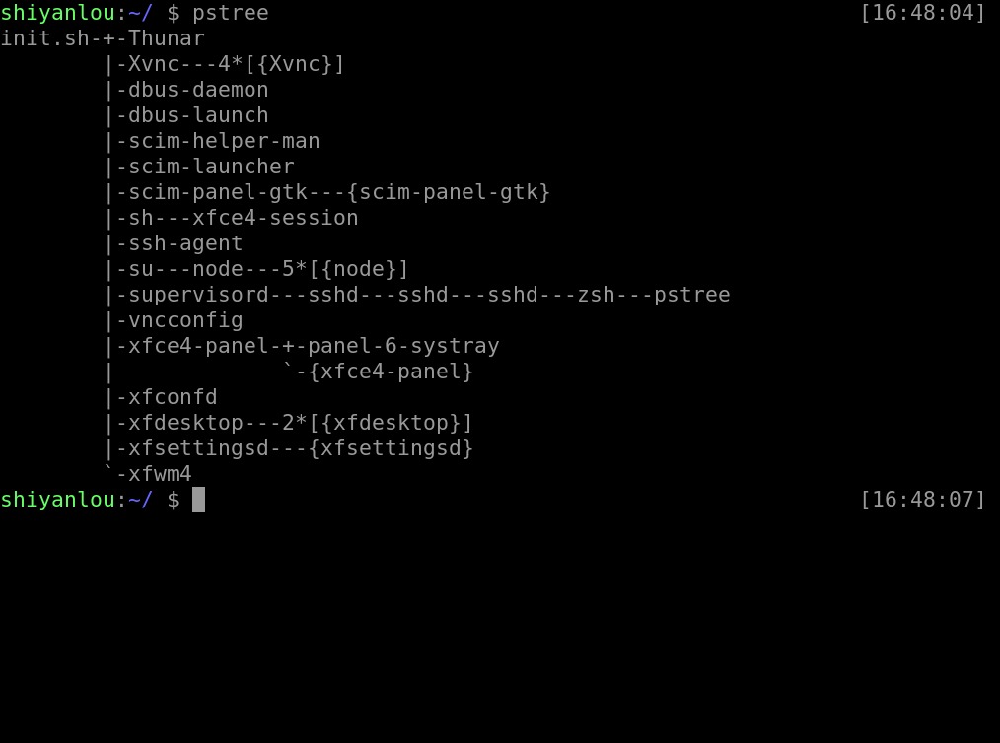

#### kill 命令的掌握

上个实验中我们讲诉了进程之间是如何衍生，之间又有什么相关性，我们来回顾一下，当一个进程结束的时候或者要异常结束的时候，会向其父进程返回一个或者接收一个 SIGHUP 信号而做出的结束进程或者其他的操作，这个 SIGHUP 信号不仅可以由系统发送，我们可以使用 `kill` 来发送这个信号来操作进程的结束或者重启等等。

上节课程我们使用 `kill` 命令来管理我们的一些 job，这节课我们将尝试用 `kill` 来操作下一些不属于 job 范畴的进程，直接对 pid 下手。

```bash
# 首先我们使用图形界面打开了 gedit、gvim，用 ps 可以查看到
ps aux

# 使用 9 这个信号强制结束 gedit 进程
kill -9 1608

# 我们再查找这个进程的时候就找不到了
ps aux | grep gedit
```

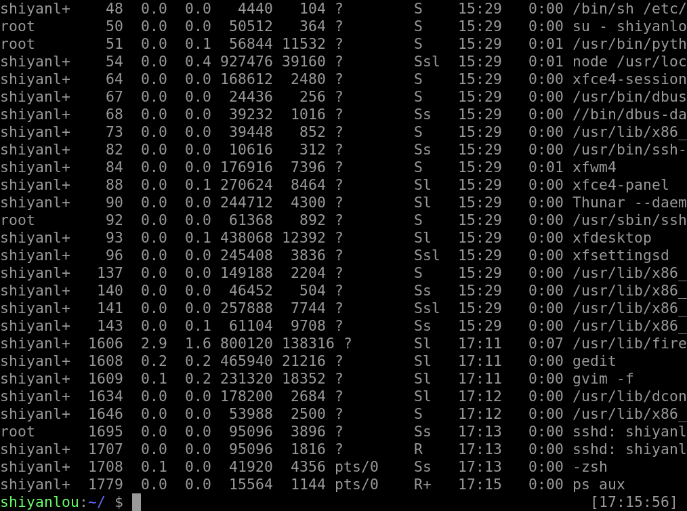

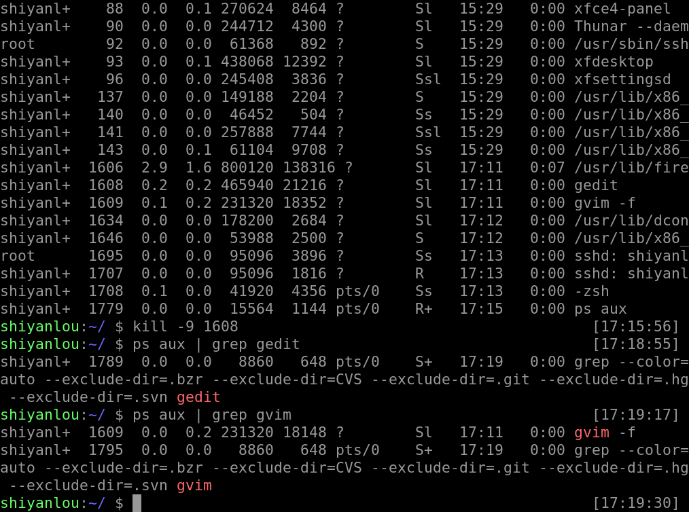


####  进程的执行顺序

我们在使用 ps 命令的时候可以看到大部分的进程都是处于休眠的状态，如果这些进程都被唤醒，那么该谁最先享受 CPU 的服务，后面的进程又该是一个什么样的顺序呢？进程调度的队列又该如何去排列呢？

当然就是靠该进程的优先级值来判定进程调度的优先级，而优先级的值就是上文所提到的 PR 与 nice 来控制与体现了

而 nice 的值我们是可以通过 nice 命令来修改的，而需要注意的是 nice 值可以调整的范围是 `-20 ~ 19`，其中 root 有着至高无上的权力，既可以调整自己的进程也可以调整其他用户的程序，并且是所有的值都可以用，而普通用户只可以调制属于自己的进程，并且其使用的范围只能是 `0 ~ 19`，因为系统为了避免一般用户抢占系统资源而设置的一个限制

```bash
# 这个实验在环境中无法做，因为权限不够，可以自己在本地尝试

# 打开一个程序放在后台，或者用图形界面打开
nice -n -5 vim &

# 用 ps 查看其优先级
ps -afxo user,ppid,pid,stat,pri,ni,time,command | grep vim
```

我们还可以用 renice 来修改已经存在的进程的优先级，同样因为权限的原因在实验环境中无法尝试。

```bash
renice -5 pid
```