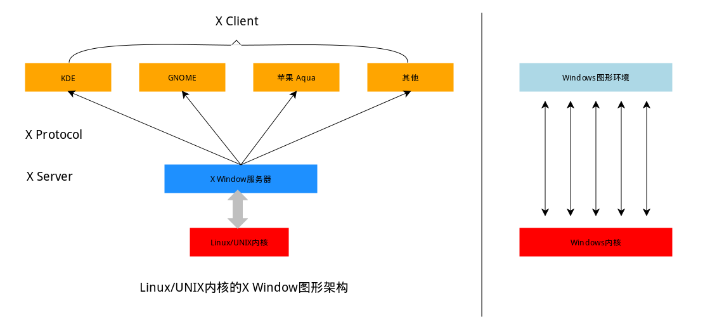

#### 二、桌面环境

2022年3月28日19:08:59

#### 1.Linux 桌面环境介绍

相对于现在的 Windows 系统，UNIX/Linux 本身是没有图形界面的，我们通常在 UNIX/Linux 发行版上看到的图形界面实际都只是运行在 Linux 系统之上的一套软件，类似 Windows95 之前的 Windows 的图形界面实则也只是运行在 DOS 环境的一套软件。而 Linux 上的这套软件以前是 XFree86，现在则是 xorg（X.Org），而这套软件又是通过 X 窗口系统（X Window System，也常被称为 X11 或 X）实现的，X 本身只是工具包及架构协议，而 xorg 便是 X 架构规范的一个实现体，也就是说它是实现了 X 协议规范的一个提供图形界面服务的服务器，就像实现了 http 协议提供 web 服务的 Apache 。如果只有服务器也是不能实现一个完整的桌面环境的，当然还需要一个客户端，我们称为 X Client，像如下几个大家熟知也最流行的实现了客户端功能的桌面环境 **KDE**，**GNOME**，**XFCE**，**LXDE** 。其中就有你看到的，实验楼目前使用的 **XFCE** 桌面环境，部分老用户可能可以回想起，实验楼之前使用的环境是 **LXDE** 。这也意味着在 Linux 上你可以自己选择安装不同的桌面环境，甚至可以定制自己的专属桌面。

这里讲这么多，主要是为了帮助你更好地理解 Linux 的桌面环境是一个怎样的概念，以及它跟 Windows 操作系统桌面的差异，实际它们之间是有着本质的差别的，**希望清楚这些内容之后可以让你忽略那些体验上的差异，专心把精力放到 Linux 系统本身或者你正准备学习的某一门技术之上，**这门实验课后面的内容和实验楼的其它课程便是为了帮助你实现以上两个目标。

#### 2.Linux 桌面环境的使用

如果你对当前实验桌面环境（xfce）的使用有任何困难，建议你先学习[实验楼入门基础课程](https://www.lanqiao.cn/courses/63)，对于其它桌面环境的使用，不在本课程的范围之内，有兴趣的用户可以在自己的计算机中安装完整的 Linux 发行版或其 Live CD 体验。