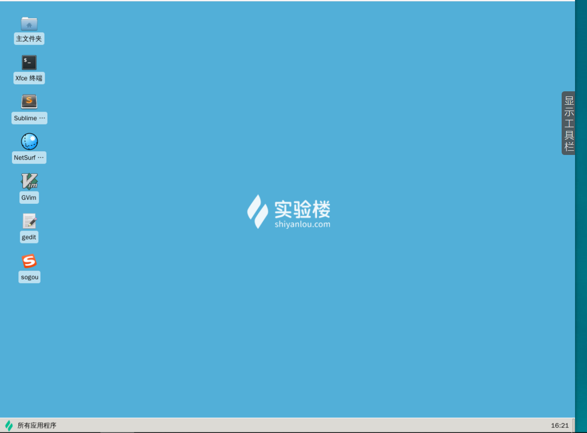

#### 三、linux 终端 /dev/tty

2022年3月28日19:11:48

#### 终端的概念

通常我们在使用 Linux 时，并不是直接与系统打交道，而是通过一个叫做 Shell 的中间程序来完成的，在图形界面下为了实现让我们在一个窗口中完成用户输入和显示输出，Linux 系统还提供了一个叫做终端模拟器的程序（Terminal）。 下面是几个比较常见的终端模拟器： gnome-terminal，Konsole，xterm，rxvt，kvt，nxterm 和 eterm 。目前我们的实验中的终端程序是 xfce 桌面环境自带的 xfce-terminal 。不过要注意的是这里所说的终端（Terminal）和控制台（Console）是有区别的。

**终端本质上是对应着 Linux 上的 /dev/tty 设备，Linux 的多用户登录就是通过不同的 /dev/tty 设备完成的**，Linux 默认提供了 6 个纯命令行界面的 “terminal”（准确的说这里应该是 6 个 virtual consoles）来让用户登录。在物理机系统上你可以通过使用`[Ctrl]`+`[Alt]`+`[F1]～[F6]`进行切换，不过在我们的在线实验环境中可能无法切换，因为特殊功能按键会被你的主机系统劫持。当你切换到其中一个终端后想要切换回图形界面，你可以按下`[Ctrl]`+`[Alt]`+`[F7]`来完成。

下一步