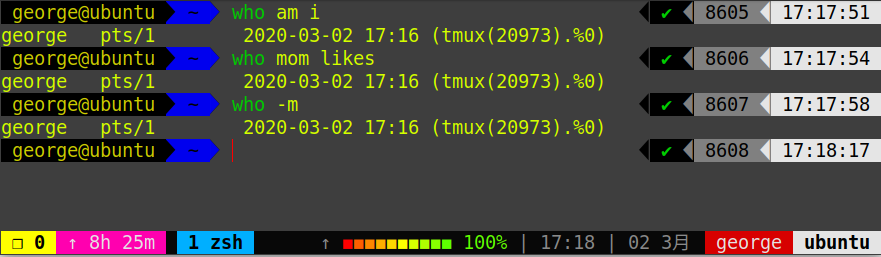

2.1 查看用户


请打开终端，输入命令：

```bash
who am i

# 或者

who mom likes
```


输出的第一列表示打开当前伪终端的用户的用户名（要查看当前登录用户的用户名，去掉空格直接使用 `whoami` 即可），第二列的 `pts/0` 中 `pts` 表示伪终端，所谓伪是相对于 `/dev/tty` 设备而言的，还记得上一节讲终端时的那七个使用 `[Ctrl]`+`[Alt]`+`[F1]～[F7]` 进行切换的 `/dev/tty` 设备么，这是“真终端”，伪终端就是当你在图形用户界面使用 `/dev/tty7` 时每打开一个终端就会产生一个伪终端，`pts/0` 后面那个数字就表示打开的伪终端序号，你可以尝试再打开一个终端，然后在里面输入 `who am i`，看第二列是不是就变成 `pts/1` 了，第三列则表示当前伪终端的启动时间。

还有一点需要注意的是，在某些环境中 `who am i` 和 `who mom likes` 命令不会输出任何内容，这是因为当前使用的 SHELL 不是登录时的 SHELL，没有用户与 who 的 stdin 相关联，因此不会输出任何内容。例如我在本地的 Ubuntu 系统上输入这个命令就不会有提示。


此时我们只需要打开一个登录 SHELL 的终端例如 Tmux，或者通过 ssh 登录到本机，再在新的终端里执行命令即可。

```bash
tmux
```



`who` 命令其它常用参数

| 参数 | 说明                       |
| ---- | -------------------------- |
| `-a` | 打印能打印的全部           |
| `-d` | 打印死掉的进程             |
| `-m` | 同`am i`，`mom likes`      |
| `-q` | 打印当前登录用户数及用户名 |
| `-u` | 打印当前登录用户登录信息   |
| `-r` | 打印运行等级               |


