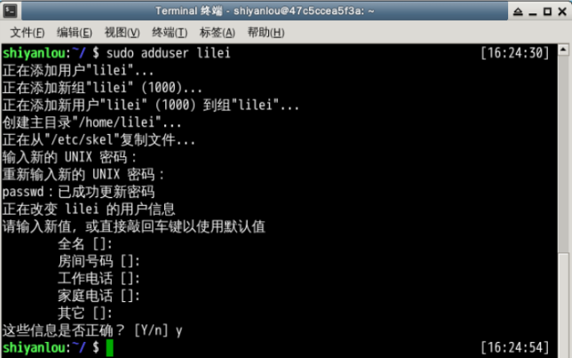
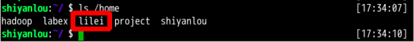

#### 2.2 创建用户

2022年3月28日20:25:41

在 Linux 系统里， `root` 账户拥有整个系统至高无上的权限，比如新建和添加用户。

> root 权限，系统权限的一种，与 SYSTEM 权限可以理解成一个概念，但高于 Administrator 权限，root 是 Linux 和 UNIX 系统中的超级管理员用户帐户，该帐户拥有整个系统至高无上的权力，所有对象他都可以操作，所以很多黑客在入侵系统的时候，都要把权限提升到 root 权限，这个操作等同于在 Windows 下就是将新建的非法帐户添加到 Administrators 用户组。更比如安卓操作系统中（基于 Linux 内核）获得 root 权限之后就意味着已经获得了手机的最高权限，这时候你可以对手机中的任何文件（包括系统文件）执行所有增、删、改、查的操作。

大部分 Linux 系统在安装时都会建议用户新建一个用户而不是直接使用 root 用户进行登录，当然也有直接使用 root 登录的例如 Kali（基于 Debian 的 Linux 发行版，集成大量工具软件，主要用于数字取证的操作系统）。一般我们登录系统时都是以普通账户的身份登录的，要创建用户需要 root 权限，这里就要用到 `sudo` 这个命令了。不过使用这个命令有两个大前提，一是你要知道当前登录用户的密码，二是当前用户必须在 `sudo` 用户组。shiyanlou 用户也属于 sudo 用户组（稍后会介绍如何查看和添加用户组）。

#### su，su- 与 sudo

**需要注意 Linux 环境下输入密码是不会显示的。**

`su <user>` 可以切换到用户 user，执行时需要输入目标用户的密码，`sudo <cmd>` 可以以特权级别运行 cmd 命令，需要当前用户属于 sudo 组，且需要输入当前用户的密码。`su - <user>` 命令也是切换用户，但是同时用户的环境变量和工作目录也会跟着改变成目标用户所对应的。

现在我们新建一个叫 `lilei` 的用户：

```bash
sudo adduser lilei
```

实验楼的环境目前设置为 shiyanlou 用户执行 sudo 不需要输入密码，通常此处需要按照提示输入 shiyanlou 密码（**Linux 下密码输入是不显示任何内容的，shiyanlou 用户密码可以在右侧环境信息里查看，请勿自行设置密码**）。然后是给 lilei 用户设置密码，后面的选项的一些内容你可以选择直接回车使用默认值。



这个命令不但可以添加用户到系统，同时也会默认为新用户在 /home 目录下创建一个工作目录：

```bash
ls /home
```



现在你已经创建好一个用户，并且你可以使用你创建的用户登录了，使用如下命令切换登录用户：

```bash
su -l lilei
```

输入刚刚设置的 lilei 的密码，然后输入如下命令并查看输出：

```bash
who am i
whoami
pwd
```


你发现了区别了吗？这就是上一小节我们讲到的 `who am i` 和 `whoami` 命令的区别。

退出当前用户跟退出终端一样，可以使用 `exit` 命令或者使用快捷键 `Ctrl+D`。


