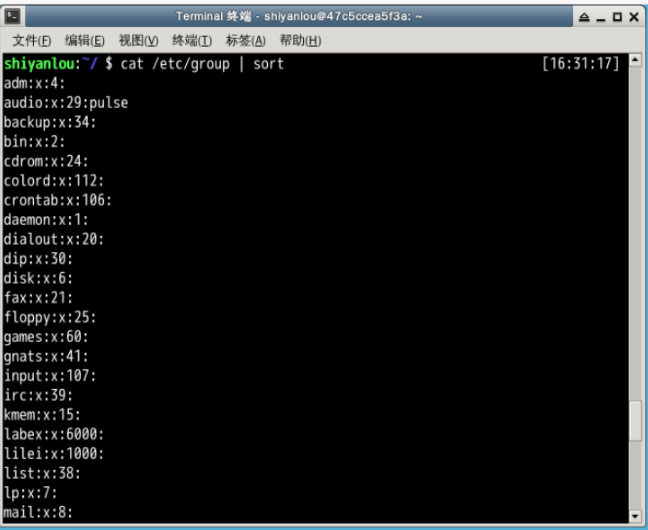
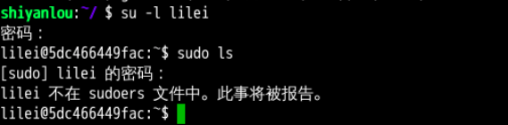
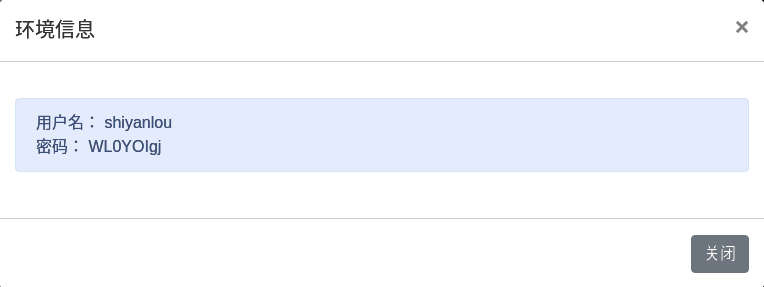
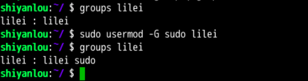
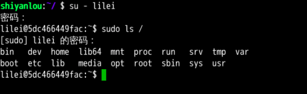

#### 2.3 用户组 (共享一些资源和权限)`sudo usermod -G groupname username `

2022年3月28日20:26:09

---

在 Linux 里面每个用户都有一个归属（用户组），用户组简单地理解就是一组用户的集合，它们**共享一些资源和权限**，同时拥有私有资源，就跟家的形式C差不多，你的兄弟姐妹（不同的用户）属于同一个家（用户组），你们可以共同拥有这个家（共享资源），爸妈对待你们都一样（共享权限），你偶尔写写日记，其他人未经允许不能查看（私有资源和权限）。当然一个用户是可以属于多个用户组的，正如你既属于家庭，又属于学校或公司。

在 Linux 里面如何知道自己属于哪些用户组呢？

#### 方法一：使用 groups 命令

```bash
groups shiyanlou
```


其中冒号之前表示用户，后面表示该用户所属的用户组。这里可以看到 shiyanlou 用户属于 shiyanlou 用户组，**每次新建用户如果不指定用户组的话，默认会自动创建一个与用户名相同的用户组**（差不多就相当于家长的意思）。

**默认情况下在 sudo 用户组里的可以使用 sudo 命令获得 root 权限。**shiyanlou 用户也可以使用 sudo 命令，为什么这里没有显示在 sudo 用户组里呢？可以查看下 `/etc/sudoers.d/shiyanlou` 文件，我们在 `/etc/sudoers.d` 目录下创建了这个文件，从而给 shiyanlou 用户赋予了 sudo 权限：


#### 方法二：查看 `/etc/group` 文件

```bash
cat /etc/group | sort
```

这里 `cat` 命令用于读取指定文件的内容并打印到终端输出，后面会详细讲它的使用。 `| sort` 表示将读取的文本进行一个字典排序再输出，然后你将看到如下一堆输出，你可以在最下面看到 shiyanlou 的用户组信息：



没找到？没关系，你可以使用 `grep` 命令过滤掉一些你不想看到的结果：

```bash
cat /etc/group | grep -E "shiyanlou"
```


##### `/etc/group` 文件格式说明

/etc/group 的内容包括用户组（Group）、用户组口令、GID（组 ID） 及该用户组所包含的用户（User），每个用户组一条记录。格式如下：

> group_name:password:GID:user_list

你看到上面的 password 字段为一个 `x`，并不是说密码就是它，只是表示密码不可见而已。

这里需要注意，如果用户的 GID 等于用户组的 GID，那么最后一个字段 `user_list` 就是空的，这里的 GID 是指用户默认所在组的 GID，可以使用 `id` 命令查看。比如 shiyanlou 用户，在 `/etc/group` 中的 shiyanlou 用户组后面是不会显示的。lilei 用户，在 `/etc/group` 中的 lilei 用户组后面是不会显示的。

#### 将其它用户加入 sudo 用户组

默认情况下新创建的用户是不具有 root 权限的，也不在 sudo 用户组，可以让其加入 sudo 用户组从而获取 root 权限：

```bash
# 注意 Linux 上输入密码是不会显示的
su -l lilei
sudo ls
```



会提示 lilei 不在 sudoers 文件中，意思就是 lilei 不在 sudo 用户组中，至于 sudoers 文件（/etc/sudoers）你现在最好不要动它，操作不慎会导致比较麻烦的后果。

**使用 `usermod` 命令可以为用户添加用户组**，同样使用该命令你必需有 root 权限，你可以直接使用 root 用户为其它用户添加用户组，或者用其它已经在 sudo 用户组的用户使用 sudo 命令获取权限来执行该命令。

这里我用 shiyanlou 用户执行 sudo 命令将 lilei 添加到 sudo 用户组，让它也可以使用 sudo 命令获得 root 权限，首先我们切换回 shiyanlou 用户。

```bash
su - shiyanlou
```

​	此处需要输入 shiyanlou 用户密码，shiyanlou 的密码可以在右侧工具栏的环境信息里看到。



当然也可以通过 `sudo passwd shiyanlou` 进行设置，或者你直接关闭当前终端打开一个新的终端。

```bash
groups lilei
sudo usermod -G sudo lilei
groups lilei
```



然后你再切换回 lilei 用户，现在就可以使用 sudo 获取 root 权限了。

