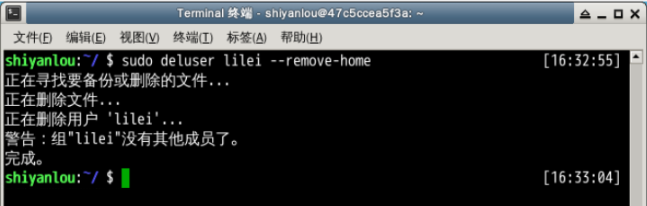
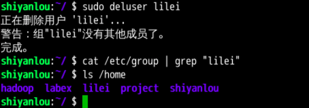

#### 2.4 删除用户和用户组 `userdel -rC` `useradd -m`

删除用户是很简单的事：

```bash
sudo deluser lilei --remove-home
```



使用 `--remove-home` 参数在删除用户时候会一并将该用户的工作目录一并删除。如果不使用那么系统会自动在 /home 目录为该用户保留工作目录。



删除用户组可以使用 `groupdel` 命令，倘若该群组中仍包括某些用户，则必须先删除这些用户后，才能删除群组。