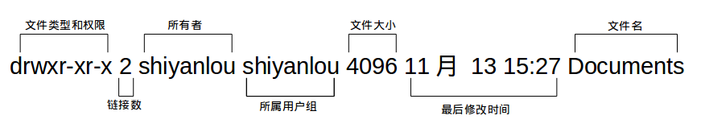

#### 3.1 查看文件权限  😂😂😂

2022年3月28日20:45:18

---

我们之前已经很多次用到 `ls` 命令了，如你所见，我们用它来列出并显示当前目录下的文件，当然这是在不带任何参数的情况下，它能做的当然不止这么多，现在我们就要用它来查看文件权限。

使用较长格式列出文件：

```bash
ls -l
```

)

你可能除了知道最后面那一项是文件名之外，其它项就不太清楚了，那么到底是什么意思呢：



可能你还是不太明白，比如第一项文件类型和权限那一堆东西具体指什么，链接又是什么，何为最后修改时间，下面一一道来：


- 文件类型

关于文件类型，这里有一点你必需时刻牢记 **Linux 里面一切皆文件**，正因为这一点才有了设备文件（ `/dev` 目录下有各种设备文件，大都跟具体的硬件设备相关）这一说。 `socket`：网络套接字，具体是什么，感兴趣的用户可以去学习实验楼的后续相关课程。`pipe` 管道，这个东西很重要，我们以后将会讨论到，这里你先知道有它的存在即可。`软链接文件`：链接文件是分为两种的，另一种当然是“硬链接”（硬链接不常用，具体内容不作为本课程讨论重点，而软链接等同于 Windows 上的快捷方式，你记住这一点就够了）。

- 文件权限

读权限，表示你可以使用 `cat <file name>` 之类的命令来读取某个文件的内容；写权限，表示你可以编辑和修改某个文件的内容；

执行权限，通常指可以运行的二进制程序文件或者脚本文件，如同 Windows 上的 `exe` 后缀的文件，不过 Linux 上不是通过文件后缀名来区分文件的类型。你需要注意的一点是，**一个目录同时具有读权限和执行权限才可以打开并查看内部文件，而一个目录要有写权限才允许在其中创建其它文件**，这是因为目录文件实际保存着该目录里面的文件的列表等信息。

所有者权限，这一点相信你应该明白了，至于所属用户组权限，是指你所在的用户组中的所有其它用户对于该文件的权限，比如，你有一个 iPad，那么这个用户组权限就决定了你的兄弟姐妹有没有权限使用它破坏它和占有它。

- 链接数

> 链接到该文件所在的 inode 结点的文件名数目（关于这个概念涉及到 Linux 文件系统的相关概念知识，不在本课程的讨论范围，感兴趣的用户可以查看 [硬链接和软链接的联系与区别](https://www.ibm.com/developerworks/cn/linux/l-cn-hardandsymb-links/index.html#major2)）。

- 文件大小

> 以 inode 结点大小为单位来表示的文件大小，你可以给 ls 加上 `-lh` 参数来更直观的查看文件的大小。

明白了文件权限的一些概念，我们顺带补充一下关于 `ls` 命令的一些其它常用的用法：

- 显示除了 `.`（当前目录）和 `..`（上一级目录）之外的所有文件，包括隐藏文件（Linux 下以 `.` 开头的文件为隐藏文件）。

```bash
ls -a
```

)

当然，你可以同时使用 `-a` 和 `-l` 参数：

```bash
ls -al
```

查看某一个目录的完整属性，而不是显示目录里面的文件属性：

```bash
ls -dl <目录名>
```

- 显示所有文件大小，并以普通人类能看懂的方式呈现：

```bash
ls -asSh
```


其中小 s 为显示文件大小，大 S 为按文件大小排序，若需要知道如何按其它方式排序，可以使用 `man ls` 命令查询。