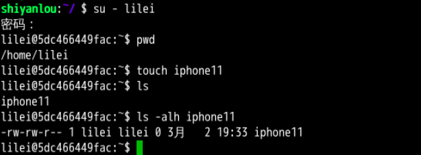
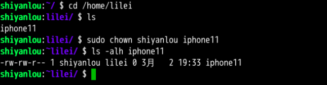

#### 3.2 变更文件所有者   😛😛😛 `sudo chown username filename`

2022年3月28日20:45:56

> 若前面已经执行删除 lilei 用户的命令，这里重新创建一下。

切换到 lilei 用户，然后在 /home/lilei 目录新建一个文件，命名为 `iphone11`。

```bash
su - lilei
pwd
touch iphone11
ls -alh iphone11
```

可见文件所有者是 lilei ：



现在切换回到 shiyanlou 用户，使用以下命令变更文件所有者为 shiyanlou。

```bash
# 需要切换到 shiyanlou 用户执行以下操作
cd /home/lilei
ls iphone11
sudo chown shiyanlou iphone11
```

现在查看，发现文件所有者成功修改为 shiyanlou。

)


