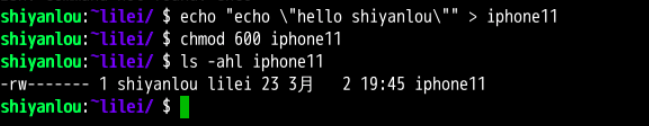
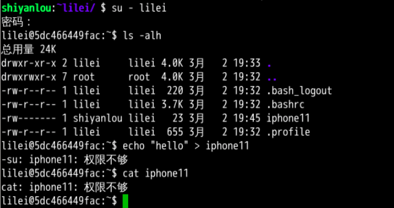
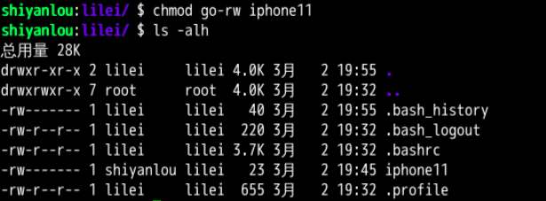

####  修改文件权限


如果你有一个自己的文件不想被其他用户读、写、执行，那么就需要对文件的权限做修改。文件的权限有两种表示方式：

- 方式一：二进制数字表示


每个文件有三组固定的权限，分别对应拥有者，所属用户组，其他用户，**记住这个顺序是固定的**。文件的读写执行对应字母 `rwx`，以二进制表示就是 `111`，用十进制表示就是 `7`，对进制转换不熟悉的同学可以看看 [进制转换](https://baike.baidu.com/item/进制转换/3117222)。例如我们刚刚新建的文件 iphone11 的权限是 `rw-rw-rw-`，换成对应的十进制表示就是 666，这就表示这个文件的拥有者，所属用户组和其他用户具有读写权限，不具有执行权限。

如果我要将文件 `iphone11` 的权限改为只有我自己可以用那么就可以用这个方法更改它的权限。

为了演示，我先在文件里加点内容：

```bash
echo "echo \"hello shiyanlou\"" > iphone11
```

然后修改权限：

```bash
chmod 600 iphone11
ls -alh iphone11
```



切换到 lilei 用户，尝试写入和读取操作，可以看到 lilei 用户已经不能读写这个 iphone11 文件了：



- 方式二：加减赋值操作

要完成上述实验相同的效果，你可以：

```bash
chmod go-rw iphone11
```



```bash
chmod 600 iphone11
ls -alh iphone11
```


切换到 lilei 用户，尝试写入和读取操作，可以看到 lilei 用户已经不能读写这个 iphone11 文件了：


`g`、`o` 还有 `u` 分别表示 group（用户组）、others（其他用户） 和 user（用户），`+` 和 `-` 分别表示增加和去掉相应的权限。