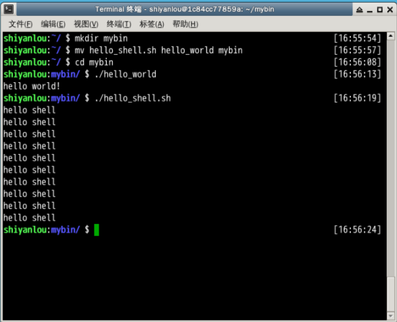

#### 2. 命令的查找路径与顺序  😂😂😂

2022年3月29日19:17:34

---

你可能很早之前就有疑问，我们在 Shell 中输入一个命令，Shell 是怎么知道去哪找到这个命令然后执行的呢？这是通过环境变量 `PATH` 来进行搜索的，熟悉 Windows 的用户可能知道 Windows 中的也是有这么一个 PATH 环境变量。这个 `PATH` 里面就保存了 Shell 中执行的命令的搜索路径。

查看 `PATH` 环境变量的内容：

```bash
echo $PATH
```

默认情况下你会看到如下输出：

```bash
/usr/local/sbin:/usr/local/bin:/usr/sbin:/usr/bin:/sbin:/bin:/usr/games:/usr/local/games
```

如果你还记得 Linux 目录结构那一节的内容，你就应该知道上面这些目录下放的是哪一类文件了。通常这一类目录下放的都是可执行文件，当我们在 Shell 中执行一个命令时，**系统就会按照 PATH 中设定的路径按照顺序依次到目录中去查找，如果存在同名的命令，则执行先找到的那个。**

> 下面我们将练习创建一个最简单的可执行 Shell 脚本和一个使用 C 语言创建的“ hello world ”程序，如果这两部分内容你之前没有学习过，那么你可以进行一个入门学习：

- [C 语言入门教程](https://www.lanqiao.cn/courses/57)
- [高级 Bash 脚本编程指南](https://www.lanqiao.cn/courses/5)
- [Linux Shell Scripting Tutorial (LSST) v2.0](http://bash.cyberciti.biz/guide/Main_Page)

创建一个 Shell 脚本文件，你可以使用 gedit，vim，sublime 等工具编辑。如果你是直接复制的话，建议使用 gedit 或者 sublime，否则可能导致代码缩进混乱。

```bash
cd /home/shiyanlou
touch hello_shell.sh
gedit hello_shell.sh
```

在脚本中添加如下内容，保存并退出。

**注意不要省掉第一行，这不是注释，有用户反映有语法错误，就是因为没有了第一行。**

```bash
#!/bin/bash

for ((i=0; i<10; i++));do
    echo "hello shell"
done

exit 0
```

为文件添加可执行权限，否则执行会报错没有权限：

```bash
chmod 755 hello_shell.sh
```

执行脚本：

```bash
cd /home/shiyanlou
./hello_shell.sh
```

创建一个 C 语言 `hello world` 程序：

```bash
cd /home/shiyanlou
gedit hello_world.c
```

输入如下内容，同样不能省略第一行。

```c
#include <stdio.h>

int main(void)
{
    printf("hello world!\n");
    return 0;
}
```

保存后使用 gcc 生成可执行文件：

```bash
gcc -o hello_world hello_world.c
```

**gcc 生成二进制文件默认具有可执行权限，不需要修改。**

在 `/home/shiyanlou` 家目录创建一个 `mybin` 目录，并将上述 `hello_shell.sh` 和 `hello_world` 文件移动到其中：

```bash
cd /home/shiyanlou
mkdir mybin
mv hello_shell.sh hello_world mybin/
```

现在你可以在 `mybin` 目录中分别运行你刚刚创建的两个程序：

```bash
cd mybin
./hello_shell.sh
./hello_world
```



回到上一级目录，也就是 `shiyanlou` 家目录，当再想运行那两个程序时，会发现提示命令找不到，除非加上命令的完整路径，但那样很不方便，如何做到像使用系统命令一样执行自己创建的脚本文件或者程序呢？那就要将命令所在路径添加到 `PATH` 环境变量了。