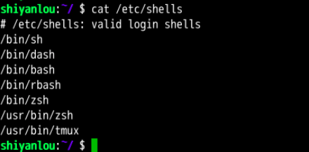

#### 添加自定义路径到“ PATH ”环境变量

2022年3月29日19:22:01

---

在前面**我们应该注意到 `PATH` 里面的路径是以 `:` 作为分割符**的，所以我们可以这样添加自定义路径：

```bash
PATH=$PATH:/home/shiyanlou/mybin
```

**注意这里一定要使用绝对路径。**

现在你就可以在任意目录执行那两个命令了（注意需要去掉前面的 `./`）。你可能会意识到这样还并没有很好的解决问题，因为我给 PATH 环境变量追加了一个路径，它也只是在当前 Shell 有效，我一旦退出终端，再打开就会发现又失效了。有没有方法让添加的环境变量全局有效？或者每次启动 Shell 时自动执行上面添加自定义路径到 PATH 的命令？下面我们就来说说后一种方式——让它自动执行。

在每个用户的 home 目录中有一个 Shell 每次启动时会默认执行一个配置脚本，以初始化环境，包括添加一些用户自定义环境变量等等。实验楼的环境使用的 Shell 是 zsh，它的配置文件是 `.zshrc`，相应的如果使用的 Shell 是 Bash，则配置文件为 `.bashrc`。它们在 `etc` 下还都有一个或多个全局的配置文件，不过我们一般只修改用户目录下的配置文件。Shell 的种类有很多，可以使用 `cat /etc/shells` 命令查看当前系统已安装的 Shell。



我们可以简单地使用下面命令直接添加内容到 `.zshrc` 中：

```bash
echo "PATH=$PATH:/home/shiyanlou/mybin" >> .zshrc
```

**上述命令中 `>>` 表示将标准输出以追加的方式重定向到一个文件中，注意前面用到的 `>` 是以覆盖的方式重定向到一个文件中，使用的时候一定要注意分辨。在指定文件不存在的情况下都会创建新的文件。**

