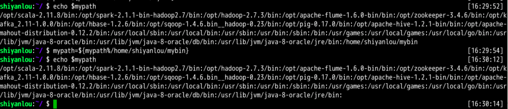
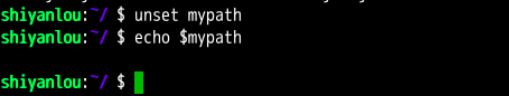

####  修改和删除已有变量   `${变量名%匹配字串}`😛

2022年3月29日19:29:41

---

#### 变量修改

变量的修改有以下几种方式：

| 变量设置方式                   | 说明                                         |
| ------------------------------ | -------------------------------------------- |
| `${变量名#匹配字串}`           | 从头向后开始匹配，删除符合匹配字串的最短数据 |
| `${变量名##匹配字串}`          | 从头向后开始匹配，删除符合匹配字串的最长数据 |
| `${变量名%匹配字串}`           | 从尾向前开始匹配，删除符合匹配字串的最短数据 |
| `${变量名%%匹配字串}`          | 从尾向前开始匹配，删除符合匹配字串的最长数据 |
| `${变量名/旧的字串/新的字串}`  | 将符合旧字串的第一个字串替换为新的字串       |
| `${变量名//旧的字串/新的字串}` | 将符合旧字串的全部字串替换为新的字串         |

比如我们可以修改前面添加到 PATH 的环境变量，将添加的 mybin 目录从环境变量里删除。为了避免操作失误导致命令找不到，我们先将 PATH 赋值给一个新的自定义变量 mypath：

```bash
mypath=$PATH
echo $mypath
mypath=${mypath%/home/shiyanlou/mybin}
# 或使用通配符 * 表示任意多个任意字符
mypath=${mypath%*/mybin}
```

可以看到路径已经不存在了。



#### 变量删除

可以使用 `unset` 命令删除一个环境变量：

```bash
unset mypath
```



