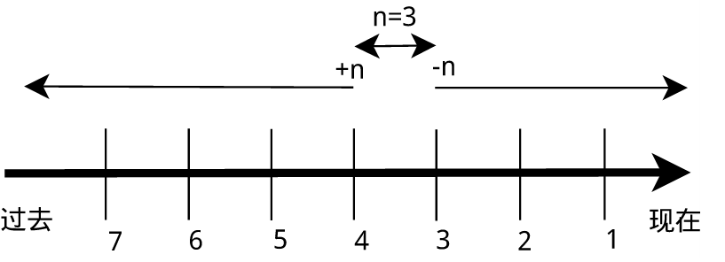

#### 三、搜索文件

2022年3月29日19:43:50

---

与搜索相关的命令常用的有 `whereis`，`which`，`find` 和 `locate`。

- `whereis` 简单快速

```bash
whereis who
whereis find
```


你会看到 `whereis find` 找到了三个路径，两个可执行文件路径和一个 man 在线帮助文件所在路径，这个搜索很快，因为它并没有从硬盘中依次查找，而是直接从数据库中查询。

`whereis` 只能搜索二进制文件（`-b`），man 帮助文件（`-m`）和源代码文件（`-s`）。如果想要获得更全面的搜索结果可以使用 `locate` 命令。

- `locate` 快而全

使用 `locate` 命令查找文件也不会遍历硬盘，它通过查询 `/var/lib/mlocate/mlocate.db` 数据库来检索信息。不过这个数据库也不是实时更新的，系统会使用定时任务每天自动执行 `updatedb` 命令来更新数据库。所以有时候你刚添加的文件，它可能会找不到，需要手动执行一次 `updatedb` 命令（在我们的环境中必须先执行一次该命令）。注意这个命令也不是内置的命令，在部分环境中需要手动安装，然后执行更新。

```bash
sudo apt-get update
sudo apt-get install locate
sudo updatedb
```

它可以用来查找指定目录下的不同文件类型，如查找 `/etc` 下所有以 sh 开头的文件：

```bash
locate /etc/sh
```

> **注意，它不只是在 /etc 目录下查找，还会自动递归子目录进行查找。**


查找 `/usr/share/` 下所有 jpg 文件：

```bash
locate /usr/share/*.jpg
```


> 环境里使用 zsh，在 `~/.zshrc` 文件里添加了 `setopt nonomatch` 配置，这样就不会自动处理和修复命令，因此可以不使用 `\` 转义。如果其他环境中执行该命令提示 `zsh: no matches found: /usr/share/*.jpg`，则可以在 `.zshrc` 中添加上述配置，或者使用 `\` 转义。


如果想只统计数目可以加上 `-c` 参数，`-i` 参数可以忽略大小写进行查找，`whereis` 的 `-b`、`-m`、`-s` 同样可以使用。

- `which` 小而精

**`which` 本身是 Shell 内建的一个命令，我们通常使用 `which` 来确定是否安装了某个指定的程序，因为它只从 `PATH` 环境变量指定的路径中去搜索命令并且返回第一个搜索到的结果**。也就是说，我们可以看到某个系统命令是否存在以及执行的到底是哪一个地方的命令。

```bash
which man
which nginx
which ping
```


- `find` 精而细

`find` 应该是这几个命令中最强大的了，它不但可以通过文件类型、文件名进行查找而且可以根据文件的属性（如文件的时间戳，文件的权限等）进行搜索。`find` 命令强大到，要把它讲明白至少需要单独好几节课程才行，我们这里只介绍一些常用的内容。

这条命令表示去 `/etc/` 目录下面 ，搜索名字叫做 interfaces 的文件或者目录。这是 `find` 命令最常见的格式，千万记住 `find` 的第一个参数是要搜索的地方。命令前面加上 `sudo` 是因为 shiyanlou 只是普通用户，对 `/etc` 目录下的很多文件都没有访问的权限，如果是 root 用户则不用使用。

```bash
sudo find /etc/ -name interfaces
```


> **注意 find 命令的路径是作为第一个参数的， 基本命令格式为 find [path][option] [action] 。**

与时间相关的命令参数：

| 参数     | 说明                   |
| -------- | ---------------------- |
| `-atime` | 最后访问时间           |
| `-ctime` | 最后修改文件内容的时间 |
| `-mtime` | 最后修改文件属性的时间 |

下面以 `-mtime` 参数举例：

- `-mtime n`：n 为数字，表示为在 n 天之前的“一天之内”修改过的文件
- `-mtime +n`：列出在 n 天之前（不包含 n 天本身）被修改过的文件
- `-mtime -n`：列出在 n 天之内（包含 n 天本身）被修改过的文件
- `-newer file`：file 为一个已存在的文件，列出比 file 还要新的文件名



列出 home 目录中，当天（24 小时之内）有改动的文件：

```bash
find ~ -mtime 0
```


列出用户家目录下比 /etc 目录新的文件：

```bash
find ~ -newer /etc
```


