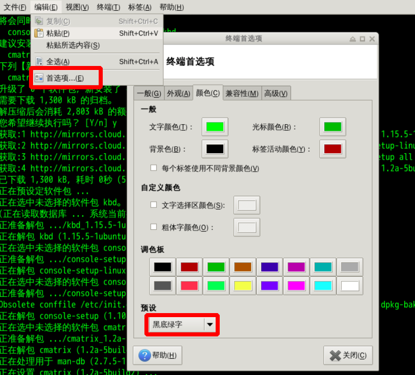
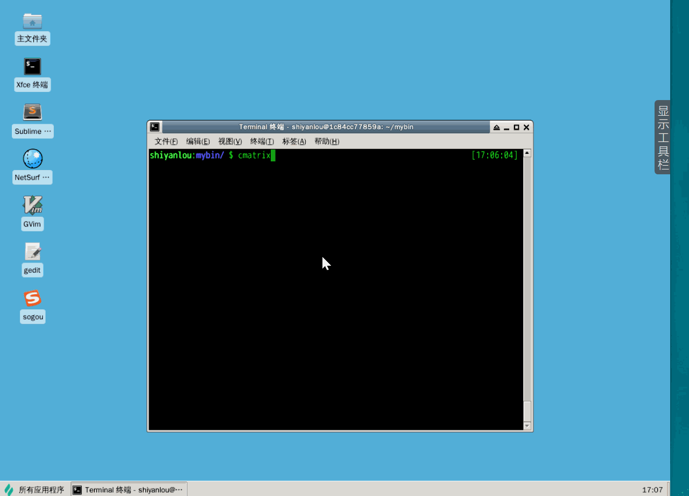
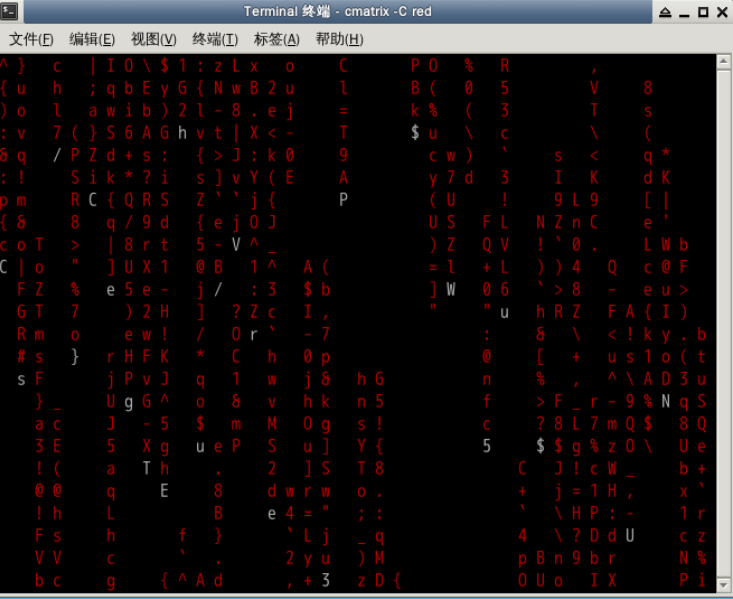

#### 轻松一下

《黑客帝国》电影里满屏幕代码的“数字雨”，在 Linux 里面你也可以轻松实现这样的效果，你只需要一个命令 `cmatrix` 。

需要先安装，因为 Ubuntu 没有预装：

```bash
sudo apt-get update
sudo apt-get install cmatrix
```

装好之后先不要急着执行，为了看到更好的效果，我们需要先修改终端的主题配色，在终端上面菜单栏中找到[首选项]修改，修改颜色预设为黑底绿字。



然后输入 `cmatrix` 开始运行。



按下 `F11` 可以全屏显示。

还可以改变代码的颜色：

```bash
cmatrix -C red
```




下一步