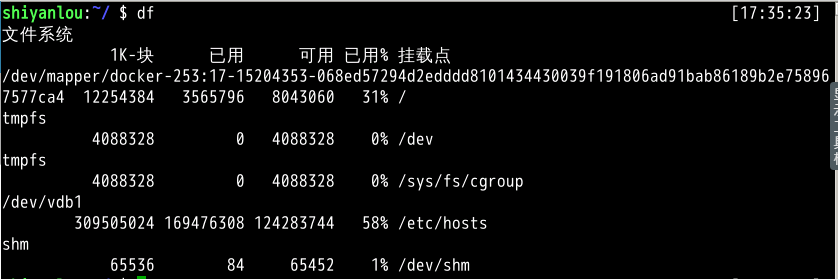
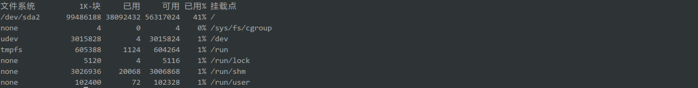
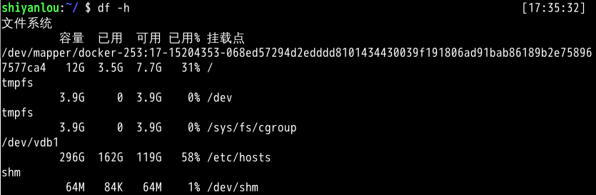
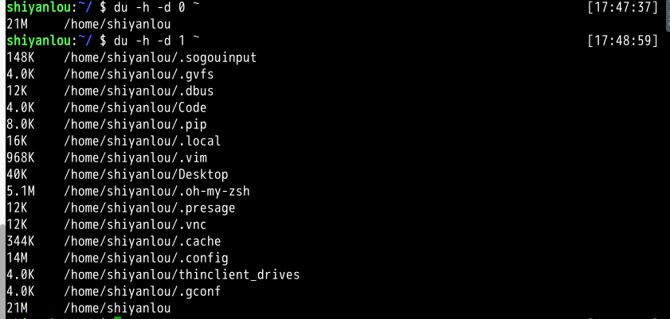

#### 二、基本操作

2022年3月30日18:40:38

#### 2.1 查看磁盘和目录的容量

- 使用 `df` 命令查看磁盘的容量

```bash
df
```

在实验楼的环境中你将看到如下的输出内容：



但在实际的物理主机上会更像这样：



物理主机上的 `/dev/sda2` 是对应着主机硬盘的分区，后面的数字表示分区号，数字前面的字母 a 表示第几块硬盘（也可能是可移动磁盘），你如果主机上有多块硬盘则可能还会出现 `/dev/sdb`，`/dev/sdc` 这些磁盘设备都会在 `/dev` 目录下以文件的存在形式。

接着你还会看到"1k-块"这个陌生的东西，它表示以磁盘块大小的方式显示容量，后面为相应的以块大小表示的已用和可用容量，在你了解 Linux 的文件系统之前这个就先不管吧，我们以一种你应该看得懂的方式展示：

```bash
df -h
```



现在你就可以使用命令查看你主机磁盘的使用情况了。至于挂载点如果你还记得前面第 4 节介绍 Linux 目录树结构的内容，那么你就应该能很好的理解挂载的概念，这里就不再赘述。

- 使用 `du` 命令查看目录的容量

这个命令前面其实已经用了很多次了：

```bash
# 默认同样以块的大小展示
du
# 加上 `-h` 参数，以更易读的方式展示
du -h
```

`-d` 参数指定查看目录的深度

```bash
# 只查看 1 级目录的信息
du -h -d 0 ~
# 查看 2 级
du -h -d 1 ~
```

常用参数

```bash
du -h # 同 --human-readable 以 K，M，G 为单位，提高信息的可读性。
du -a # 同 --all 显示目录中所有文件的大小。
du -s # 同 --summarize 仅显示总计，只列出最后加总的值。
```



`du`（estimate file space usage）命令与 `df`（report file system disk space usage）命令只有一字之差，希望大家注意不要弄混淆了，你可以像我这样从 man 手册中获取命令的完整描述，记全称就不会搞混了。


