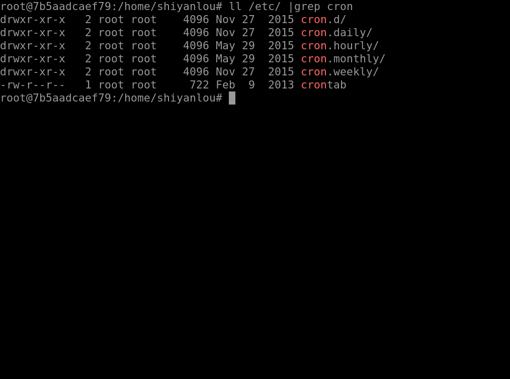

#### crontab 简介

#### 安装

```
sudo apt-get install -y rsyslog
sudo service rsyslog start
```

crontab 命令从输入设备读取指令，并将其存放于 crontab 文件中，以供之后读取和执行。通常，crontab 储存的指令被守护进程激活，crond 为其守护进程，crond 常常在后台运行，**每一分钟会检查一次是否有预定的作业需要执行。**

通过 crontab 命令，我们可以在固定的间隔时间执行指定的系统指令或 shell 脚本。时间间隔的单位可以是分钟、小时、日、月、周的任意组合。

#### 格式

这里我们看一看 crontab 的格式：

```bash
# Example of job definition:
# .---------------- minute (0 - 59)
# |  .------------- hour (0 - 23)
# |  |  .---------- day of month (1 - 31)
# |  |  |  .------- month (1 - 12) OR jan,feb,mar,apr ...
# |  |  |  |  .---- day of week (0 - 6) (Sunday=0 or 7) OR sun,mon,tue,wed,thu,fri,sat
# |  |  |  |  |
# *  *  *  *  * user-name command to be executed
```

#### 启动后台

在本实验环境中 crontab 也是不被默认启动的，同时不能在后台由 upstart 来管理，所以需要我们来启动它:

```bash
sudo cron －f &
```


#### 添加计划

下面将开始 crontab 的使用了，我们通过下面一个命令来添加一个计划任务：

```bash
crontab -e
```

在了解命令格式之后，我们通过这样的一个例子来完成一个任务的添加，在文档的最后一排加上这样一排命令，该任务是每分钟我们会在/home/shiyanlou 目录下创建一个以当前的年月日时分秒为名字的空白文件

```bash
*/1 * * * * touch /home/shiyanlou/$(date +\%Y\%m\%d\%H\%M\%S)
```

#### 查看计划

当然我们也可以通过这样的一个指令来查看我们添加了哪些任务：

```bash
crontab -l
```

#### 确认后天已经启动

虽然我们添加了任务，但是如果 `cron` 的守护进程并没有启动，它根本都不会监测到有任务，当然也就不会帮我们执行，我们可以通过以下 2 种方式来确定我们的 `cron` 是否成功的在后台启动，默默的帮我们做事，若是没有就得执行上文准备中的第二步了。

```bash
ps aux | grep cron

# or

pgrep cron
```

#### 删除计划

当我们并不需要这个任务的时候我们可以使用这么一个命令去删除任务：

```bash
crontab -r
```

#### 用户隔离

每个用户使用 `crontab -e` 添加计划任务，都会在 `/var/spool/cron/crontabs` 中添加一个该用户自己的任务文档，这样目的是为了隔离。


#### /etc/crontab

如果是系统级别的定时任务，需要 root 权限执行的任务应该怎么处理？

只需要使用 `sudo` 编辑 `/etc/crontab` 文件就可以。

`cron` **服务监测时间最小单位是分钟**，所以 `cron` 会每分钟去读取一次 `/etc/crontab` 与 `/var/spool/cron/crontabs` 里面的內容。

#### 其他重要文件

在 `/etc` 目录下，`cron` 相关的目录有下面几个：



每个目录的作用：

1. `/etc/cron.daily`，目录下的脚本会每天执行一次，在每天的 6 点 25 分时运行；
2. `/etc/cron.hourly`，目录下的脚本会每个小时执行一次，在每小时的 17 分钟时运行；
3. `/etc/cron.monthly`，目录下的脚本会每月执行一次，在每月 1 号的 6 点 52 分时运行；
4. `/etc/cron.weekly`，目录下的脚本会每周执行一次，在每周第七天的 6 点 47 分时运行；

