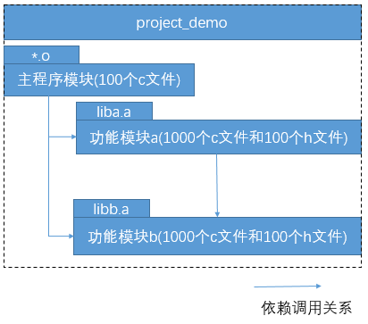

理解模块的依赖关系, 是写好Makefile的关键.

在介绍makefile和make的具体概念前，我们先通过一个例子来说明makefile和make到底是为解决什么问题而存在的。

假设有一个如图所示的C工程：



那么要编译出我们的可执行程序project_demo，必须执行以下命令：

```
# 步骤1：编译主程序模块
$ gcc -o <100个主程序模块的o文件> -c <100个主程序模块的c文件>

# 步骤2：编译功能模块a
$ gcc -o <1000个功能模块a的o文件> <1000个功能模块a的c文件>
$ ar rcs liba.a <1000个功能模块a的o文件>

# 步骤3：编译功能模块b
$ gcc -o <1000个功能模块b的o文件> <1000个功能模块b的c文件>
$ ar rcs libb.a <1000个功能模块b的o文件>

# 步骤4：生成可执行文件demo
$ gcc -o demo <100个主程序模块的o文件> -L. -la -lb
```

上述例子反映了两个问题：

1. 重复劳动
2. 减少编译时间(有些文件没有改动, 传动方法还是会重新编译)

> 1. 上述4个编译步骤中，几乎每个步骤都有亢长的文件名列表需要输入而且有些还是重复的，这种工作枯燥而又费时，且极易因人为疏忽而出现错误；
> 2. 假设我们的demo项目每次编译所需的时间都比较长，那么如果我们之前已经成功编译过了我们的demo项目，而此后当我们修改了某些源文件需要更新的demo文件时，理论上我们是不希望也不需要去重新编译整个项目的，我们只需要仅分析其中的依赖关系，仅执行需要重新编译链接的命令，以节省编译时间，但是对于依赖关系非常复杂的工程而言，分析源文件涉及到的依赖关系是个非常复杂且容易出错的过程。

make和makefile的存在正是为了解决上述两个问题的：

> 1. makefile文件帮助我们记录了整个项目工程的所有需要编译的文件列表，这样我们在编译时仅需要输入简单的make命令就能编译出我们期望的结果
> 2. makefile文件反映了整个项目中各个模块的依赖关系，这样我们改动了某些源文件后，仅需简单的输入make命令，make工具就会根据makefile文件里描述的依赖关系帮助我们分析哪些模块需要重新编译，并执行相应的操作。

在linux/unix开发环境中，makefile文件则是描述了一个特定编译系统所需要的策略，而make工具则是通过解析makefile文件并执行相应的命令来帮助我们构建其编译系统。

下面我们就带着这样两个问题来认识makefile和make工具：

> 1. makefile如何记录整个项目工程的所有需要编译的文件列表及如何反映整个项目中各个模块的依赖关系？
> 2. 提供了makefile策略描述后，make工具又是是如何解析makefile文件来帮助我们构建其编译系统的？