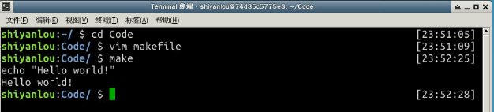
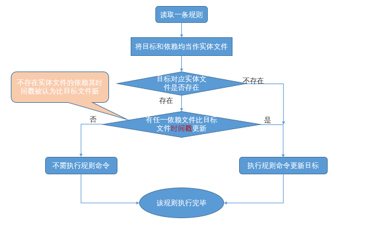
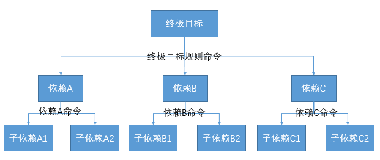

#### 2.1.1 makefile 简介

makefile就是一个简单的文本文件，它基本上就是由一条条的规则构成。下面，我们就来看一下makefile里的最基本的语法单元，**规则**。一条makefile的规则构成如下：

> ```
> target:prerequisites
> <tab> command1
> <tab> command2
> .....
> <tab> commandN
> ```

> - target：规则的目标，可以简单理解为这条规则存在的目的是什么。通常是程序中间或者最后需要生成的文件名，也可以不对应具体的文件，而仅仅就是个概念上的规则目标。
>
> - prerequisites：规则的依赖列表，可以简单的理解为要达到本条规则的目标所需要的先决条件是什么。可以是文件名，也可以是其他规则的目标；
>
> - command：规则的命令，可以简单的理解为当目标所需要的先决条件的满足了之后，需要执行什么动作来达成规则的目标。规则的命令其实就是shell命令。一条规则中可以有多行命令，**特别注意：每行命令都必须以tab键开始！**

下面我们就立马来感性的认识一下makefile文件，先来一个"hello world"吧，编写 makefile 文件 /home/shiyanlou/Code/makefile：

```
# 最简单的makefile文件
all: 
    echo "Hello world!"  #注意：每行命令都必须以tab键开始！
```

这个简单的makefile文件，只有一条规则，规则的目标是all，没有任何依赖(**规则不可以没有目标但是可以没有依赖**)，以及一条命令(其实规则也是可以不需要任何命令的)。怎么用这个makefile呢？

打开Xcfe通过vim将上述内容写入一个叫makefile的文件中，并执行make：



#### 2.1.2 make 的工作机理

那make工具又到底是如何工作的呢？解释make的工作机理，需分别回答以下3个问题：

> 1. make命令如何使用 ；
> 2. make从哪读取makefile；
> 3. make如何解析执行makefile文件的规则。

make命令的基本使用范式如下：

> ```
> make [ -f makefile ] [ options ] ... [ targets ] ...
> ```

使用make命令的最简单的方式主要有以下四种形式：

> 1. 简单粗暴，不带任何参数，直接执行make：
>
>    ```bash
>    $ make
>    ```
>
> 2. 指定makefile文件：
>
>    ```bash
>    $ make -f <makefile_name>
>    ```
>
> 3. 指定 makefile 目标：
>
>    ```bash
>    $ make <target>
>    ```
>
> 4. 到指定目录下执行make：
>
>    ```bash
>    $ make -C <subdir> <target>
>    ```

在执行make的时候，我们可以带上`-f <文件名>`参数，来指定make命令从哪里读取makefile文件；而如果我们不显式指定，则make就会在当前目录下依次查找名字为**GNUmakefile, makefile,和 Makefile**的文件来作为其makefile文件。

在读取完makefile的内容后，make工具并不是逐条去执行makefile里的规则，而是以某条规则为突破口，多米诺骨牌效应式的去执行makefile里的规则。而这条作为突破口的规则的目标，称为**终极目标** ，我们可以在执行make时以参数的形式指定终极目标，从而执行作为突破口的规则，如果我们不显式指定终极目标，make一般情况下将选择makefile的第一条规则的目标作为终极目标。

一般情况下，make执行一条规则的具体过程是这样的：



make解析makefile的流程如下：

假设有mekefile内容如下：

> ```
> 终极目标：依赖A  依赖B 依赖C
>     终极目标命令
>     
> 依赖A：子依赖A1 子依赖A2 
>     依赖A命令
>     
> 依赖B：子依赖B1 子依赖B2 
>     依赖B命令
> 
> 依赖C：子依赖C1 子依赖C2 
>     依赖C命令
> ```

过程一，以终极目标为树根，解析出整颗依赖树：



过程二，对整颗依赖树以从底到上，从左到右的顺序，解析执行每一条规则：


