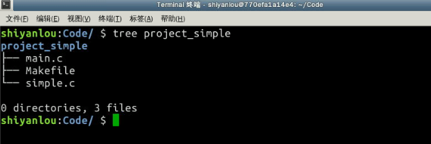
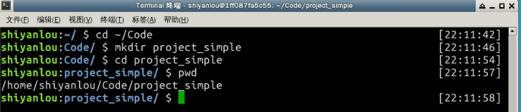
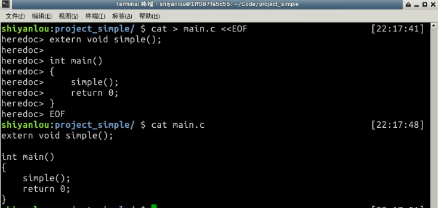
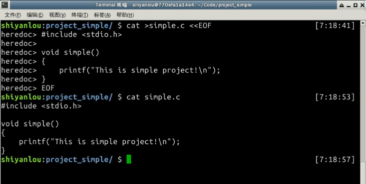
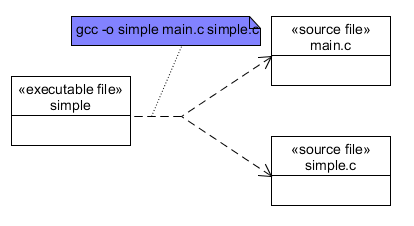
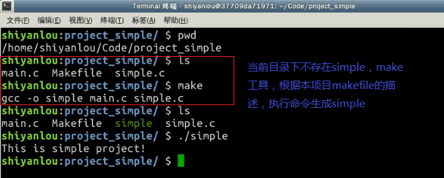
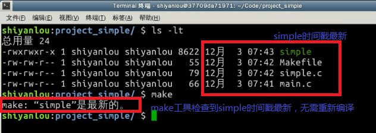
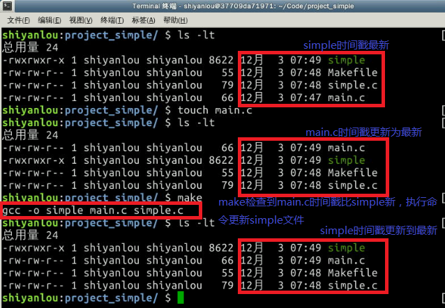

本节我们将通过构建一个简单的c语言项目工程(我们命名为project_simple)来理解makefile的基本概念。

先来看一下project_simple的整体目录结构：



下面，我们先来一步步构建我们的项目：

创建工程目录 /home/shiyanlou/Code/project_simple/：



#### 2.2.1 main.c 文件

编写源代码文件 /home/shiyanlou/Code/project_simple/main.c：

```
$ cat > main.c <<EOF
extern void simple();

int main()
{
    simple();
    return 0;
}
EOF
```

结果如下：



#### 2.2.2 simple.c 文件

编写源代码文件 /home/shiyanlou/Code/project_simple/simple.c：

```
$ cat >simple.c <<EOF
#include <stdio.h>

void simple()
{
    printf("This is simple project!\n");
}
EOF
```

结果如下：



#### 2.2.3 Makefile 文件

最后就是要编写我们的makefile了，一般在编写makefile之前都需要先分析清楚整个工程各个模块的依赖关系，及相应的生成命令。我们的project_simple工程最终生产的是一个叫simple的可执行文件，而该可执行文件是使用gcc命令编译main.c和simple.c生成的，因此我们的整个工程的关系依赖图，如下：



因此我们的makefile可以这么写：

> ```
> simple: main.c simple.c
>     gcc -o simple main.c simple.c
> ```

接下来，我们来编写 /home/shiyanlou/Code/project_simple/Makefile：

```
$ cat > Makefile <<EOF
simple: main.c simple.c
    gcc -o simple main.c simple.c
EOF
```

#### 2.2.4 运行验证 Makefile

下面我们分三个步骤来验证一下我们的simple项目的编译系统：

1. **能否编译出可执行的simple**

   ```
   $pwd        #查看当前路径
   $ls         #查看编译前当前目录
   $make       #编译simple项目
   $ls         #查看编译结果
   $./simple   #执行simple可执行文件
   ```

   过程及结果如下：



1. **已经编译出simple后，不改变任何源文件再次执行编译，是否不再执行任何操作**

   ```
   $ ls -lt #查看当前项目中各文件时间戳
   $ make   #再次执行编译，查看是否会执行编译命令
   ```

过程及结果如下：



1. **已经编译出simple后，修改任一源文件是否能再次生成新的simple可执行文件**

   ```
   $ ls -lt       #对比当前项目各文件时间戳
   $ touch main.c #将main.c文件的时间戳修改至最新
   $ ls -lt       #查看main.c的时间戳是否最新
   $ make         #执行编译命令
   $ ls -lt       #查看simple的时间戳是否被更新至最新
   ```

过程及结果如下：




