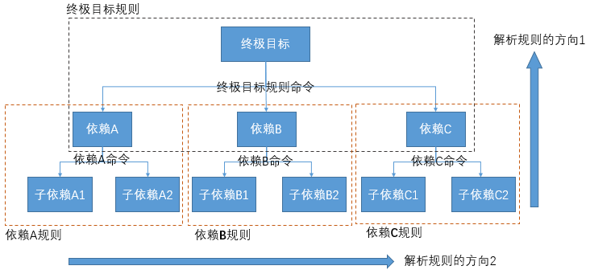
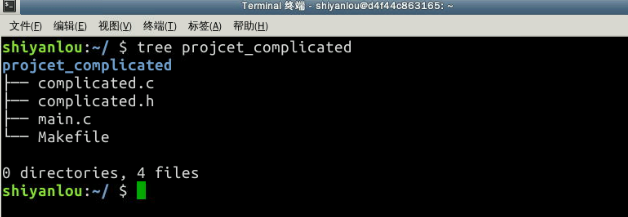
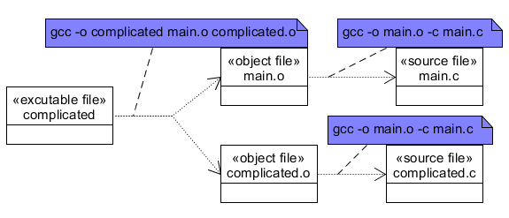
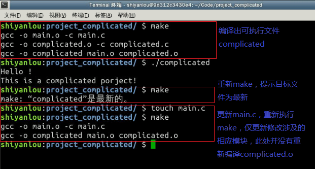

过程二，对整颗依赖树以从底到上，从左到右的顺序，解析执行每一条规则：




#### 2.3.1 complicated 项目构建

我们仿照project_simple项目，构建一个名为project_complicated的项目工程，目录结构如下：



- 编写源代码文件 /home/shiyanlou/Code/project_complicated/main.c：

```c++
// ---------------------------------------------
// main.c
#include <stdio.h>
#include "complicated.h"
int main()
{
    printf("%s\n", HELLO_STRING);
    complicated();
    return 0;
}
```

- 编写源代码文件 /home/shiyanlou/Code/project_complicated/complicated.h：

```c
// ---------------------------------------------
// complicated.h
#ifndef __COMPLICATED_H__
#define __COMPLICATED_H__
#define HELLO_STRING "Hello !"
#define PROJECT_NAME "complicated"
extern void complicated(void);
#endif
```

- 编写源代码文件 /home/shiyanlou/Code/project_complecated/complicated.c：

```c
// ---------------------------------------------
// complicated.c
#include <stdio.h>
#include "complicated.h"
void complicated(void)
{
    printf("This is a %s porject!\n", PROJECT_NAME);
}
```

项目的依赖关系：



对比simple项目，我们的complicated项目貌似只是多了一个头文件，但是我们的依赖关系图却多了一层.o文件，这是为何？

> 熟悉gcc编译过程的朋友应该知道，其实我们在用gcc 编译出可执行文件的过程中是包含两个阶段的：编译阶段和链接阶段。

我们上述的依赖关系图更加准确的反映出了整个项目的构建过程，这样我们据此写出来的makefile才能更加灵活及更具可扩展性，记住：**精确的分析清楚项目的依赖关系，是编写一个好的makefile的关键。**

至此，我们可以写出complicated项目的文件 /home/shiyanlou/Code/project_complicated/makefile 了：

```
complicated: main.o complicated.o
    gcc -o complicated main.o complicated.o

main.o: main.c
    gcc -o main.o -c main.c
    
complicated.o: complicated.c
    gcc -o complicated.o -c complicated.c
```

验证过程及结果如下：

