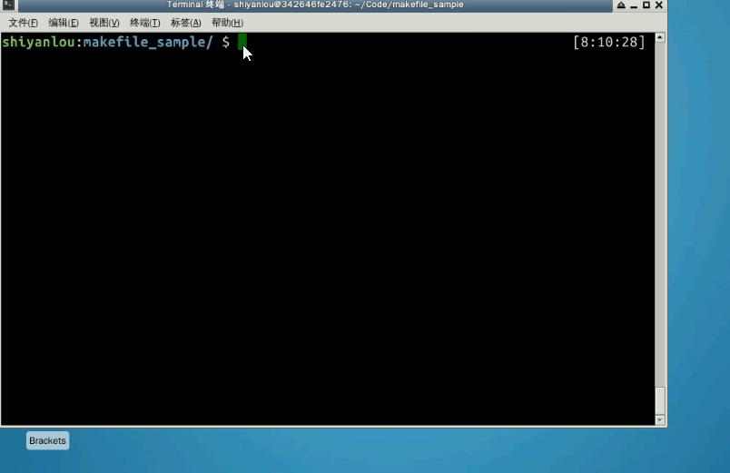
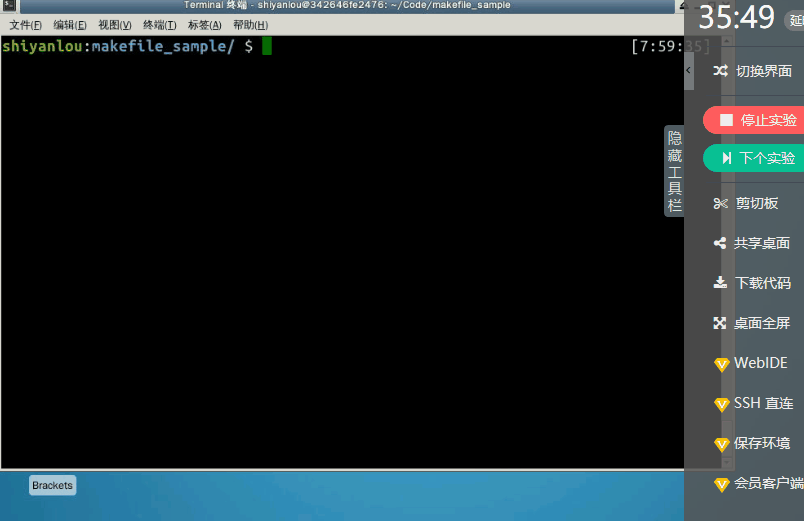

#### 变量的定义

makefile中的变量，与C语言中的宏类似，它为一个文本字符串（变量的值，其类型只能是字符串类型）提供了一个名字(变量名)。

变量定义的基本格式：

```
变量名 赋值符 变量值
```

> - 变量名指的就是该变量的名字，是不包括“:”、“#”、“=”、前置空白和尾空白的任何字符串。需要注意的是，尽管在GNU make中没有对变量的命名有其它的限制，但定义一个包含除字母、数字和下划线以外的变量的做法也是不可取的，因为除字母、数字和下划线以外的其它字符可能会在以后的make版本中被赋予特殊含义，并且这样命名的变量对于一些shell来说不能作为环境变量使用。变量名是大小写敏感的。变量“foo”、“Foo”和“FOO”指的是三个不同的变量。Makefile传统做法是变量名是全采用大写的方式。推荐的做法是在对于内部定义定义的一般变量（例如：目标文件列表objects）使用小写方式，而对于一些参数列表（例如：编译选项CFLAGS）采用大写方式。
>
> - 变量值，指的是变量所代表的内容，可以是一个文件名列表、编译选项列表、程序运行的选项参数列表、搜索源文件的目录列表、编译输出的目录列表和所有我们能够想到的事物。变量的值，其本质就是一个字符串。
>
> - 赋值符，有`=` 、 `:=` 、 `?=`和 `+=`四种格式，其中`=` 和 `:=` 为基本定义类型， `?=`和 `+=`为基于`=`的扩展定义类型。

一个在makefile中定义变量的例子：

> ```
> objects = program.o foo.o utils.o
> ```

#### 2.4.2 变量的引用

当我们定义了一个变量之后，我们就可以在makfile中的**目标**、**依赖**、**命令**中引用我们的变量；而所谓的变量引用，就是在引用变量名的地方，用变量所代表的内容，执行一个严格的文本替换过程(该过程也称为变量**被展开的过程** )，替换掉变量的名字。

变量的引用有以下几种方式：

> 1. `${变量名}`
> 2. `$（变量名）`
> 3. `$单字符变量名` ，变量名仅包含一个字符，如`$@` 、`$^`等

一个在makefile中引用变量的例子：

```
# 变量定义
objects = program.o foo.o utils.o

program : $(objects)          #在依赖中引用变量
    gcc -o program ${objects} #在命令中引用变量

$(objects) : defs.h           #在目标中引用变量
```

#### 2.4.3 变量的分类与赋值

根据变量定义时所使用的赋值操作符的不同，可以将变量分成两种类型(或者说是两种风格)：

`递归展开式变量`和`直接展开式变量`；

> 使用赋值操作符`=` 、 `+=` 和 `?=`定义的变量都是**递归展开式变量**，使用赋值操作符 `:=`定义的变量为**直接展开式变量** 。
>
> 两种变量类型的的最根本区别在于：**变量值的求值时机**，递归式变量的求值时机在于**变量被引用时**，直接展开式的求值时机在于**变量被定义时**。

我们来编写makefile 文件 /home/shiyanlou/Code/makefile_sample/variabletype.mk：

```
foo1 = $(bar)   #递归展开式变量
foo2 := $(bar)  #直接展开式变量
bar = $(ugh)
ugh = Huh?

all:
    echo "foo1 is $(foo1), foo2 is $(foo2)"
```

然后，使用 `$ make -f variabletype.mk` 执行variabletype.mk，演示及结果如下：



由于变量`foo1`的变量值是在执行`echo`命令时才求的值，所以`foo1`的值被递归的展开为`Huh?`； 而变量`foo2`的变量值在定义时就被求值了，此时由于变量`bar`的值为空，因此`foo2`的值也为空。

> **注意：使用递归展开式的变量定义，可能会由于出现变量的递归定义而导致make陷入到无限的变量展开过程中，最终使make执行失败**

`+=` 和 `?=`是基于`=`扩展而来的两种变量赋值操作符；

`+=` 称为追加赋值操作符，它实现对于一个已经存在定义的变量进行追加赋值，如下例子：

> ```
> bar = foo1   
> bar += foo2  #追加赋值，bar的值将为 foo1 foo2
> 
> all:
>     echo $(bar)
> ```

`?=`称为条件赋值的赋值操作符，被称为条件赋值为：只有此变量在之前没有赋值的情况下才会对这个变量进行赋值。看一下例子：

> ```
> bar1 = foo1
> bar1 ?= foo2  # bar1 的值还是foo1
> bar2 ?= foo2  # bar2 的值为foo2
> 
> all:  
>     echo "bar1 is $(bar1), bar2 is $(bar2)" 
> ```

#### 2.4.4 特殊的变量

在makefile 中用户除了可以自定义变量外，还可以使用make工具为我们提供的一些特殊的变量及用法。

- 自动化变量

所谓自动化变量，就是在每条规则中，make自动为我们提供的用于指定规则各个组成部分的变量，一般情况下常用的有以下几个自动化变量：

> `$@` -- 代表规则中的目标文件名
>
> `$<` -- 代表规则的第一个依赖的文件名
>
> `$^` -- 代表规则中所有依赖文件的列表，文件名用空格分割

看例子，编写makefile 文件 /home/shiyanlou/Code/makefile_sample/auto_var.mk：

```
all: first second third
    echo "\$$@ = $@"
    echo "$$< = $<"
    echo "$$^ = $^"

first second third:
```

这里有几点需要说明一下：

> 1. `$`字符在makefile中有特殊用途，因此如果要取消其特殊用途当成一个普通字符传递给`echo`命令执行，需要使用`$$`
> 2. `$@`在bash shell中也有特殊用途，因此如果希望`echo`命令在bash中正常输出`$@`， 需要加上`\`字符
> 3. 该makefile的最后一行`first second third:` 看起来有点奇怪，这是一条**没有依赖和命令的多目标规则**，读者可自行将它删除看有什么效果，并思考原因。

演示及结果如下：



#### 2.4.5 变量的替换引用

- 变量的分类与赋值

对于一个已经定义的变量，可以使用“替换引用”将其值使用指定的字符（字符串）进行替换。格式为`$(VAR:A=B)`或者`${VAR:A=B}`，意思是，将变量“VAR”所表示的值中所有字符串“A”结尾的字符替换为“B”的字。“结尾”的含义是空格之前（变量值的多个字以空格分开）。而对于变量其它部分的“A”字符不进行替换。例如：

> ```
> sources := a.c b.c c.c d.d
> objects := $(sources:.c=.o)
> all:
>     echo "objects = $(objects)"
> ```

在这个定义中，变量“objects”的值就为“a.c b.c c.c d.d”。使用变量的替换引用将变量“sources”以空格分开的值中的所有的字的尾字符“o”替换为“c”，其他部分不变，注意这里的`d.d`并不会被替换。

使用变量改进我们complicated项目的makefile(v1.2)：

```
# 描述：complicated 项目 makefile文件
# 版本：v1.2
# 修改记录：
# 1. 为complicated项目makefile添加注释
# 2. 使用变量改进我们complicated项目的makefile

# 定义可执行文件变量
executbale := complicated
# 定义源文件列表变量
sources := main.c complicated.c
# 使用变量的引用替换，定义object文件列表
objects := $(sources:.c=.o)
# 定义编译命令变量
CC := gcc

# 终极目标规则，生成complicated可执行文件
$(executbale): $(objects)
#  使用自动化变量改造我们的编译命令
    $(CC) -o $@ $^

# 子规则1, main.o的生成规则
main.o: main.c
    $(CC) -o $@  -c $<
    
# 子规则2，complicated.o的生成规则
complicated.o: complicated.c
    $(CC) -o $@  -c $<
```


