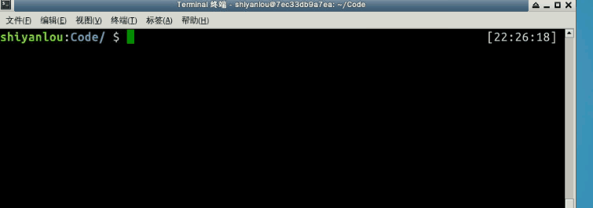
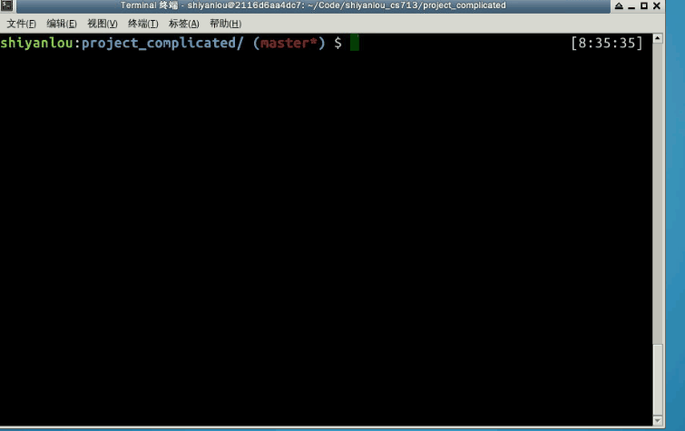
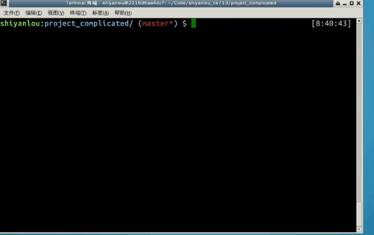
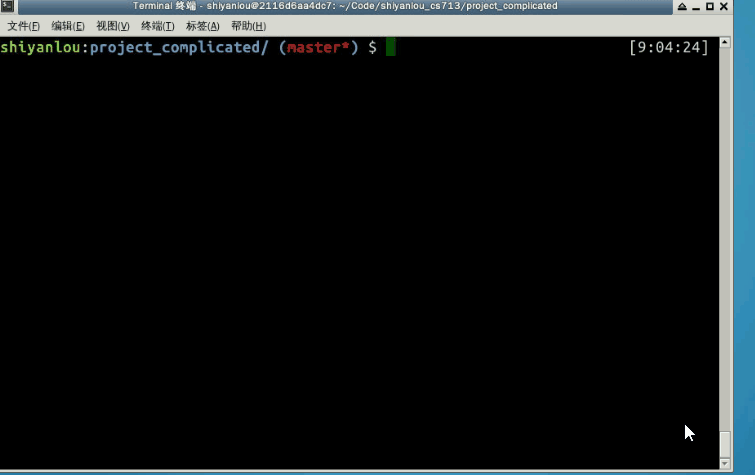

#### .1 多目标规则与多规则目标

- 多目标规则

多目标规则，可以简单的理解为是一种将多条具有**1)相同依赖**和**2)相同生成命令**的规则，合并成一条规则的语法，其基本格式为：

> ```
> targets...: prerequisites...
>     commands
>     ...
> ```

假设我们有以下makefile：

> ```
> all: target1 target2
>     echo "This is a rule for $@"
> 
> target1: dep
>     echo "This is a rule for $@"
>     
> target2: dep
>     echo "This is a rule for $@"
> 
> dep:
> ```

利用多目标规则，可以将makefile改写成 makefile 文件 /home/shiyanlou/Code/multi_targets.mk：

```
all: target1 target2
    echo "This is a rule for $@"

# 利用多目标规则合并 target1 和target2的规则
target1 target2: dep
    echo "This is a rule for $@"
    
dep:
```

演示及结果如下：



这里我们可以观察到，虽然多目标规则中要求命令必须相同，但是配合上自动化变量的使用，就是可以针对不同的目标有不同的执行结果。

- 多规则目标

Makefile中，一个目标可以同时出现在多条规则中。

> 这种情况下，此目标文件的所有依赖文件将会被合并成此目标一个依赖文件列表，其中任何一个依赖文件比目标更新（比较目标文件和依赖文件的时间戳）时，make将会执行特定的命令来重建这个目标
>
> 。对于一个多规则的目标，**重建此目标的命令只能出现在一个规则中**（可以是多条命令）。
>
> 如果多个规则同时给出重建此目标的命令，make将使用最后一个规则的命令，同时提示错误信息。

#### 2.5.2 静态模式规则

仔细观察我们的complicated项目中的两条子规则：

> ```
> # 子规则1, main.o的生成规则
> main.o: main.c
>     $(CC) -o $@  -c $<
>     
> # 子规则2，complicated.o的生成规则
> complicated.o: complicated.c
>     $(CC) -o $@  -c $<
> ```

我们发现它们长得很像，好像一个模子里印出来的：

> 首先**它们的命令是一样的**，
>
> 其次它们目标依赖关系有点相似(目标都是以.o结尾的文件，依赖都是以.c结尾的文件)。

对于这种长得很像的规则，makefile提供了一种称为**静态模式规则**的规则来帮助我们简化规则的编写。

静态模式规则：

> 可以理解为一种特殊的多目标规则，它仅要求多条规则具有相同的命令，而依赖可以不完全一样。

静态模式规则，其基本语法：

> ```
> TARGETS ...: TARGET-PATTERN: PREREQ-PATTERNS ...
>     COMMANDS
>     ...
> ```

其大致意思就是，用`TARGET-PATTERN: PREREQ-PATTERNS ...`描述的模式，从`TARGETS ...`取值来形成一条条规则，所有规则的命令都用`COMMANDS`。

`TARGETS ...`代表具有相同模式的规则的目标列表，在我们的项目中就是main.o和complicated.o，我们可以直接引用我们先前定义的objects变量。

`TARGET-PATTERN: PREREQ-PATTERNS ...`部分定义了，如何为目标列表中的目标，生成依赖；`TARGET-PATTERN`称为目标模式，`PREREQ-PATTERNS`称为依赖模式；目标模式和依赖模式中，一般需要包含模式字符`%`。

目标模式的作用就是从目标列表中的目标匹配过滤出需要的值，目标模式中的字符`%`表示在匹配过滤的过程中不做过滤的部分，目标模式中的其他字符表示要与目标列表中的目标精确匹配，例如，目标模式`%.o`， 表示从目标列表的目标中匹配所有以`.o`结尾的目标，然后过滤掉匹配目标的`.o`部分， 因此目标`main.o`经过目标模式`%.o`匹配过滤后，得到的输出就是`main`。

依赖模式的作用就是表示要如何生成依赖文件。具体的生成过程，就是使用目标模式过滤出来的值，替换依赖模式字符`%`所表示的位置。因此，如果依赖模式为`%.c`， 则使用上述例子过滤出来的`main`来替换字符`%`， 最终得到依赖文件`main.c`

因此，我们可以这么用静态模式规则来简化我们的complicated项目：

> ```
> # 静态模式规则简化complicated makefile
> $(objects): %.o: %.c
>     $(CC) -o $@  -c $<
> ```

#### 2.5.3 伪目标

我们的complicated项目编译完成后，会有可执行文件及中间目标文件，有时出于某些需求，需要将编译生成的文件都删除，让整个项目回到最初的状态。我们可以在该项目makefile定义添加一条目标为`clean`的规则，如下：

```
# complicated项目添加clean 规则
clean:
    rm -rf complicated complicated.o main.o
```

演示如下： 

上述的clean规则，貌似能正常工作，但其实是存在bug的，当我们的目录下刚好存在一个叫做clean的文件时，事情就没那么顺利了：



出现以上问题的原因是，当编译目录下存在clean文件时，由于clean规则没有依赖，所以clean文件的时间戳永远显得都是最新的，故其命令也无法被执行，这时我们就得请伪目标出手帮助了。

当我们将一个目标定义成伪目标时，意味着它不代表一个真正的文件名，在执行make时可以指定这个目标来执行其所在规则定义的命令。

定义一个伪目标的基本语法：

```
.PHONY: <伪目标>
```

因此我们以定义complicated项目的clean目标，为伪目标，如下：

```
# complicated项目添加clean 规则
.PHONY: clean
clean:
    rm -rf complicated complicated.o main.o
```

这样目标`clean`就是一个伪目标，无论当前目录下是否存在`clean`这个文件。我们输入`make clean`之后。`rm`命令都会被执行。

演示如下： 


下一步

