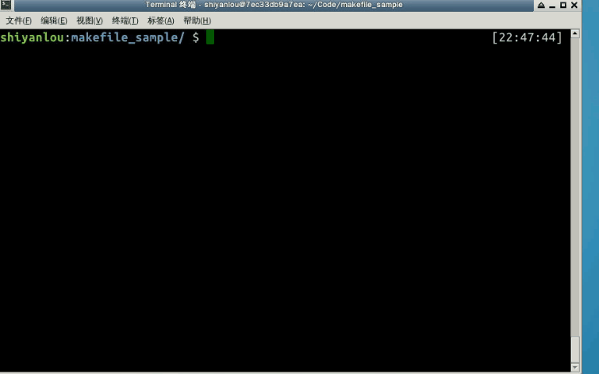
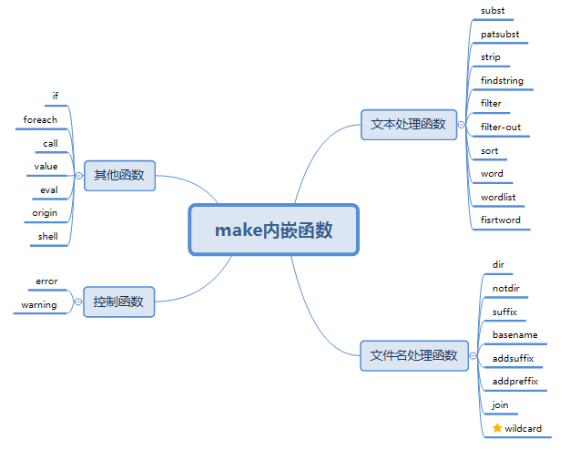
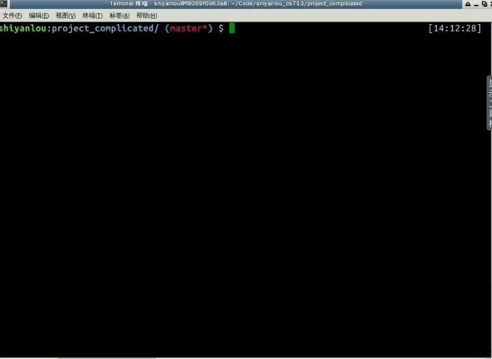

#### 命令

- 命令的回显

通常，make在执行命令行之前会把要执行的命令行进行输出，如以下makefile：

> ```
> all:
>     echo "Hello world!"
> ```

在执行make时，其输出：

> ```
> $ make
>   echo "Hello world!"
>   Hello world!
> ```

关闭命令回显有以下几种方式：

> 1. 每个需要关闭回显的命令行前加上"@"字符，上述例子关闭回显：
>
>    ```
>    all:
>        @echo "Hello world!"
>    ```
>
> 2. 执行make时带上参数`-s`或`--slient`禁止所有执行命令的显示
>
> 3. 在Makefile中使用没有依赖的特殊目标`.SILENT`也可以禁止所有命令的回显

- 命令的执行

在Makefile中**书写在同一行中的多个命令属于一个完整的shell命令行**，**书写在独立行的一条命令是一个独立的shell命令行**。所以需要注意：在一个规则的命令中，命令行`cd`改变目录不会对其后的命令的执行产生影响。就是说其后的命令执行的工作目录不会是之前使用`cd`进入的那个目录。如果要实现这个目的**，**就不能把`cd`和其后的命令放在两行来书写。而应该把这两条命令写在一行上，用分号分隔。这样它们才是一个完整的shell命令行。

对比以下例子两个规则的输出，编写makefile 文件 /home/shiyanlou/Code/makefile_sample/cmd.mk：

```
target1:
    @echo "target1"
    @cd ~
    @pwd
    
target2:
    @echo "target2"
    @cd ~; pwd
```

例子演示： 

- 命令执行的错误处理

通常情况下，规则中的每一条命令在运行结束后，make都会检测命令执行的返回状态，如果返回成功，就执行下一条命令；命令出错（返回状态非0），make就会放弃对当前规则的执行，或者终止对当前makefile的解析执行。

在一些情况下，规则中的一个命令的执行失败并不代表规则执行的错误。为了忽略一些无关紧要的命令执行失败的情况，我们可以在命令之前加一个减号`-`，来告诉make忽略此命令的执行失败检查。

在更加深入的认识了makefile的规则后，我们complicated项目的makefile(v1.3)就可以这样写了：

```
# 描述：complicated 项目 makefile文件
# 版本：v1.3
# 修改记录：
# 1. 为complicated项目makefile添加注释
# 2. 使用变量改进我们complicated项目的makefile
# 3. 使用静态模式规则，简化makefile
# 4. 使用伪目标，加上clean规则

# 定义可执行文件变量
executbale := complicated
# 定义源文件列表变量
sources := main.c complicated.c
# 使用变量的引用替换，定义object文件列表
objects := $(sources:.c=.o)
# 定义编译命令变量
CC := gcc
RM := rm -rf

# 终极目标规则，生成complicated可执行文件
$(executbale): $(objects)
#  使用自动化变量改造我们的编译命令
    $(CC) -o $@ $^

# 子规则, main.o和complicated.o的生成规则，使用静态模式规则
$(objects):%.o:%.c
    $(CC) -o $@  -c $<
        
# clean规则
.PHONY: clean
clean:
    $(RM) $(executbale) $(objects)
```

#### 2.6.2 内嵌函数

make的内嵌函数为我们提供了处理文件名、变量、文本和命令的方法。使我们的Makefile更为灵活和健壮。我们可以在需要的地方调用函数来处理指定的文本（参数），函数在调用它的地方被替换为它的处理结果。函数调用（引用）的展开和变量引用的展开方式类似：

函数调用方式1：

> ```
> $(FUNCTION ARGUMENTS)
> ```

函数调用方式2：

> ```
> ${FUNCTION ARGUMENTS}
> ```

- 内嵌函数的分类



- 使用wildcard函数改进complicated项目makefile

wildcard函数，其使用范式：

> ```
> $(wildcard PATTERN)
> ```

> 函数名称：wildcard
>
> 函数功能：列出当前目录下所有符合模式“PATTERN”格式的文件名。
>
> 返回值：空格分割的、存在当前目录下的所有符合模式“PATTERN”的文件名。
>
> 函数说明：“PATTERN”使用shell可识别的通配符，包括`?`（单字符）、`*`（多字符）等。

示例： 

```
$(wildcard *.c) 
```

返回值为当前目录下所有.c源文件列表。

我们可以引进wildcard函数，改进complicated项目的makefile，使其能够自动扫描当前目录下的源文件：

```
# 描述：complicated 项目 makefile文件
# 版本：v1.4
# 修改记录：
# 1. 为complicated项目makefile添加注释
# 2. 使用变量改进我们complicated项目的makefile
# 3. 使用静态模式规则，简化makefile
# 4. 使用伪目标，加上clean规则
# 5. 引进wildcard函数，自动扫描当前目录下的源文件

# 定义可执行文件变量
executbale := complicated
# 引进wildcard函数扫描源文件，定义列表变量
sources := $(wildcard *.c)
# 使用变量的引用替换，定义object文件列表
objects := $(sources:.c=.o)
# 定义编译命令变量
CC := gcc
RM := rm -rf

# 终极目标规则，生成complicated可执行文件
$(executbale): $(objects)
#  使用自动化变量改造我们的编译命令
    $(CC) -o $@ $^

# 子规则, main.o和complicated.o的生成规则，使用静态模式规则
$(objects):%.o:%.c
    $(CC) -o $@ -c $<
        
# clean规则
.PHONY: clean
clean:
    $(RM) $(executbale) $(objects) 
```

演示如下：




下一步

