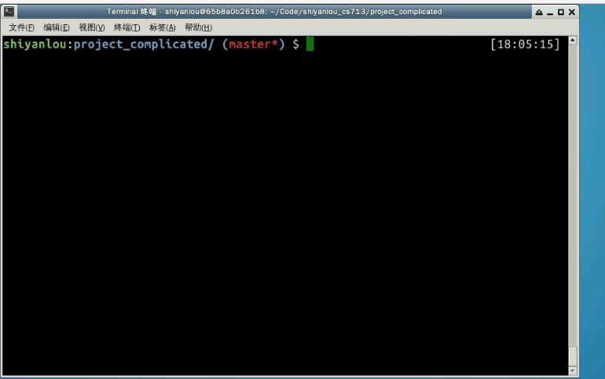
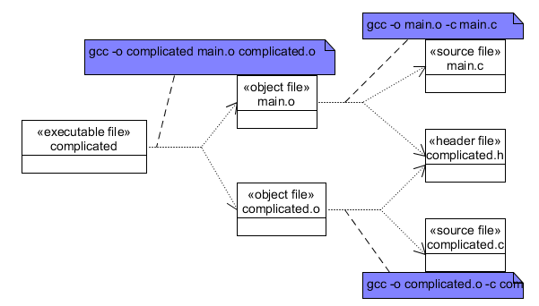
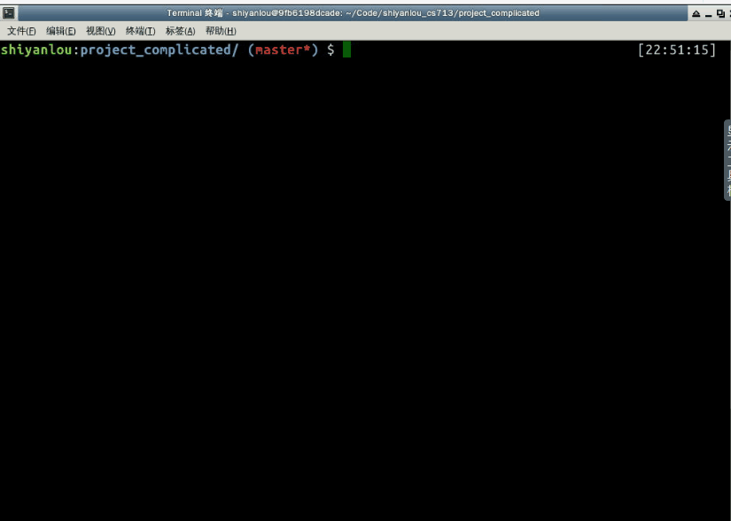

#### 自动生成依赖关系

2022年5月16日15:37:00

---

至此，我们complicated项目的makefile已经完成的比较完善了，但还存在一个问题，当我们更新头文件complicated.h的内容后，执行make时，项目并不会重新编译，看演示： 

出现以上问题的根本原因是，我们的makefile还没能精确的反映整个项目工程的依赖关系！很明显，项目的依赖关系应该加入对于头文件的依赖，即如下图：



根据上述依赖关系，我们可以在makefile加上如下规则：

```
$(objects): complicated.h
```

上述新增规则，是一条多目标规则，它与之前的静态模式规则，又组成了多规则目标，读者可自行思考其工作原理。

上述规则加入虽然能解决我们的问题，但是对于大型复杂的项目，这种需要我们逐个去分析头文件被依赖的关系，几乎是不可能的。所以我们需要工具来帮我们做这个事。下面我们来介绍如何实现自动生成依赖关系。

gcc为我们提供了这样的功能，帮助我们分析一个文件对其他文件的依赖关系列表。当我们在执行gcc时带上`-MM`选项时，gcc工具就会为我们列出指定文件对其他文件的依赖关系列表。直接来看例子：


接下来要考虑的问题就是如何将gcc的输出导入到我们的makefile中了。

makefile支持使用`sinclude`关键字将指定文件导入到当前的makefile当中，它的作用与C语言的`#inlucde`预处理命令是一样的。使用方式`sinclude <other_makefiles>`。因此，我们可以将gcc对于源文件的依赖关系分析输出到某个文件(我们可以称为依赖描述文件，一般命名为与源文件同名但以.d结尾的文件)当中，然后再将依赖描述文件导入到makefile中。

> ```
> # 使用变量的引用替换，定义依赖描述文件列表
> deps := $(sources:.c=.d)
> 
> # 导入依赖描述文件列表
> sinclude $(deps)
> ```

当我们使用`sinclude`关键字向当前makefile导入文件时，如果所导入的文件不存在，make会试图去执行可以生产导入文件的规则去生产被导入的文件，然后再执行导入。因此我们可以使用静态模式规则，让make在执行时，去调用gcc生成依赖关系文件，我们可以这么写：

> ```
> $(deps):%.d:%.c
>     gcc -MM $< > $@
> ```

因此，我们complicated项目的最终makefile可以这么写：

```
# 描述：complicated 项目 makefile文件
# 版本：v1.5
# 修改记录：
# 1. 为complicated项目makefile添加注释
# 2. 使用变量改进我们complicated项目的makefile
# 3. 使用静态模式规则，简化makefile
# 4. 使用伪目标，加上clean规则
# 5. 引进wildcard函数，自动扫描当前目录下的源文件
# 6. 加入自动规则依赖

# 定义可执行文件变量
executbale := complicated
# wildcard函数扫描源文件，定义列表变量
sources := $(wildcard *.c)
# 使用变量的引用替换，定义object文件列表
objects := $(sources:.c=.o)
# 使用变量的引用替换，定义依赖描述文件列表
deps := $(sources:.c=.d)

# 定义编译命令变量
CC := gcc
RM := rm -rf

# 终极目标规则，生成complicated可执行文件
$(executbale): $(objects)
#  使用自动化变量改造我们的编译命令
    $(CC) -o $@ $^

# 子规则, main.o和complicated.o的生成规则，使用静态模式规则
$(objects):%.o:%.c
    $(CC) -o $@  -c $<
        
# clean规则
.PHONY: clean
clean:
    $(RM) $(executbale) $(objects) $(deps)

# 自动规则依赖
sinclude $(deps)

$(deps):%.d:%.c
    $(CC) -MM $< > $@
```

演示如下：




