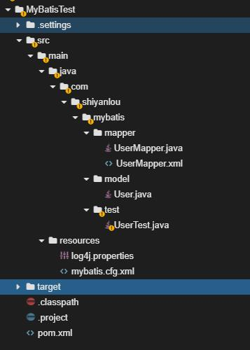
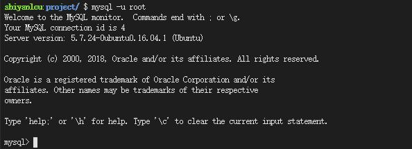
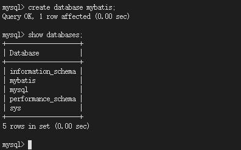
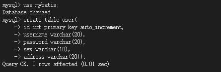
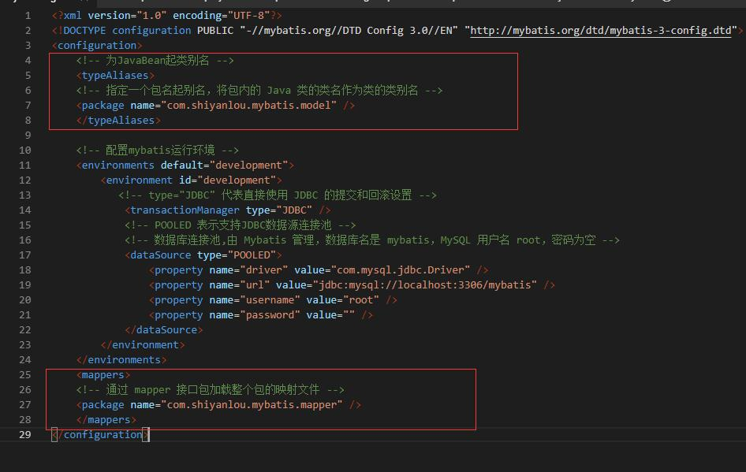

#### 实验介绍😯

2022年06月06日20:16:13

---

#### 实验内容

本次课程我们学习一个 MyBatis 的入门小程序，利用 MyBatis 实现数据库数据的增删改查操作。

#### 实验知识点

- MyBatis 框架
- 接口式编程
- MySQL

#### 实验环境

- JDK1.8
- WEB IDE
- MySQL 5.7

#### 代码获取

```bash
wget https://labfile.oss.aliyuncs.com/courses/802/MybatisTest.zip
```


#### 项目文件结构




接下来就是实战了

本次课程使用 MySQL 数据库。首先启动 mysql ：

```bash
sudo service mysql start
```

然后在终端下输入以下命令，进入到 MySQL 数据库（-u 表示用户名，比如这里的 root，-p 表示密码，这里没有密码就省略了）：

```bash
mysql -u root
```



为了实验方便，我们在这里新建一个数据库并取名 `mybatis` 用作实验。

```sql
create database mybatis;
show databases;
```



创建表 `user` ，代码如下：

```sql
use mybatis;
create table user(
id int primary key auto_increment,
username varchar(20),
password varchar(20),
sex varchar(10),
address varchar(20));
```




---

#### 导入所需 jar 包


打开 pom.xml 文件，修改为以下内容

```xml
<project xmlns="http://maven.apache.org/POM/4.0.0" xmlns:xsi="http://www.w3.org/2001/XMLSchema-instance"
         xsi:schemaLocation="http://maven.apache.org/POM/4.0.0 http://maven.apache.org/maven-v4_0_0.xsd">
    <modelVersion>4.0.0</modelVersion>
    <groupId>com.shiyanlou.mybatis</groupId>
    <artifactId>MybatisTest</artifactId>
    <packaging>jar</packaging>
    <version>1.0-SNAPSHOT</version>
    <name>MybatisTest</name>
    <url>http://maven.apache.org</url>
    <dependencies>
        <dependency>
            <groupId>org.mybatis</groupId>
            <artifactId>mybatis</artifactId>
            <version>3.4.6</version>
        </dependency>
        <dependency>
            <groupId>mysql</groupId>
            <artifactId>mysql-connector-java</artifactId>
            <version>6.0.6</version>
        </dependency>
        <dependency>
            <groupId>log4j</groupId>
            <artifactId>log4j</artifactId>
            <version>1.2.17</version>
        </dependency>

    </dependencies>

    <build>
        <resources>
            <resource>
                <directory>src/main/java</directory>
                <includes>
                    <include>**/*.xml</include>
                </includes>
            </resource>
            <resource>
                <directory>src/main/resources</directory>
                <includes>
                    <include>**/*.*</include>
                </includes>
            </resource>
        </resources>
    </build>
</project>
```

---

#### 配置文件 mybatis.cfg.xml


在项目目录 `src/main/` 下新建文件夹`resources`，接着在`resources`下新建 MyBatis 配置文件 `mybatis.cfg.xml` ，用来配置 Mybatis 的运行环境、数据源、事务等。

mybatis.cfg.xml 的配置如下，具体解释注释已经给出：

```xml
<?xml version="1.0" encoding="UTF-8"?>
<!DOCTYPE configuration PUBLIC "-//mybatis.org//DTD Config 3.0//EN" "http://mybatis.org/dtd/mybatis-3-config.dtd">
<configuration>
       <!-- 配置 mybatis 运行环境 -->
    <environments default="development">
        <environment id="development">
           <!-- type="JDBC" 代表直接使用 JDBC 的提交和回滚设置 -->
            <transactionManager type="JDBC" />

            <!-- POOLED 表示支持 JDBC 数据源连接池 -->
            <!-- 数据库连接池，由 Mybatis 管理，数据库名是 mybatis，MySQL 用户名 root，密码为空 -->
            <dataSource type="POOLED">
                <property name="driver" value="com.mysql.jdbc.Driver" />
                <property name="url" value="jdbc:mysql://localhost:3306/mybatis" />
                <property name="username" value="root" />
                <property name="password" value="" />
            </dataSource>
        </environment>
    </environments>
</configuration>
```

---

#### 实体类 User

在包 `com.shiyanlou.mybatis.model` 下新建类 User.java ， 一个用户具有：id、username、password、sex、address 五个属性。作为 mybatis 进行 sql 映射使用，与数据库表对应。

User 类的代码如下：

```java
package com.shiyanlou.mybatis.model;

public class User {

    private Integer id;
    private String username;
    private String password;
    private String sex;
    private String address;

    public Integer getId() {
        return id;
    }

    public void setId(Integer id) {
        this.id = id;
    }

    public String getUsername() {
        return username;
    }

    public void setUsername(String username) {
        this.username = username;
    }

    public String getPassword() {
        return password;
    }

    public void setPassword(String password) {
        this.password = password;
    }

    public String getSex() {
        return sex;
    }

    public void setSex(String sex) {
        this.sex = sex;
    }

    public String getAddress() {
        return address;
    }

    public void setAddress(String address) {
        this.address = address;
    }

}
```


---

新建包 `com.shiyanlou.mybatis.mapper` ，并在包下新建方法接口 UserMapper.java ，提供简单的增删改查数据操作。

UserMapper 接口的代码如下：

```java
package com.shiyanlou.mybatis.mapper;

import java.util.List;

import com.shiyanlou.mybatis.model.User;

public interface UserMapper {

    /*
     * 新增用戶
     * @param user
     * @return
     * @throws Exception
     */
    public int insertUser(User user) throws Exception;

    /*
     * 修改用戶
     * @param user
     * @param id
     * @return
     * @throws Exception
     */
    public int updateUser(User user) throws Exception;

    /*
     * 刪除用戶
     * @param id
     * @return
     * @throws Exception
     */
    public int deleteUser(Integer id) throws Exception;

    /*
     * 根据 id 查询用户信息
     * @param id
     * @return
     * @throws Exception
     */
    public User selectUserById(Integer id) throws Exception;

    /*
     * 查询所有的用户信息
     * @return
     * @throws Exception
     */
    public List<User> selectAllUser() throws Exception;
}
```

在包 `com.shiyanlou.mybatis.mapper` 下新建映射文件 `UserMapper.xml` ，用来定义各种 SQL 语句和这些语句的参数，以及要返回的类型等。

#### UserMapper.xml 配置：

```xml
<?xml version="1.0" encoding="UTF-8"?>
<!DOCTYPE mapper PUBLIC "-//mybatis.org/DTD Mapper 3.0" "http://mybatis.org/dtd/mybatis-3-mapper.dtd">
<mapper namespace="com.shiyanlou.mybatis.mapper.UserMapper">
    <!-- 自定义返回结果集 -->
    <resultMap id="userMap" type="User">
        <id property="id" column="id" javaType="int"></id>
        <result property="username" column="username" javaType="String"></result>
        <result property="password" column="password" javaType="String"></result>
        <result property="sex" column="sex" javaType="String"></result>
        <result property="address" column="address" javaType="String"></result>
    </resultMap>

    <!-- 定义 SQL 语句，其中 id 需要和接口中的方法名一致 -->
    <!-- useGeneratedKeys：实现自动生成主键 -->
    <!-- keyProperty： 唯一标记一个属性 -->
    <!-- parameterType 指明查询时使用的参数类型，resultType 指明查询返回的结果集类型 -->
    <insert id="insertUser" useGeneratedKeys="true" keyProperty="id">
        insert into user (username,password,sex,address) values
        (#{username},#{password},#{sex},#{address})
    </insert>

    <update id="updateUser"  parameterType="User">
        update user set
        address=#{address} where
        id=#{id}
    </update>

    <delete id="deleteUser" parameterType="int">
        delete from user where
        id=#{id}
    </delete>

    <!-- 如未为 Java Bean 起类别名，resultType="com.shiyanlou.mybatis.model.User" -->

    <!-- 使用 resultType 时，一定要保证，你属性名与字段名相同；如果不相同，就使用 resultMap -->
    <select id="selectUserById" parameterType="int" resultType="User">
        select * from user where id=#{id}
    </select>

    <select id="selectAllUser" resultMap="userMap">
        select * from user
    </select>

</mapper>
```

UserMapper.xml 映射文件写好后，需要在 mybatis.cfg.xml 中加载它，在 mybatis.cfg.xml 中添加代码：

```xml
<mappers>
    <!-- 通过 mapper 接口包加载整个包的映射文件 -->
    <package name="com.shiyanlou.mybatis.mapper" />
</mappers>
```

同时为 Java Bean 起别名，添加如下代码：

```xml
<!-- 为 JavaBean 起类别名 -->
<typeAliases>
    <!-- 指定一个包名起别名，将包内的 Java 类的类名作为类的类别名 -->
    <package name="com.shiyanlou.mybatis.model" />
</typeAliases>
```

注意顺序：typeAliases -> environments -> mappers



---

#### 测试类 UserTest

在包 `com.shiyanlou.mybatis.test` 下新建测试类 `UserTest.java` ， 用来测试数据的增删改查操作。

UserTest 类的代码如下：

```java
package com.shiyanlou.mybatis.test;

import java.io.IOException;
import java.io.InputStream;
import java.util.List;

import org.apache.ibatis.io.Resources;
import org.apache.ibatis.session.SqlSession;
import org.apache.ibatis.session.SqlSessionFactory;
import org.apache.ibatis.session.SqlSessionFactoryBuilder;

import com.shiyanlou.mybatis.mapper.UserMapper;
import com.shiyanlou.mybatis.model.User;

public class UserTest {
    private static SqlSessionFactory sqlSessionFactory;

    public static void main(String[] args) {
        // Mybatis 配置文件
        String resource = "mybatis.cfg.xml";

        // 得到配置文件流
        InputStream inputStream = null;
        try {
            inputStream = Resources.getResourceAsStream(resource);
        } catch (IOException e) {
            e.printStackTrace();
        }

        // 创建会话工厂，传入 MyBatis 的配置文件信息
        sqlSessionFactory = new SqlSessionFactoryBuilder().build(inputStream);

        insertUser();
        // updateUser();
        // deleteUser();
        // selectUserById();
        // selectAllUser();

    }

    // 新增用戶
    private static void insertUser() {
        // 通过工厂得到 SqlSession
        SqlSession session = sqlSessionFactory.openSession();

        UserMapper mapper = session.getMapper(UserMapper.class);
        User user = new User();
        user.setUsername("Tom");
        user.setPassword("123456");
        user.setSex("male");
        user.setAddress("chengdu");
        try {
            mapper.insertUser(user);

            session.commit();
        } catch (Exception e) {
            e.printStackTrace();
            session.rollback();
        }

        // 释放资源
        session.close();
    }

    // 更新用戶
    private static void updateUser() {

        SqlSession session = sqlSessionFactory.openSession();

        UserMapper mapper = session.getMapper(UserMapper.class);
        User user = null;
        try {
            user = mapper.selectUserById(1);
        } catch (Exception e1) {
            e1.printStackTrace();
        }
        user.setAddress("chongqing");
        try {
            mapper.updateUser(user);
            session.commit();
        } catch (Exception e) {
            e.printStackTrace();
            session.rollback();
        }

        session.close();
    }

    // 删除用戶
    private static void deleteUser() {

        SqlSession session = sqlSessionFactory.openSession();

        UserMapper mapper = session.getMapper(UserMapper.class);
        try {
            mapper.deleteUser(3);
            session.commit();
        } catch (Exception e) {
            e.printStackTrace();
            session.rollback();
        }

        session.close();
    }

    // 根据 id 查询用户信息
    private static void selectUserById() {

        SqlSession session = sqlSessionFactory.openSession();

        UserMapper mapper = session.getMapper(UserMapper.class);
        try {
            User user = mapper.selectUserById(1);
            session.commit();
            System.out.println(user.getId() + " " + user.getUsername() + " "
                    + user.getPassword() + " " + user.getSex() + " "
                    + user.getAddress());
        } catch (Exception e) {
            e.printStackTrace();
            session.rollback();
        }

        session.close();
    }

    // 查询所有的用户信息
    private static void selectAllUser() {

        SqlSession session = sqlSessionFactory.openSession();

        UserMapper mapper = session.getMapper(UserMapper.class);
        try {
            List<User> userList = mapper.selectAllUser();
            session.commit();
            for (User user : userList) {
                System.out.println(user.getId() + " " + user.getUsername() + " "
                        + user.getPassword() + " " + user.getSex() + " "
                        + user.getAddress());
            }
        } catch (Exception e) {
            e.printStackTrace();
            session.rollback();
        }
        session.close();
    }
}
```

#### 实验总结


本次实验完成了 Mybatis 的一个简单的入门程序，简单的实现了对数据库的增删改查功能，对 MyBatis 有了一个基本的了解。

