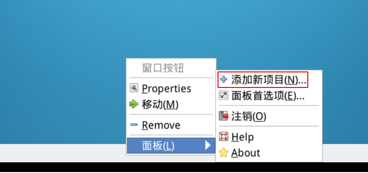

####  实验环境的工作模式

2022年4月5日09:26:41

---

#### （1）准备环境

`hit-oslab` 实验环境简称 oslab，是一个压缩文件（hit-oslab-linux-20110823.tar.gz），这个文件在 **/home/teacher** 目录和 **/home/shiyanlou/oslab**

推荐大家使用如下的命令解压到 `/home/shiyanlou/oslab/` 中。

```bash
# 进入到 oslab 所在的文件夹
$ cd /home/shiyanlou/oslab/

# 解压，并指定解压到 /home/shiyanlou/
# 这样的话，在 /home/shiyanlou/oslab/ 中就能找到解压后的所有文件
$ tar -zxvf hit-oslab-linux-20110823.tar.gz \
  -C /home/shiyanlou/

# 查看是否解压成功
$ ls -al
# 除了压缩包 hit-oslab-linux-20110823.tar.gz 之外，其他的就是压缩包中的内容
```

> 如果终端窗口最小化后无法找到，可以在任务栏右键，面板 -> 添加新项目 -> 窗口菜单 -> Add 来打开显示。




#### （2）文件结构

- Image 文件

oslab 工作在一个宿主操作系统之上，在宿主操作系统之上完成对 Linux 0.11 的开发、修改和编译之后，在 linux-0.11 目录下会生产一个名为 **Image** 的文件，它就是编译之后的目标文件。

该文件内已经包含引导和所有内核的二进制代码。如果拿来一张软盘，从它的 0 扇区开始，逐字节写入 Image 文件的内容，就可以用这张软盘启动一台真正的计算机，并进入 Linux 0.11 内核。

> oslab 采用 bochs 模拟器加载这个 Image 文件，模拟执行 Linux 0.11，这样避免重新启动计算机的麻烦。

- bochs 目录

bochs 目录下是与 bochs 相关的执行文件、数据文件和配置文件。

- run 脚本

run 是运行 bochs 的脚本命令。

因为 bochs 配置文件中的设置是从软驱 A 启动，所以 Linux 0.11 会被自动加载。

- hdc-0.11.img 文件

hdc-0.11.img 文件的格式是 Minix 文件系统的镜像。

**宿主 Linux 上通过 mount 访问此文件内的文件，宿主系统可以和 bochs 内运行的 Linux 0.11 之间交换文件**

hdc-0.11.img 内包含有：

- Bash shell；
- 一些基本的 Linux 命令、工具，比如 cp、rm、mv、tar；
- vi 编辑器；
- gcc 1.4 编译器，可用来编译标准 C 程序；
- as86 和 ld86；
- Linux 0.11 的源代码，可在 0.11 下编译，然后覆盖现有的二进制内核。

> 其他文件在后面用到的时候会进行单独讲解。