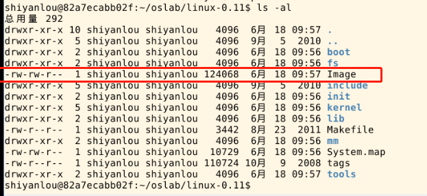

#### 04.1 编译内核

2022年4月5日09:31:03

“编译内核” 比 “编写内核” 要简单得多。

首先要进入 linux-0.11 目录，然后执行 make 命令：

```bash
$ cd ./linux-0.11/
$ make all
```

因为 `all` 是最常用的参数，所以可以省略，只用 `make`，效果一样。

多处理器机器上，可以用 -j 参数进行并行编译，加快速度。例

```bash
$ make -j 2
```


最后生成的目标文件是一个软盘镜像文件—— `linux-0.11/Image`如果将此镜像文件写到一张 1.44MB 的软盘上，就可以启动一台真正的计算机。



linux-0.11 目录下是全部的源代码，很多实验内容都是要靠修改这些代码来完成。修改后需要重新编译内核，还是执行命令：`make all`。

make 命令会自动跳过未被修改的文件，但如果重新编译后，你的修改貌似没有生效，可以试试先 `make clean` ，再 `make all`（或：`make clean && make all`。