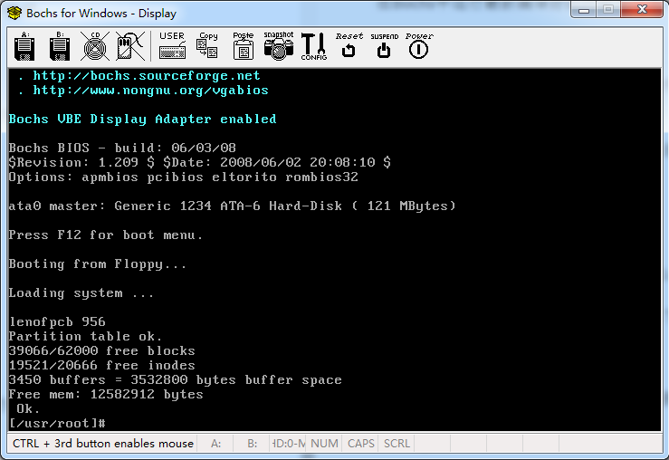

#### 4.2 运行

2022年4月5日09:31:1

--

在 Bochs 中运行最新编译好的内核很简单，在 oslab 目录下执行：

```bash
# 注意是在上层目录
# 刚刚编译是在 oslab/linux-0.11/ 文件夹下
$ cd ~/oslab/

# 执行 run 脚本
$ ./run
```

如果出现 Bochs 的窗口，里面显示 linux 的引导过程，最后停止在 `[/usr/root/]#`，表示运行成功，如下图所示。



图 1 用 Bochs 启动 Linux 0.11 以后的样子